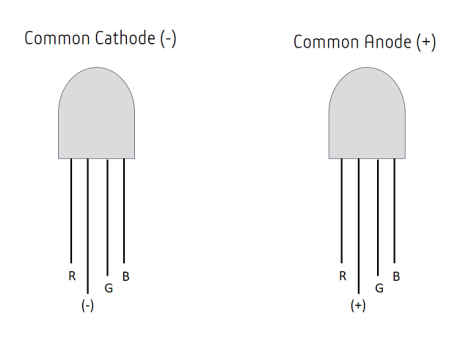
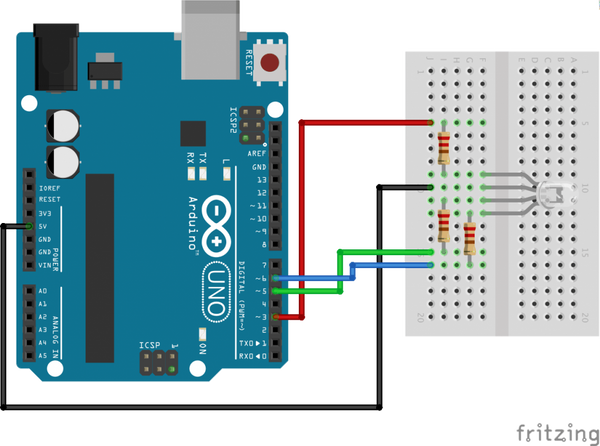
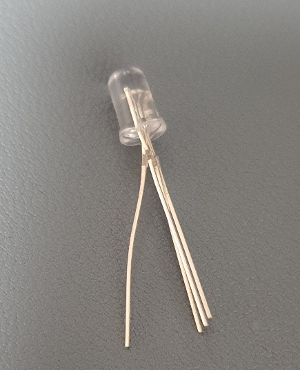
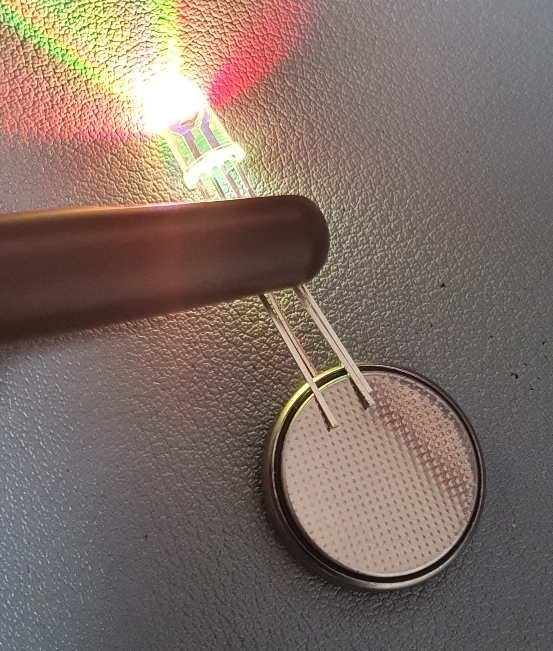
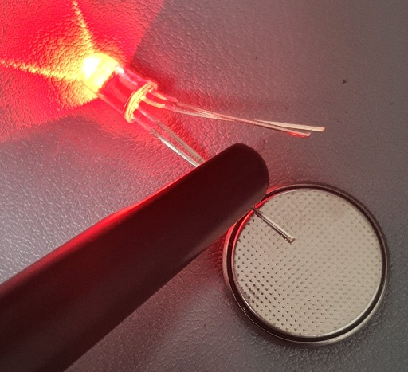
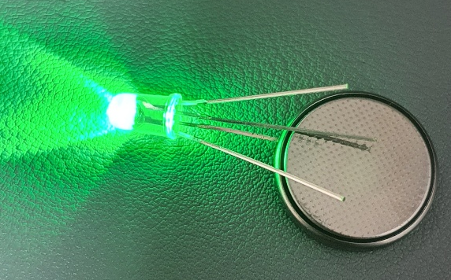
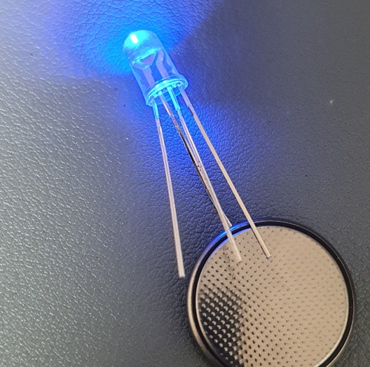

_注：筆者は韓国在住のため、本文には韓国特有の文脈が含まれることがあります。_

Arduinoをいじっていると、単純にLEDを点けたり消したりする

行為が思った以上に大きな原始的な喜びをもたらしてくれることに気づきます。

しかし..すぐに上のような単色LEDでは1色しか出せないことに気づき、何やら「どんな色でも出せるLED」を探すことになりまして..

冒険を続けると、以下のようなCathode (-)、Anode (+) LEDに出会います。

そして配線図を調べてみると、だいたいこんなものが出てきて

適当に真似して作ってみると、うーん...ArduinoのDigital Outputに従って点けたり消したりがちゃんとできます。

でも？じゃあ？何か本当に使い物になるものを作ってみたくて？複数のLEDを並列につなぐとかするときには？どうすればいいのか？悩みます。なんだか単色LEDより回路もずいぶん複雑になった気がして...

でも実は大したことはありません！
写真は3色Anode LEDですが、Cathodeも特に変わりません(..)

原理を把握してみましょう。

1) LEDを次のようにRGBピンと+ピン（Cathode LEDは-ピン）に分けます。

2) そして転がっている3Vのボタン電池の+極に+ピンを、RGBピンを反対側に当ててみます。

？？そうです。実は3色LEDはただの単色LED3つが並列につながっていただけなのです..

3) なので1ピンずつ抜いてみると、実は他のピンとは関係なく単色LEDのようにちゃんと動作することがわかります(...)

あ..だから3色LEDが単色LED3つを並列につないだものだとわかれば、

単色LEDをつなぐときに抵抗どうこうしていた記憶がよみがえります。抵抗を3つ使うのが、だいたい適正な電圧をかけているということのようです。

上のArduino回路も実は理解できます。実は単色LED3つを並列につないだのと同じ回路だったのです..

あ..これを知らなくて3色LEDが数ヶ月間倉庫に放り込まれていました。

次は1つ犠牲にする覚悟で、思い切ってガンガン使ってみようかなと思います..
