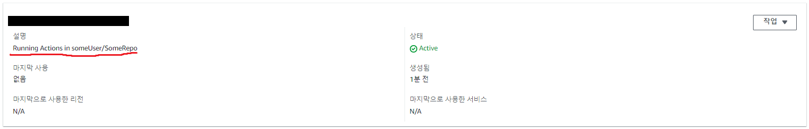
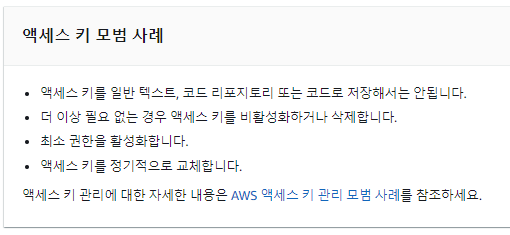
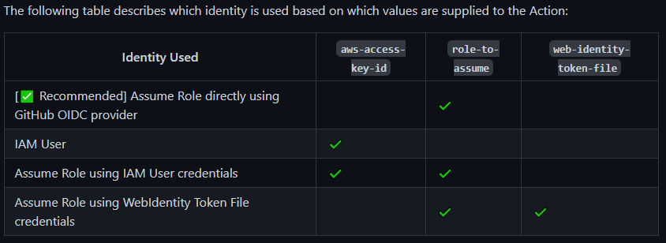
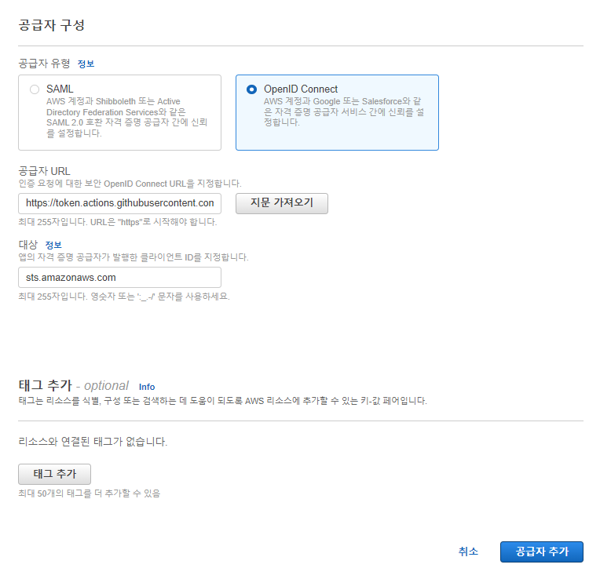
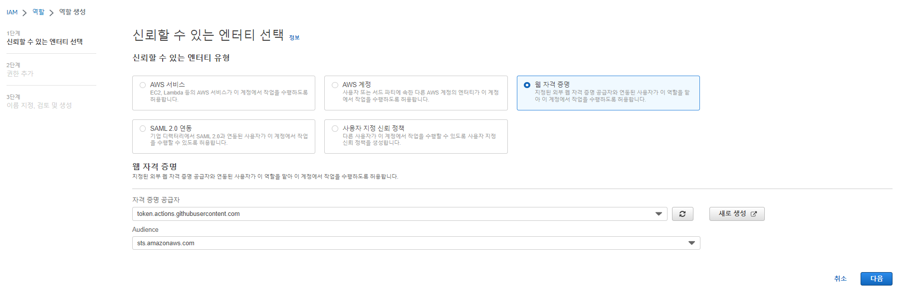
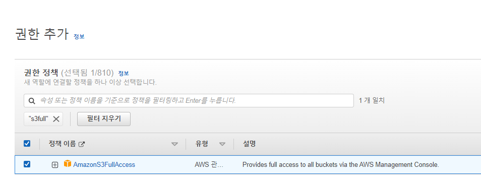
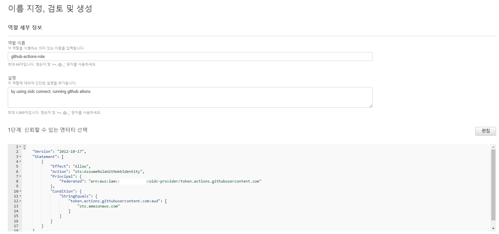
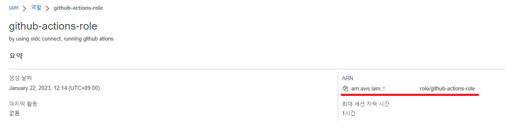
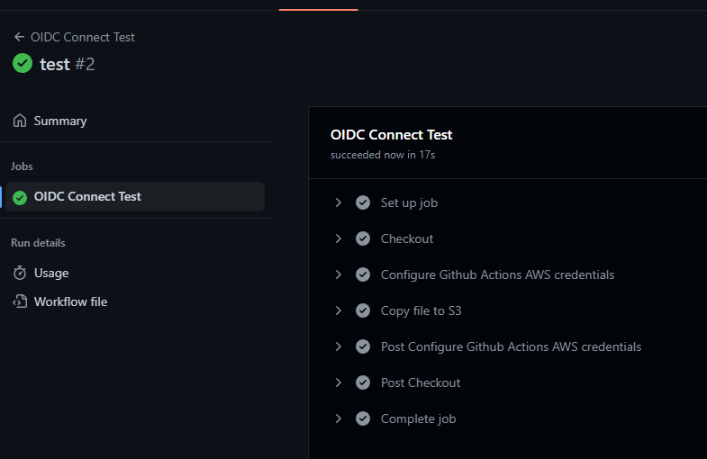
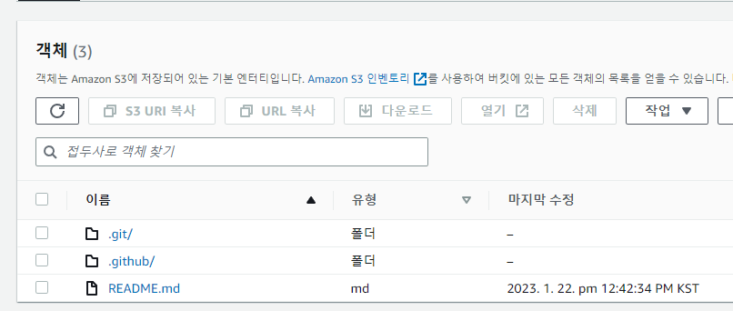

_註:筆者居住於韓國,部分內容包含韓國特有的背景。_

要在 GitHub Actions 中使用 AWS,通常會經過以下步驟。

- 進入 IAM 控制台,建立一個新使用者。
- 為 GitHub Actions 新增 IAM Role,採用 Programmatic access 方式,取得 `AWS_ACCESS_KEY_ID` 與 `AWS_SECRET_ACCESS_KEY`。
- 在儲存庫設定中,將剛剛取得的 `AWS_ACCESS_KEY_ID` 與 `AWS_SECRET_ACCESS_KEY` 加入 GitHub Secrets。
- 接著在 GitHub Actions 加入如下的工作流程,即可存取 AWS 資源。

```yaml
- name: Configure AWS Credentials
    uses: aws-actions/configure-aws-credentials@v1
    with:
    aws-access-key-id: ${{ secrets.AWS_ACCESS_KEY_ID }}
    aws-secret-access-key: ${{ secrets.AWS_SECRET_ACCESS_KEY }}
    aws-region: us-east-2
```

如果只有一個專案,這樣管理也沒有太大問題。

但當使用 AWS 的專案開始變多後,便會遇到一些煩惱。

例如,要為每個儲存庫各發一個 IAM User?還是發一個超級使用者,讓 `ACCESS_KEY`、`ACCESS_SECRET` 共用?

發超級使用者的話,一旦相關金鑰外洩,可能會收到一張巨額的 AWS 帳單,所以稱不上是好做法。

但若要發多個使用者,隨著使用者數量增加,要追蹤哪個 Key 用在何處就變得很困難。

最近 AWS 新增了為每個 Access Key 加上 Description 的功能,管理上稍微好一些,但在那之前,因為不知道某個 Key 用在哪裡而不敢去動的情況屢見不鮮。



再更進一步!若想遵循 Access Key 管理的最佳實務,頭會更痛。



按照最佳實務,長期憑證需要定期輪換,但一想到要定期取得新 Key 並到儲存庫替換 Secrets,就讓人頭痛。

(各位拿到的、不會過期的 `ACCESS_KEY`、`ACCESS_SECRET` 就稱為長期憑證。)

**如果不必每次都把 Key 塞進 Secrets,而是會自動只把我的 Key 塞進我的儲存庫,那該有多方便?**

而且,

**如果每次 Actions 執行時都核發一個只能短暫使用的暫時 Token,即使 Token 外洩,過段時間就會過期失效,那該多好?**

透過 OIDC 連結就可以做到!而且,這也是 AWS 推薦的資安最佳實務([Link](https://github.com/aws-actions/configure-aws-credentials#assuming-a-role))!



接著介紹一種只需設定一次,日後跑 Actions 就會變得相當方便的方法!


* 設定方式有官方文件。若有卡住的地方,請參考官方文件([Link](https://docs.github.com/en/actions/deployment/security-hardening-your-deployments/configuring-openid-connect-in-amazon-web-services))

### 1. 建立 OIDC 身分提供者

* 連到 IAM Console。https://console.aws.amazon.com/iam/
* 在左側選單選擇 **身分提供者**,然後選擇 **新增提供者**。
* 依下列方式設定。
    * 提供者 URL:`https://token.actions.githubusercontent.com`
    * 對象:`sts.amazonaws.com`




* 之後點選取得指紋,並新增提供者。

### 2. 建立 OIDC 連動的 Role

* 選擇 **角色** 選單,建立一個新的角色。
* 選擇 **Web 身分識別**,如下所示選擇步驟 1 建立的 GitHub Provider。




* 權限部分,因為這裡只是簡單範例,所以使用了 Managed Policy 中的 `S3FullAccess`。
    * 實際使用時,也可以自行建立 Policy 來使用。



* 填入適當的名稱和描述,建立 Role。



* 建立完成!之後請把該 Role 的 ARN 記錄在某處。



### 3. 在 GitHub Actions 中使用該 Role

* 可以依下列方式使用剛剛建立的 Role。
* 開一個新的儲存庫,並建立 `.github/workflows/oidc-connect-test.yaml`。
* **完全不需要設定 Access key 或 Secret 等內容!**

* 下面是一個將目前儲存庫原樣上傳至 S3 的 GitHub Actions。

* 請依自己的情況修改以下部分。
    * 將 `role-to-assume` 部分改為步驟 2 記錄的 Role 之 ARN。
    * 為了測試,隨意建立一個名稱的 bucket,並將 `<bucket 名稱>` 部分替換為建立的 bucket 名稱。

```yaml
name: OIDC Connect Test

on:
  push:
    branches: [ main ]

jobs:
  deploy:
    name: OIDC Connect Test
    runs-on: ubuntu-latest
    # These permissions are needed to interact with GitHub's OIDC Token endpoint.
    permissions:
      id-token: write
      contents: read
    steps:
      - name: Checkout
        uses: actions/checkout@v3

      - name: Configure Github Actions AWS credentials
        uses: aws-actions/configure-aws-credentials@v1
        with:
          role-to-assume: arn:aws:iam::123456461:role/github-actions-role # 使用剛才建立的 Role
          aws-region: ap-northeast-1

      - name: Copy file to S3 
        run: |
          aws s3 sync . s3://<bucket 名稱>
```

* 之後,若 Actions 正常運作



* 並且儲存庫檔案實際上被上傳到 S3,代表設定成功了!




### Appendix 1. 強化安全性

* 因為是個人使用,目前所有儲存庫都可以取得 Credentials,但也可以僅限定特定儲存庫。
* 建立 Role 時,如下所示加入 repo,就可以僅在 `octo-org/octo-repo` 的所有分支/PR 中使用 AWS。

```json
{
    "Version": "2012-10-17",
    "Statement": [
        {
            "Effect": "Allow",
            "Principal": {
                "Federated": "arn:aws:iam::123456123456:oidc-provider/token.actions.githubusercontent.com"
            },
            "Action": "sts:AssumeRoleWithWebIdentity",
            "Condition": {
                "StringLike": {
                    "token.actions.githubusercontent.com:sub": "repo:octo-org/octo-repo:*" # 加上這一段
                },
                "StringEquals": {
                    "token.actions.githubusercontent.com:aud": "sts.amazonaws.com"
                }
            }
        }
    ]
}

```

### Appendix 2. Role 要怎麼管理?

* 已經設定過一次後,日後若需要新的 Role,只需再執行步驟 2(建立 OIDC 連動的 Role)建立新的 Role,然後將 `role-to-assume` 部分替換掉即可。

完!
