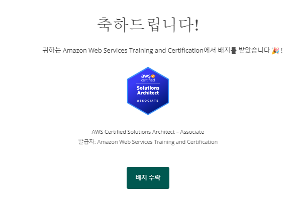
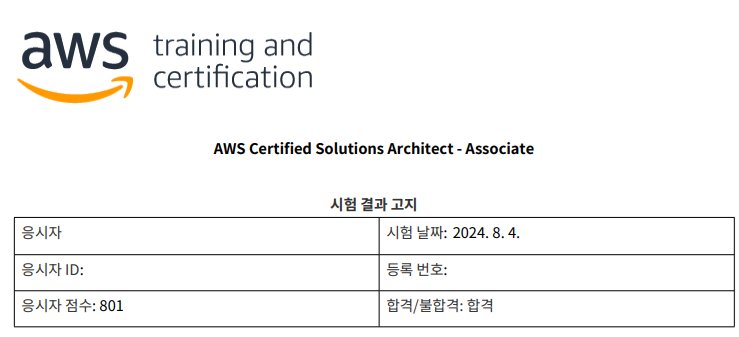

_Note: I'm based in Korea, so some context here is Korea-specific._

AWS offers practical certifications. ([Link](https://aws.amazon.com/certification/exams/))

I'd been telling myself "someday, someday I'll get it..." for ages. Worried I'd never actually do it, I figured since I had no plans today, I'd just sign up on the spot and take it as an online exam.

There are tons of articles out there about what this certification is, why it's worth getting, and how to study for it, so I'll leave that to other blogs. I just want to summarize the application process / things to watch out for / a quick review based on 2024.

#### 1. Application

You can book a slot from the [AWS Certification](https://aws.amazon.com/certification/) link by clicking "Schedule an exam."

I picked Online with OnVUE and took it online.
You'll need a **webcam** when setting up for the exam, so prepare one in advance if needed!

You can apply in Korean, and even if you do, during the exam you can switch to the English version of any question if a translation looks off.

One extra tip: there's a good chance you can find an AWS discount voucher if you look around, so I'd recommend searching for one.

I used a discount voucher link from [Reddit](https://www.reddit.com/r/AWSCertifications/comments/18woit6/2024_aws_vouchers_exam_discounts_other), but if you have time, asking around in places like the [AWS Korea User Group](https://awskrug.github.io/)[^1] Slack might also be a good move.

#### 2. Preparation

Downloading the program and following the instructions to set up the exam environment goes pretty smoothly.

However, some background processes can cause issues. In my case, even after closing all foreground processes as instructed, the Chrome Remote Desktop service running in the background nearly kept me from starting the exam.

If you see something like `chrome ¿ø°Ý µ¥½ºũÅé ¼­ºñ` (a garbled Korean string for Chrome Remote Desktop), that's the Chrome Remote Desktop program. Go to Task Manager > Services > search for `chromoting` > Stop, and you should be able to finish setting up the exam properly.

#### 3. The Exam

The exam goes like this:
1. 30 minutes before the exam, check in first
2. Take a face photo, an ID photo, and photos of the exam area (surroundings)
3. Connect to the proctor via webcam, show your hands to confirm you're not wearing a watch, show yourself head-to-toe, and let them check via webcam that there's nothing on your desk or around you
4. Then the exam begins

That's the order.

The questions were generally fair. If you're stuck on something:

1. If there are multiple similar services, pick the most recently released one (e.g. if it's CLB vs ALB, ALB is probably the answer)
2. Pick keywords AWS is currently pushing, like Serverless

These are the rough guessing tips (...).

#### 4. Result Delivery

I'd heard results used to come right after the exam, but that wasn't the case for me.

I signed up around 11 AM for a 1:15 PM exam the same day, started checking in at 12:45, and finished the exam around 2 PM.

The result came around 7:15 PM, so processing seems to take roughly 5–6 hours.

If you pass, you get an email like this.

It had been a while since I'd worked with AWS, so I solved a lot of questions while digging through fuzzy memories.

The exam fee was steep so I'd been hesitant, but I figured if I kept hesitating I'd never take it. Going in with a "fine, I'll fail" mindset actually worked out well.

I'm thinking about going for the Developer cert next, though I haven't decided when. See you later!

[^1]: AWS Korea User Group (AWSKRUG) — a community of AWS users in Korea that runs meetups and a Slack workspace.
