_注：筆者は韓国在住のため、本文には韓国特有の文脈が含まれることがあります。_

会社や組織でAWSを使っていると、次のようなSSO（Single Sign On）ページからログインする画面を見たことがあると思います。

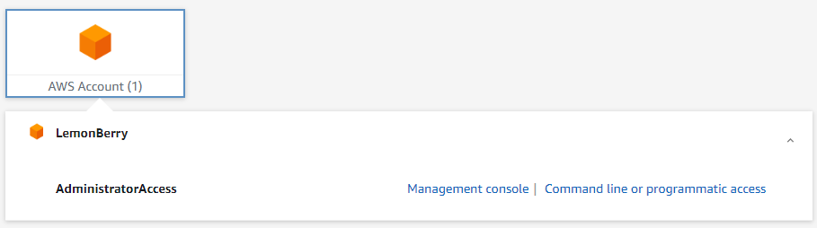

一度設定しておけば、セッションが維持されている間は毎回id/passwordを入力しなくても済むので便利です。

また、aws-cliやaws-sdkを使う際にも、`AWS_ACCESS_KEY`や`AWS_ACCESS_SECRET`のような流出してはいけない情報をローカルマシンに平文で保存しなくて済むので、セキュリティ面でもメリットがあります。

しかも無料サービスなので（[Link](https://aws.amazon.com/ko/iam/identity-center/faqs/)）、追加料金は **一切** かかりません！

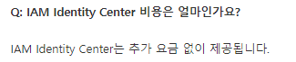

それでは設定してみましょう！

## 1. IAM Identity Centerの設定

### 1. AWSでSSOを検索してIAM Identity Centerを見つけます。

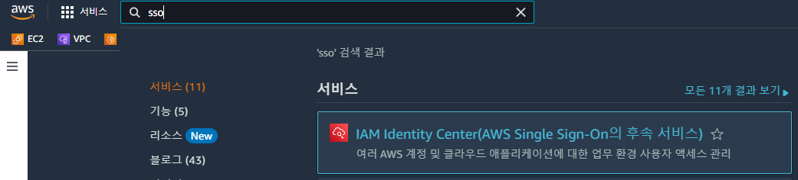

### 2. 有効化を押します！
- このとき、Identity Centerは1つのリージョンでしか有効化できないので、よく使うリージョンで有効化しておくと後の管理が楽になります。

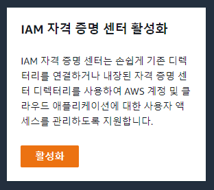

### 3. 先にAWS Organizationを設定します。

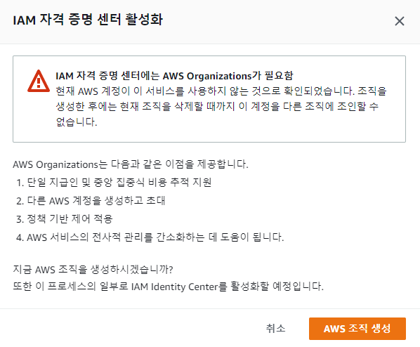

- 上のようなエラーが出るので、先にAWS Organizationを作成します。
- AWS Organizationも同じく*無料*サービスです。（[Link](https://docs.aws.amazon.com/ko_kr/organizations/latest/userguide/orgs_introduction.html#pricing)）

### 4. Dashboardが作成されるので、追加設定のために「設定に移動」ボタンを押します。

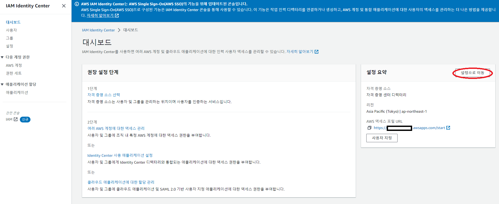

### 5. まずはSSOログインページに別名（エイリアス）を付けてみましょう。
 - デフォルトで提供されるログインページは`aadfbasdf-d.awsapps.com/start`のように自動生成されたページなので覚えづらいです。
 - これを`lemonlogin.awsapps.com/start`のような分かりやすい名前にしてみましょう。
 - 一度しか設定できないので、慎重に決めましょう！

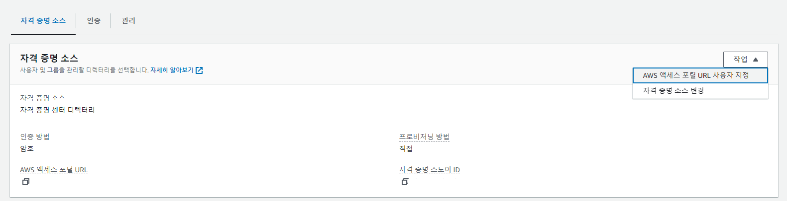

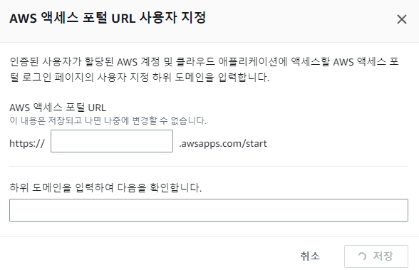

### 6. グループを追加しましょう！

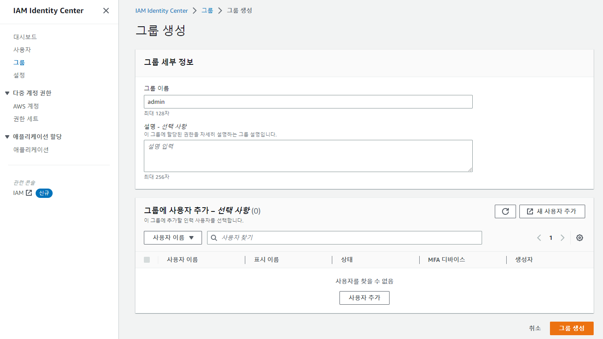

グループを追加します。

### 7. ユーザーを追加しましょう！

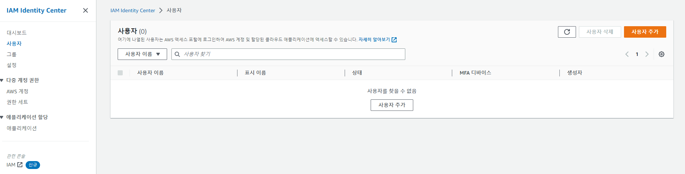

- ユーザー追加ボタンを押した後…

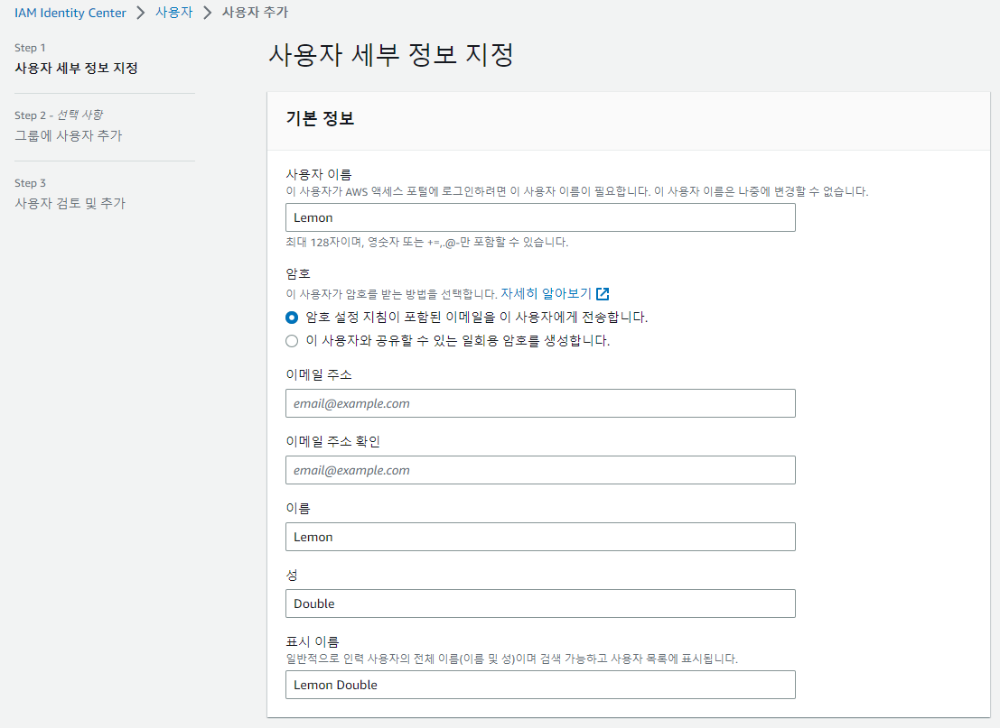

- ユーザー情報を入力します。パスワードはメールで設定メールを受け取ることも、ワンタイムパスワードを受け取ることもできます。
- デフォルトのメール受信のままにしましょう。

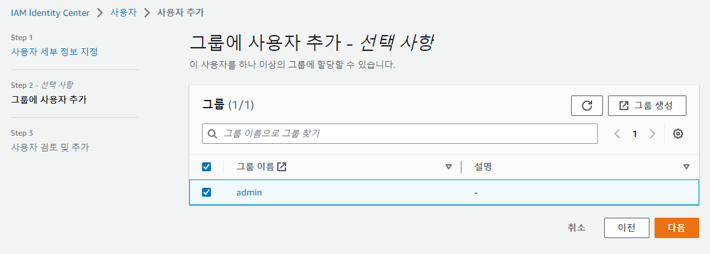

- その後Groupを選択できるので、6.で設定したグループを追加します。

- メールを確認して招待を承諾し、そのアカウントのPasswordを設定したらどこかに記録しておきましょう！

### 8. 権限を追加しましょう！

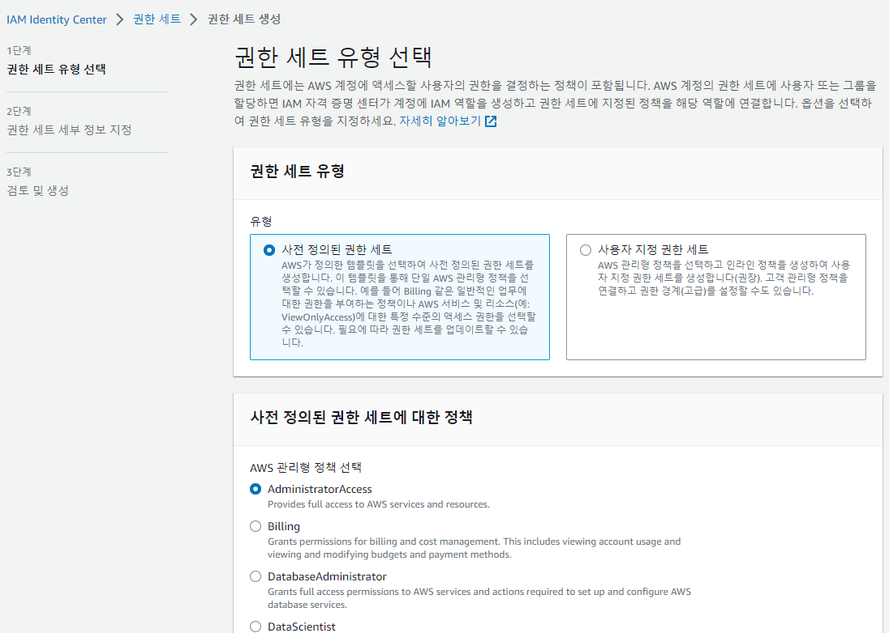

- 権限セットを選択します。私は`AdministratorAccess`を選びましたが、他の値を選んでも構いません。
- 事前定義された権限セットに希望のRoleがない場合は、カスタムで直接選択することもできます。

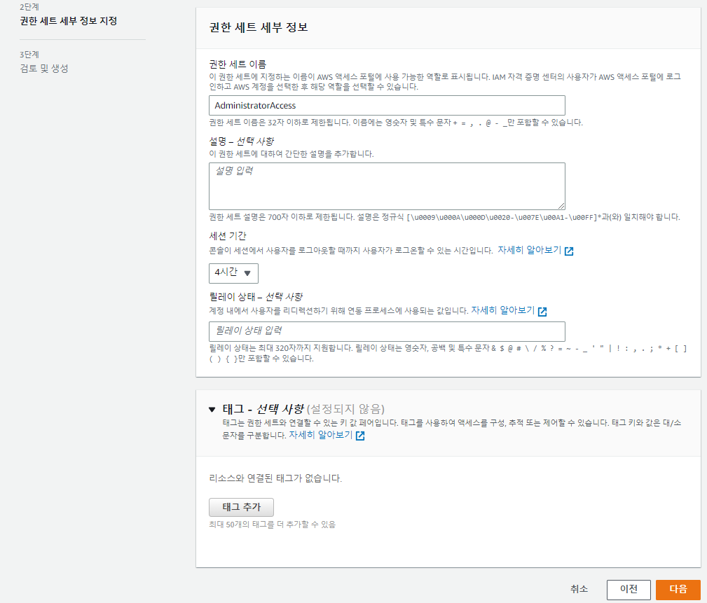

- 残りの設定を入力します。
- セッション期間は、その時間が過ぎると自動でAWSがログアウトする時間です。
- デフォルトは1時間ですが、頻繁にログアウトされると面倒なので私は4時間ほどに延ばしました。
- `リレー状態`はログイン成功時にリダイレクトするURLを指定できます。例えばBilling権限ならログイン成功時にBillingページにリダイレクトされる、といった具合です。
- 必要であればドキュメント（[Link](https://docs.aws.amazon.com/ko_kr/singlesignon/latest/userguide/howtopermrelaystate.html)）を参考に設定してください。私は空欄のままにしました。

### 9. SSOログイン設定

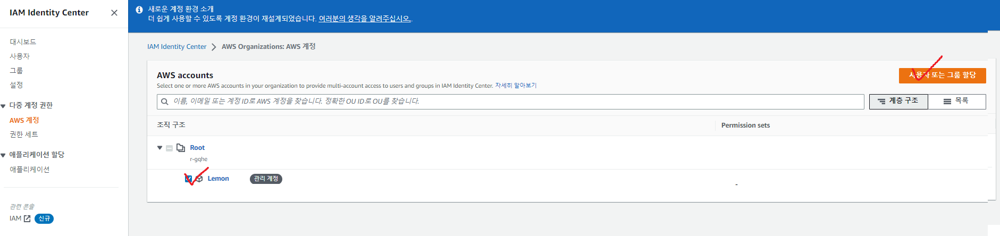

- AWSアカウントタブで自分のアカウントを選び、`ユーザーまたはグループの割り当て`を押します。

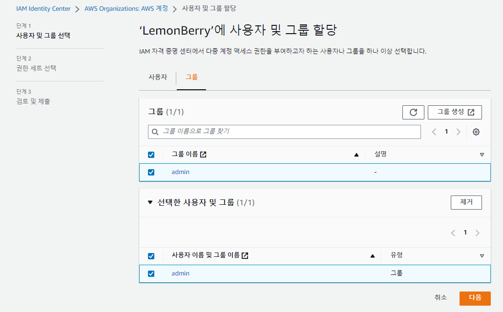

- 上で設定したグループを追加し、

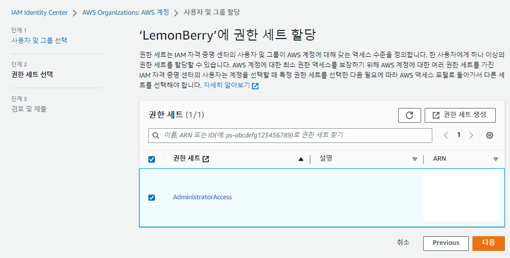

- 上で設定した権限を追加します。

### 10. SSOログイン

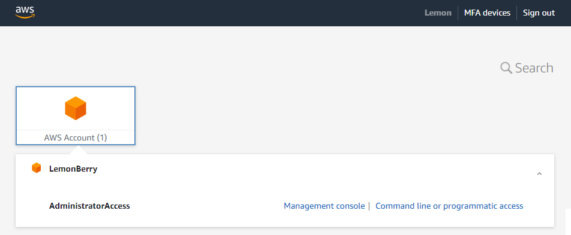

- 5.で追加したAWSログインアドレスへ行ってログインしてみましょう。`別名.awsapps.com/start`にアクセスしてログインします。

- SSO設定に成功しました！

### Appendix 1. セキュリティ強化

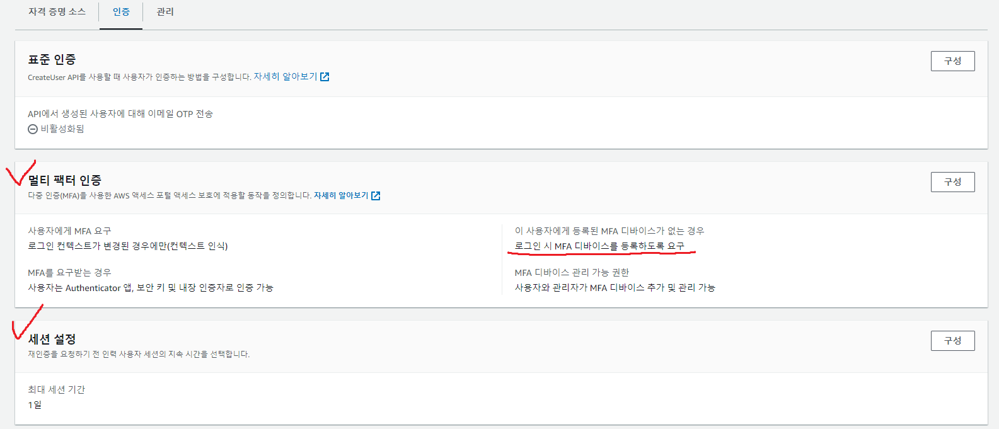

- IAM Identity Center - 設定に入ると、SSOアカウントに対するMFA設定やセッション長の設定などができます。
- 他はそのままでも、`このユーザーに登録されたMFAデバイスがない場合 - ログイン時にMFAデバイスの登録を要求する`オプションは有効化することをおすすめします。

### Appendix 2. AWS SSOでAWS_CLIを使う

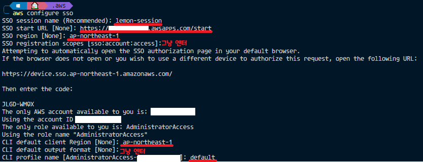

- SSO設定後、上記のように`aws configure sso`を使ってログイン設定を行います。（赤線で下線を引いた行は手で入力します。）
- 設定後、`aws s3 ls`コマンドなどで正常に設定されているか確認します。
