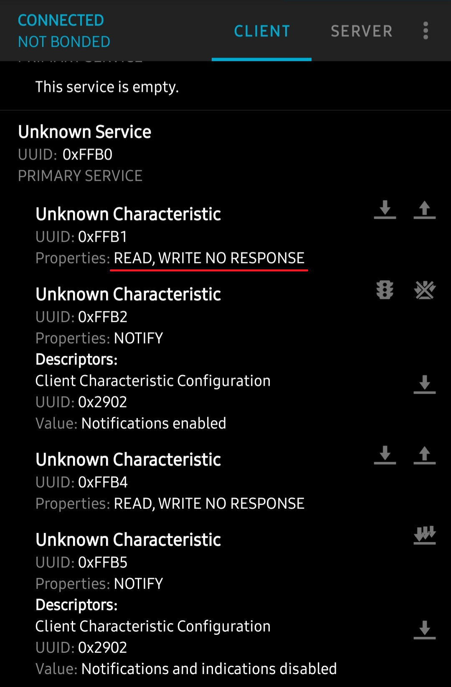

_注：筆者は韓国在住のため、本文には韓国特有の文脈が含まれることがあります。_


AliExpressでTVバックライトを一つ買いました。

実は最初は連動するかどうかなんて気にしていなくて..とりあえずTVの後ろが光ってわずか2万5千ウォン[^1]？買わない理由がないでしょう？

[^1]: 約2,500円程度。

ざっくりと..TVの内容とリアルタイムで連動したら本当にいいんですが..

Chromecastなら大体HDMI線があるからHDMIをフックして使えば良さそうなんですが、私のTVにはそんなものはなくAndroid TVなんですよね。じゃあ大体？ADBで接続するか別のアプリを入れるかして画面の端っこの情報を抽出してリアルタイムで連動させるとか..？

って、2万5千ウォンの製品にそこまで求めちゃダメですよね？というわけで〜たぶんカメラセンサーをぴったり付けて、カメラが認識した色をそのままLEDに出すシンプルな構造みたいでした。

ささやかながらTVの中央部だけカメラが撮影するので..完全にTVの色と完璧にSyncされる感覚とは程遠い感じはありますが、まあそれは関係なくTVの後ろから光が出るのが大事なんですよ、うんうん。

ところが？


実は配送されてから知ったんですが、専用アプリ／リモコンみたいなのがあったんです。リモコンは正直使うことがなさそうなので捨てて..専用アプリを使ってみたらBluetoothで接続するのを見ました。

でも？AliExpressで？販売量順で並べた一番上に来てるくらいだから..どこかの在野の達人が作った怪しいスター10個の専用統合とかないかな〜って内心期待していたんですが..ガサガサ探してみたんですがそんなのはなくて..

Bluetoothの権限確認を10回くらい出してくる安っぽい専用アプリはあるんですが..統合を一生懸命探したんですがなさそうでした。

ところが、ふと思ったんですが..

- Bluetoothシグナルは大体周りに撒き散らすものなので..他の場所で受信して中身を見られる
- それどころか？アプリがあって、Bluetoothシグナルが私のスマホから出ているわけだから？たぶんAndroidのデバッグログを覗けばシグナルもわかるはず
- なら、よくわからないけど？ON/OFFシグナルだけ何とかキャプチャできればHome Assistantにつなげられるんじゃない？

という考えが浮かんだものの...

2万5千ウォンのLEDデバイス一つを消すためにこんな苦労を？という気持ちで目をそらしていたんですが....


しまった..バックライトが消えません。

本来であれば

- USB電源をTVに挿す
- TVがオフになるとUSBにも電力が供給されない
- TVが消えると`スマート`にバックライトもオフになる

このようなワークフローなんですが..私の場合は

- Android Debug BridgeでHome AssistantとTVを連動させてある。これでTVをつけたり色々やる
- でも？TVが完全に消えるとADB接続できない
- 今まで作ってきた自動化が使えない
- だから？TVを省電力モードで生かしておく
- 省電力モードだから？電源が来るのでUSBにも電源が来る
- バックライトが永遠に消えない

このような苦痛のループを歩むことになったわけです..

もちろんアプリもあるし..そのLEDコントローラーに物理的なスイッチもあるんですが..面倒じゃないですか...

それで歯を食いしばって永遠に点いているLEDバックライトと同居していたら..睡眠時間がだんだん減っていく感じがして、あ..週末を機に一度頑張ってみよう..ということで始めました。

でも、せっかく作るなら？Bluetoothの信号を読み書きするのって結構ありふれたケースですよね？というわけでBluetooth信号WRITEができるものが何かあるか探してみたんですが、意外とあまりなかったんです。

そこでついでに..汎用的なものを作って末永く使おうということで、取りかかりました。

というわけで？この記事は[BLE Controller](https://github.com/Lemon-HACS/ble_controller)を作りながら遭遇した技術的問題と解決過程をまとめた記事です。


さて、でも..頑張るためには..まずBluetoothパケットをどうやって解析する..？というところから知らないといけませんよね？

私も昔..学校でプロジェクトをやるとBLE Scanはやったことがあるんですが、実際にパケットを解析したことはなかったんです。（ライブラリの上で遊んでいたので）

なので、Rawを見ようとすると途方に暮れる感じだったんですが..

とりあえずAndroidのBluetoothデバッグを探してログファイルを作って（Androidではバグレポートと呼んでいました）..

そのままClaudeにzipファイルごと投げました。今こういう状況で..オン／オフを4回くらいしたんだけど何かある？って。

そしたらログが見えると言うので、とりあえず手当たり次第やってみました。これがうまくいけば良し、ダメでも頑張りながら色々学べるから損はないでしょう？

### 1. 大体どんな構造か

トラブルシューティングの話の前に..全体構造をざっくり見ていきますが、理解するためにBLE関連用語を少し整理しましょう。

**BLE (Bluetooth Low Energy)** — Bluetoothの低電力バージョン。低電力小型デバイスで主に使われるプロトコルです。消費電力が重要なIoTでもよく使われます。

**GATT (Generic Attribute Profile)** — BLEデバイスとデータをやり取りする規約です。簡単に言うと「このデバイスにどのアドレスで何を送れば何ができる」を定義したものです。構造はこんな感じで：
- **Service** — 機能の束（例：「LED制御サービス」）。UUIDという固有のアドレスがある
- **Characteristic** — Service内の個別機能（例：「電源ON/OFF」）。これにもUUIDがある
- 結局**Service UUID + Characteristic UUID + 送るhexデータ**、この3つだけわかればどんなデバイスでも制御できます

**BlueZ** — LinuxのBluetoothスタック。Home AssistantはLinuxベースなのでBLE通信は全部BlueZを経由します。たまに変なエラーを吐くんですが..それは後で扱います。

そういうわけで、この3つの値をUIから直接入力する構造で作りました。

```
config_flow.py   ← UI設定（デバイススキャン、UUID/データ入力）
__init__.py      ← エントリーセットアップ（BLEDeviceManager生成）
ble_client.py    ← すべてのBLE接続を管理
switch.py        ← スイッチエンティティ
button.py        ← ボタンエンティティ
select.py        ← セレクトエンティティ
```

#### BLEDeviceManager — 接続の心臓

`ble_client.py`の`BLEDeviceManager`がすべてのBLE接続を管理します。

```python
class BLEDeviceManager:
    def __init__(self, hass, mac, *, keep_alive=False, keepalive_interval=10):
        self._client: BleakClientWithServiceCache | None = None
        self._connect_lock = asyncio.Lock()      # 接続の直列化
        self._operation_lock = asyncio.Lock()     # GATTオペレーションの直列化
        self._disconnect_timer: asyncio.TimerHandle | None = None
```

ここで2つのLockがキモなんですが：
- **`_connect_lock`**：接続/切断を一度に1つだけ処理します。同時に2か所で接続しようとするとBlueZが混乱するんですよ。
- **`_operation_lock`**：GATT Writeも一度に1つだけ。BLEは同時に複数のコマンドを送ると噛み砕いてしまいます。

#### 2つの接続モード

**On-demandモード**（デフォルト）：コマンドを送るときだけ接続して、15秒間静かなら自動切断。BLEは1:1接続なのでHAが接続を握っているとメーカーアプリからアクセスできなくなるんです。並行して使うときに便利です。

```python
def _reset_disconnect_timer(self):
    if self._keep_alive:
        return  # keep_aliveモードではタイマー不要
    self._cancel_disconnect_timer()
    self._disconnect_timer = loop.call_later(
        DISCONNECT_DELAY,  # 15秒
        lambda: asyncio.ensure_future(self._timed_disconnect()),
    )
```

**Keep Aliveモード**：HA起動時にすぐ接続して、バックグラウンドで定期的に接続状態を確認。切れたら自動的に再接続します。メーカーアプリなど使う気がなく、HAがすべて制御するならこの方が動作がキビキビしています。

```python
async def _keepalive_loop(self):
    if await self._ensure_connected():
        await self._fire_on_connect()  # 初期状態照会
    while True:
        await asyncio.sleep(self._keepalive_interval)
        if self._client is None or not self._client.is_connected:
            if await self._ensure_connected():
                await self._fire_on_connect()
        else:
            await self._fire_on_connect()  # pingで接続維持
```


### 2. トラブルシューティングの旅

ここから..結構頑張りました..

正直、On/Offひとつ作るためにここまで頑張ることになるとは思いませんでした..

#### 2-1. Write With Responseの無限hang

**症状**：1回目のコマンドはちゃんと動きます。でも2回目から永遠に応答がありません。

**原因**：テストデバイス（uLamp TVバックライト）のWrite Characteristic（機能）が`Write Without Response`（0x04）しかサポートしていないのに、`Write With Response`をONに設定していたんです。

ちょっと説明すると..BLE Characteristicには**Properties**という属性があります。「私にデータを送るときはこういう方式で送って」を定義するものなんですが。主なものは2つ：
- **Write Without Response (0x04)** — データを送って終わり。デバイスが受信したか確認しない
- **Write With Response (0x08)** — データを送って「ちゃんと受け取ったよ」というACKを待つ

これは[nRF Connect](https://www.nordicsemi.com/Products/Development-tools/nRF-Connect-for-mobile)というアプリで確認できるんですが..



そこに書いてあるNO RESPONSEがACKを返さないという意味ですね。

ところで0xFFB1がOn/Offだってどうやって分かったかって？-> これはHCIログで分かりました。

ともかく結論的には..`write_gatt_char(response=True)`を呼ぶとデバイスにWrite Requestを送ってACKを待つんですが..デバイスがこれをサポートしていないと**ACKが永遠に来ません**。

おまけにこのACKを待つために内部的にロックを掴んでいるので、後から来るWriteコマンドも全部待機状態に入ります。1回目のコマンドが永遠に終わらないので、2回目、3回目もぞろぞろと詰まるわけです..

**解決**：すべてのGATT Writeに3秒のタイムアウトをかけました。

```python
async def write(self, char_uuid, data, response=False):
    async with self._operation_lock:
        if not await self._ensure_connected():
            return False
        try:
            await asyncio.wait_for(
                self._client.write_gatt_char(char_uuid, data, response=response),
                timeout=GATT_TIMEOUT,  # 3秒
            )
            return True
        except TimeoutError:
            _LOGGER.error("GATT writeタイムアウト — 強制disconnect")
            await self._disconnect()
            return False
```

タイムアウトしたら接続を強制的に切ってLockを解除し、次のコマンドで新しく接続するようにしました。

**教訓**：BLEデバイスを制御する前に、nRF Connectのようなアプリで必ずCharacteristic Propertiesを確認しましょう。デバイスがACKを返すかどうかをまず見ておかないといけません..


#### 2-2. 0x0e Unlikely Error — Notify購読の衝突

**症状**：間欠的に`BleakDBusError: 0x0e Unlikely Error`が発生。

間欠的だからこそ余計に苛立つエラーでした(..)

`0x0e Unlikely Error`が何かというと..BlueZ（LinuxのBluetoothスタック）が「これは起きてはいけない状況なんだけど？」と吐くエラーです。名前がUnlikelyなのが面白いですが、実戦では結構頻繁に遭遇します(..)

**原因**：BLEには**Notify**という機能があります。デバイスが「状態変わったよ！」と先に教えてくれるもので、これを受け取るには`start_notify()`で購読を張る必要があるんです。

問題はこの購読を複数の場所から同時に張る場合でした。バックグラウンドで状態を定期的に確認するループと、ユーザーがスイッチを押したときに実行されるコードが同時に同じCharacteristic（機能）への購読を試みると..BlueZが`0x0e`を投げます。

元の実装はデータを送るたびに：
1. `start_notify()` — 購読開始
2. データ送信
3. Notify応答待機
4. `stop_notify()` — 購読解除

これを2か所で同時に実行すると衝突するわけです。

**解決**：購読を毎回張ったり外したりせずに、接続するときに1回だけ購読を張ってずっと維持する方式に変えました。簡単に言うと、1か所でNotifyをずっと受信してバッファに溜めておいて、残りはそのバッファから読み込む構造です。

```python
async def _subscribe_persistent_notify(self):
    """接続直後に1回呼ぶ。接続維持中は購読を維持。"""
    if not self._persistent_notify_uuid or self._notify_subscribed:
        return
    await self._client.start_notify(self._persistent_notify_uuid, self._on_notify)
    self._notify_subscribed = True

def _on_notify(self, _handle, data):
    """すべてのNotify受信をバッファに保存。"""
    self._notify_data_buffer.append(bytes(data))
    self._notify_event.set()
```

購読/解除の繰り返しがなくなったらエラーも消えました。


#### 2-3. HAエンティティの状態更新遅延

**症状**：デバイスはすぐ点くんですが、HA UIのスイッチ状態がしばらく経ってから変わります。

体感的にかなり気になる問題でした。

**原因**：`write_and_notify()`でWrite後にNotify応答を1.5秒まで待っていたんです。Notify応答が来なかったり一致しなかったりすると毎回1.5秒ずつ無駄にする構造..

**解決**：Write後すぐにoptimisticに状態を更新するように変えました。上で言ったようにWrite Without Responseモードではデバイスが「ちゃんと受け取ったよ」というACKを送らないんです。だから本当に送られたかは知る方法がないですが？正常に接続されているからたぶん送られただろう〜と思って、まずUIから先にぱっと更新するわけです。正常に連動していれば送られた確率がはるかに高いので。（TMIですが、Twitterのいいね/リツイートとかもこんな感じで動作するんですよ）

```python
# Before: write_and_notify()でNotify応答待機
ok, state = await self._manager.write_and_notify(...)
if state is not None:
    self._attr_is_on = state

# After: 即座にexpected stateを反映
ok = await self._manager.write(self._char_uuid, data, response=self._response)
if ok:
    self._attr_is_on = expected_on  # 楽観的更新
self.async_write_ha_state()
```

もしデバイスの状態が実際に違ったら？それはKeepaliveループで定期的にデバイスの状態を取ってくるので、それを基準に補正します。結果的にUIは即座に反応して、実際の状態との差は数秒以内に補正される構造です。


#### 2-4. BLE接続切れ — KeepaliveがKeep Aliveしていなかった問題

**症状**：Keep Aliveをオンにしたのに「予期しない接続切断」ログが2分に8〜12回ずつ出続ける。

いやKeep Aliveなのに接続が切れたらKeep Aliveじゃないんじゃない？

**原因**：初期実装は接続状態だけチェックしてデータを送りませんでした。BLEデバイスは一定時間データのやり取りがないと**idle timeout**で接続を切ってしまうんです。（バッテリーを節約しないと）

```python
# Before: 接続状態だけチェック
while True:
    await asyncio.sleep(60)
    if not self._client.is_connected:
        await self._ensure_connected()  # 切れた後に再接続
```

**解決**：Keepaliveループから定期的に**実際のデータを送信**するように変えました。

```python
# After: 定期的にstatus queryを送信（ping）
while True:
    await asyncio.sleep(self._keepalive_interval)  # 10秒（設定可能）
    if not self._client.is_connected:
        if await self._ensure_connected():
            await self._fire_on_connect()  # 再接続 + 状態照会
    else:
        await self._fire_on_connect()  # ping! 接続維持 + 状態更新
```

こうしたら結果的に..一石二鳥だったのが：
1. 定期的なデータ送信でデバイスが接続を切らない
2. 状態照会の応答でHAエンティティの状態も常に最新


#### 2-5. Keepalive周期 — デバイスごとに違うんだよなあ

**症状**：Keepalive周期を60秒 → 30秒 → 15秒 → 10秒に減らしてみたんですがそれでも切れる。

**原因**：私のバックライトは10秒でも頻繁に切れて..5秒に減らしたらようやく安定..BLEデバイスごとにidle timeoutが違うんです。

実はこれは最初にAndroid HCIログをダンプしたときに接続をじっと放っておいたら、接続をどう維持するか分かったはずなんですが..面倒で適当に接続+オン／オフだけキャプチャしたのが間違いだったみたいです..

**解決**：Keepalive周期をデバイスごとに設定可能にしました。

```python
class BLEDeviceManager:
    def __init__(self, hass, mac, *, keep_alive=False, keepalive_interval=10):
        self._keepalive_interval = keepalive_interval
```

Config FlowとOptions Flowの両方に`keepalive_interval`フィールドを入れて、デバイスごとに最適値を設定できるようにしました。デフォルトは10秒、不安定なら5〜7秒推奨。

#### 2-6. Notify UUIDなしでパターンだけ入力すると静かに無視される問題

**症状**：Notify ON/OFFパターンを入力したんですが状態確認ができません。エラーも出ずただ静かに無視されるので原因を見つけにくかったです。

**原因**：Notify関連設定はサポートしないデバイスもあるのでOptionalにしたんですが..Notifyを使うには**Notify UUID、ONパターン、OFFパターン、状態照会コマンド**この4つがセットで全部揃っている必要があります。1つでも欠けると動作しないんですが、最初はこのvalidationがなかったのでNotify UUIDだけ抜けていても何のエラーもなく保存できていたんです。

**解決**：保存時点でvalidation追加。4つのフィールドのうち1つでも入力されていれば残りも必須として要求するように。

```python
has_patterns = notify_on or notify_off or status_query
if has_patterns and not notify_uuid:
    errors["base"] = "notify_uuid_required"
```


### 3. 実戦例：uLamp TVバックライト

それでは、実際にこの統合を使ってAliExpressバックライト（UAC088-YH-C0）をHAに連動させた過程です。

#### プロトコルはどうやって把握したか

正直私もBLEプロトコルの分析は初めてだったんですが..AIに聞きながらstep-by-stepで進めました。似た状況の方のために過程を書いてみます。

**1ステップ：HCIスヌープログをオンにする**
Androidで`設定 → 開発者オプション → Bluetooth HCIスヌープログを使用`をオンにします。これをオンにするとスマホでやり取りされるBluetoothパケットを全部ファイルに保存してくれます。

**2ステップ：専用アプリで操作しながらログをキャプチャ**
メーカー専用アプリでON/OFFのような動作をしてみます。このとき出ていくパケットがまさに私たちが知りたいデータです。

**3ステップ：ログファイル抽出**
`adb pull /data/misc/bluetooth/logs/btsnoop_hci.log`でファイルを抜くか、開発者オプションでバグレポートを生成して抽出できます。

**4ステップ：分析**
Wiresharkで開いて直接分析することもできますが..黄金の週末にhexを見ながら楽しい時間を過ごしたくなかったので..

Claude Codeに投げて「これBLE GATT Writeパケット探して」とお願いしました。AIがパケット構造を勝手にパースしてくれてすぐ終わりました。

こうやって把握したパケットフォーマットはこんな感じです：

```
0A A5 <SEQ> <CMD> [<PARAMS>]
```

- `0AA5` — プロトコルヘッダ（固定）
- `SEQ` — シーケンスID（毎回1ずつ増える、でも検証していないので固定値でも動く）
- `CMD 01` — 電源ON/OFF（`01`=ON、`00`=OFF）
- `CMD FF` — 状態照会

HCIログでキャプチャした電源トグル：

| 送信データ | 動作 | Notify応答 |
|------------|------|-------------|
| `0AA5120100` | OFF | `0AA5000A0000000000000000` |
| `0AA5130101` | ON | `0AA554050000640001001F` |

#### BLE Controller設定値

| 項目 | 値 |
|------|-----|
| Service UUID | `0000ffb0-0000-1000-8000-00805f9b34fb` |
| Write Char UUID | `0000ffb1-0000-1000-8000-00805f9b34fb` |
| ONデータ | `0aa5010101` |
| OFFデータ | `0aa5010100` |
| Write With Response | **OFF**（0x04のみサポート） |
| Notify UUID | `0000ffb2-0000-1000-8000-00805f9b34fb` |
| ONパターン | `0aa554` |
| OFFパターン | `0aa5000a` |
| 状態照会コマンド | `0aa501ff` |
| Keep Alive | **ON** |
| Keepalive周期 | **5秒** |

#### 注意事項

- **TV USB電源**：通常はTVが消えるとUSB電源も切れてデバイスがoffになるんですが..私の場合は上で言ったようにTVを省電力モードで生かしているのでUSBに常に電源が供給されます。だからBLEで制御する必要があったんです。一般的にはTVが点いた状態でのみBLE制御可能
- **Keepalive 5秒**：このデバイスは10秒周期でもidle disconnectが発生。5秒が安定
- **Write With Response OFF必須**：ffb1 CharacteristicのPropertiesが0x06（Read + Write Without Response）。Write With Responseをオンにするとackを待ってhang


### 4. まとめ

ざっくりOn/Offスイッチ一つだけ作りたかっただけなんですが..改めて何かたくさん学ぶことになりました。

特に物理デバイスはいつもフィードバックループを回すのが大変です。コード修正して → HACSで更新して -> Hass再起動して → BLE接続を待って → テストして → ログを確認して..1サイクルに5分ずつ消えるのでデバッグが本当に...楽じゃなかったです。

接続が切れたり、ACKが来なかったり、同じリソースに同時アクセスするとエラーになったり、デバイスごとにidle timeoutが違ったり..

このプロジェクトで学んだことをまとめると：

1. **BLE Writeには必ずタイムアウト。** ACKが来ないとLockが永遠に解放されません。
2. **Notify購読は1回だけ、接続維持中はずっと。** 毎回start/stopするとrace conditionの温床。
3. **Keepaliveはチェックだけでは不十分。** 実際にデータを送らないと接続が維持されません。

BLE Controllerは[HACS](https://hacs.xyz/)を通じてインストールできます。専用統合のないBLEデバイスをHAで制御したいなら[GitHubレポ](https://github.com/Lemon-HACS/ble_controller)を一度確認してみてください！
