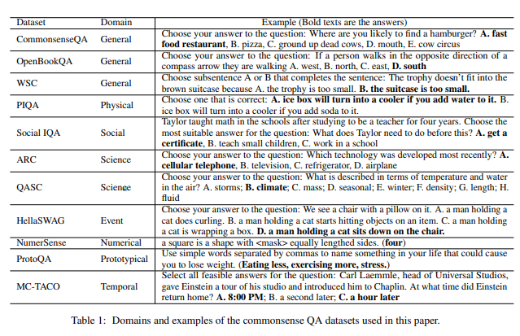
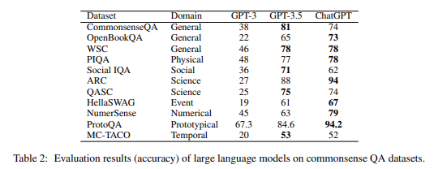
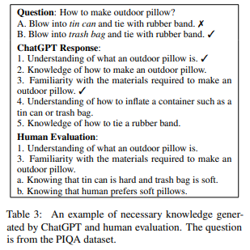
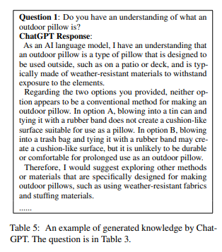
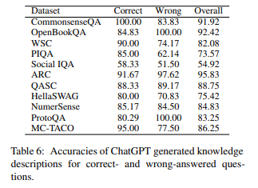
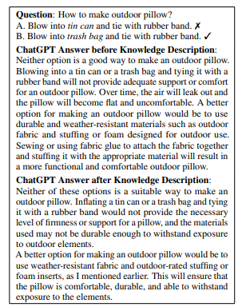
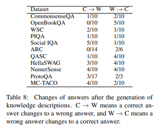

_註：筆者居住於韓國，部分內容包含韓國特有的背景。_

最近，我養成了閒暇時讀論文的習慣。
其中，我在 arxiv 上讀到一篇有趣的論文，所以想整理並分享一下。

論文標題是 `ChatGPT is a Knowledgeable but Inexperienced Solver: An Investigation of Commonsense Problem in Large Language Models` ([Arxiv Link](https://arxiv.org/abs/2303.16421))。

主題是：**大規模語言模型（ChatGPT）能好好解決常識問題嗎？** 這是一個相當有趣的話題，所以我想一邊學習一邊分享，整理一下讀到的內容。

我從未讀過論文，大學的記憶也已模糊，所以先聲明可能會有錯誤！（如有錯誤請告訴我，嘿嘿）

## 1. 摘要

論文提出了以下問題：
1. GPT 能否有效地回答關於常識的問題？
2. GPT 是否對常識了解得很好？
3. GPT 能否好好區分回答某個特定問題所需的常識與不需要的常識？
4. GPT 能否有效地利用給定的常識來回答問題？

簡要回答如下：

1. 可以有效地回答，但在社會規範、因果關係、時間相關的特定領域回答得不太好。
2. 大部分常識都掌握得很好。
3. 無法好好區分回答問題所密切相關（必要）的常識與不相關的常識。
4. 即使在上下文中輸入額外的常識，也無法好好使用。

## 2. 常識的分類

研究人員將常識分為 8 個類別。
分別如下：

**1. 一般（General）常識（廣泛共享的常識）**
- 太陽從東方升起

**2. 物理（Physical）常識（關於物理世界的知識）**
- 玻璃杯掉下來會破。水往下流。

**3. 社會（Social）常識（關於社會規範的知識）**
- 受到幫助應該說「謝謝」。

**4. 科學（Science）常識（科學概念的原理/知識）**
- 重力將所有物體拉向地球中心。

**5. 因果關係（Event）常識（關於因果關係和順序的知識）**
- 打翻水杯 -> 水灑出來

**6. 與數字相關的（Numerical）常識（與數字相關的常識）**
- 人有 2 隻手和 10 根手指

**7. 典型的（Prototypical）常識（關於概念的知識）**
- 燕子是鳥的一種，有翅膀

**8. 與時間相關的（Temporal）常識**
- 海外旅行比散步花的時間更長。

然後，研究人員為每個類別準備了 11 個與常識相關的資料集。

從左到右是資料集名稱 / 類別 / 範例問題。

## 3. ChatGPT 能否有效地回答常識問題？

研究人員從上述每個資料集中各抽取 100 個問題，分別向 GPT3、GPT3.5、ChatGPT 模型提問。

下面是 GPT3、GPT3.5、ChatGPT 對每個問題的正確率。

值得注意的幾點：

* 整體回答得不錯
  * 科學（Science）領域以約 94% 的正確率最高。
  * 社會規範（Social）、因果關係（Event）、時間（Temporal）的正確率較低（低於 70%）
* 整體上，相比 GPT 3.5 模型，調校模型 ChatGPT 的精度更高
  * 在某些問題上 GPT 3.5 的正確率看起來更高，但這更多是 ChatGPT 回答「僅憑給定資料無法得出答案」造成的錯覺。

## 4. ChatGPT 能否好好區分回答問題所需的常識和不需要的常識？

研究人員從上述問題資料集中，每個資料集再抽取了 20 個。

然後，向 GPT 詢問「回答這個問題需要什麼知識」，並基於人類的回答計算 Precision（精確率）、Recall（召回率）、F1 Score。

Precision? Recall? 出現了難懂的詞，所以先整理一下再繼續。

* Precision：GPT 給出的答案的準確度
  * GPT 的回答中正確的占多少 %？
  * 例如 5 個回答中，3 個正確 2 個錯誤，那麼 Precision 是 60%
  
* Recall：全部正確答案中 GPT 找出的正確答案的數量
  * 人預測的正確答案中，GPT 找出了多少個？
  * 例如預測正確答案有 5 個，GPT 在 10 個回答中 4 個正確、6 個錯誤，那麼 Recall 是 80%（4/5）
  * 計算 Recall 時錯誤答案不重要！

* F1 Score：Precision 和 Recall 的調和平均
  * 只用 Precision 作為指標？：只需給出機率最高的答案**僅一個**即可
  * 只用 Recall 作為指標？：寫一萬個答案，其中**總有幾個會矇對**
  * 但我們想要的是「準確地」且「足夠多地」回答的 AI 模型
  * 因此對 Precision 和 Recall 取調和平均就能得到類似「準確度」的指標！
  * 也就是說，F1 Score 高 == 回答得好！

講了這些難懂的內容！結論上得到了如下結果。

- GPT 的 Precision 低但 Recall 高
  - 在整個資料集上，Precision 是 **55.88%**，但 Recall 是 **84.42%**
  - **也就是說，解決問題所需的知識幾乎都能告訴你，但準確度並不高**
- GPT 在科學領域表現相對較好（F1 74~76%），但在社會規範、時間領域表現尤其差（F1 低於 50%）

## 5. ChatGPT 在常識方面博學嗎？

研究人員基於在第 3 節生成的所需知識手動製作了問題提示。然後，手動評估 GPT 生成的回答是否正確。

上面的問題是 ChatGPT 生成的錯誤答案的範例。

GPT 說 `blowing into a trash bag and tying it with a rubber band may create a cushion-like surface, but it is unlikely to be durable or comfortable for prolonged use as an outdoor pillow`（翻譯：往垃圾袋裡吹氣並用橡皮筋綁起來可能形成像墊子一樣的表面，但作為戶外枕頭長時間使用可能不耐用或不舒適），但據說**用垃圾袋做枕頭是常見做法，因此被判定為錯誤答案**。

根據上面的結果表，研究人員得出了以下結果：

- GPT 是博學的，掌握了回答問題所需的大部分常識。
  - 在整個資料集上平均準確度為 82.66%
  - 在大部分資料集上準確度超過 70%。
  - 但是，在社會規範領域準確度僅為 54.92%，效能較低。
- 但是，GPT 的回答中也包含可能引起誤解或過度泛化、不需要的知識
  - 全部回答的 26.25% 包含相關性低且可能引起誤解的資訊。
  - 大約 15% 的解釋過度泛化，不是回答問題所需的具體資訊

## 6. ChatGPT 在響應時能否利用從對話上下文中添加的常識來回答？

為了確認 GPT 能否利用上下文中出現的常識進行回答，研究人員像第 4 節一樣讓 GPT 推斷回答問題所需的常識，然後讓其再次回答同一個問題，確認回答是否得到改善。

上面的範例展示了之前錯誤的答案在生成額外說明後仍然沒有改變的例子。

根據上面的結果表，研究人員得出了以下結果：

- GPT 僅靠將 GPT 生成的常識說明添加到對話上下文中，無法有效地用於回答。
  - 當上下文中添加說明時，正確變錯誤的情況（C->W）和錯誤變正確的情況（W->C）都存在
  - 在 Social IQA 資料集上，由於上下文中添加的常識有誤，正確變錯誤的情況（5 個）反而比錯誤變正確的情況（1 個）更多。
  - 研究人員推測，由於模型中已經生成了知識，僅僅生成額外資訊沒有太大效果。

甚至，即使在對話上下文中添加的不是「GPT 生成的常識」，而是「使用者直接添加正確的常識」，正確率也無法達到 100%。

- 基於人工標註的 CoS-E、ECQA 資料集，將正確答案（Golden Knowledge）添加到對話上下文中。
  - CoS-E 錯誤->正確增加了 4 個
  - ECQA 錯誤->正確增加了 8 個，正確->錯誤增加了 1 個
  - 研究人員推測 GPT 缺乏運用複雜推理（例如否定推理）等能力
    - 否定推理範例
      - Q：籃球破了一個洞但形狀保持原樣，錯誤的是？
      - A：破了一個洞，B：在美國很受歡迎，C：充滿空氣
    - CoS-E 資料集解釋「有洞的物體裡空氣無法停留」，但 GPT 仍然預測 A

// TODO：繼續寫...
