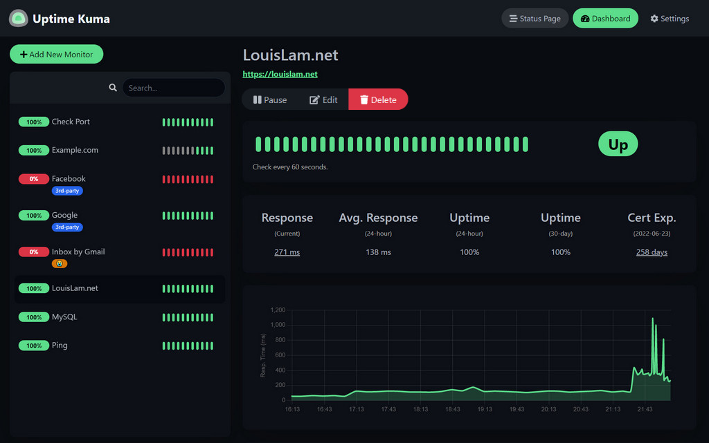
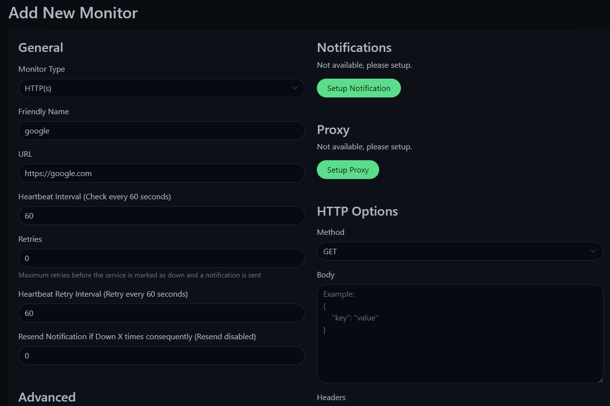
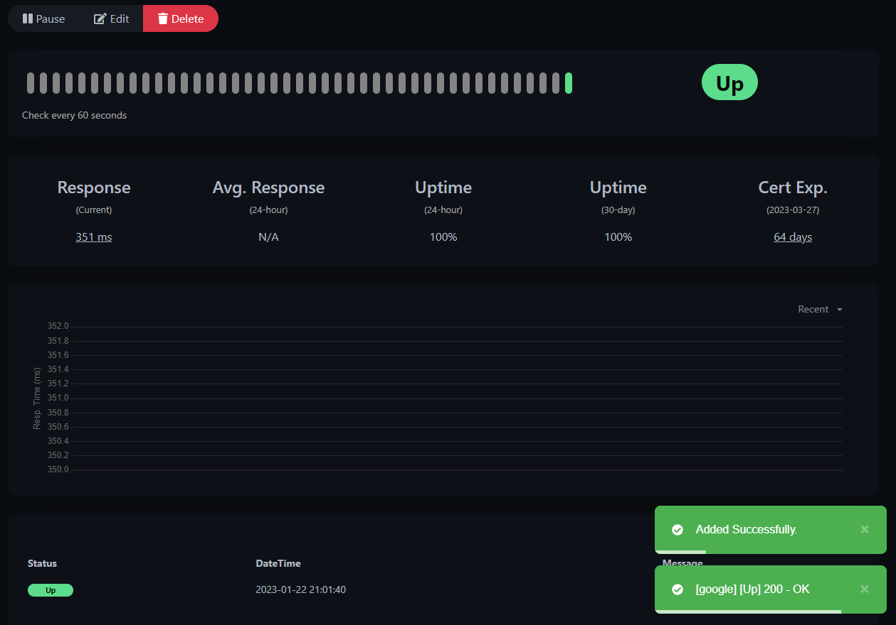
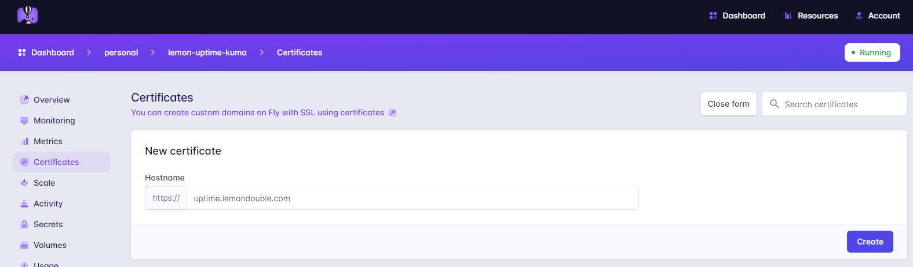

_注：作者居住在韩国，部分内容包含韩国特有的背景。_

这次要介绍的项目是一个名为 Uptime Kuma 的服务，它可以记录服务器的 Uptime。

它可以监控你自己的集群/服务器等，当出现问题时，可以通过 Telegram、Slack、Discord、E-mail 等多种方式通知你服务器宕机了。



它长这个样子！

进入 GitHub 地址 ( [Link](https://github.com/louislam/uptime-kuma) ) 还可以体验 Demo 服务。

关于 Fly.io 的介绍，我在之前的文章 ([Fly.io 介绍及适合部署在 Fly.io 上的服务推荐 (VaultWarden)](/zh-cn/p/fly.io-%EC%86%8C%EA%B0%9C-%EB%B0%8F-fly.io%EC%97%90-%EC%98%AC%EB%A6%AC%EA%B8%B0-%EC%A2%8B%EC%9D%80-%EC%84%9C%EB%B9%84%EC%8A%A4-%EC%B6%94%EC%B2%9C-vaultwarden/)) 里已经讲过很多了，请参考那篇文章，这次的文章只专注于安装方法。

### 1. 创建 fly.toml 文件

* 进入合适的目录，输入 `flyctl launch` 来创建 fly.toml 文件。

### 2. 创建 volume

* 为了保存监控记录、ID/Password 等，需要 Volume。
* 不需要太多的卷空间，我这里创建的是 1GB。

```bash
flyctl volume create uptime_kuma_data --region nrt --size 1
```


### 3. 修改 fly.toml 文件

* 请参考下面的 toml 文件来编写部署文件。
* 

```toml

# 应用名是 flyctl launch 时设置的值。
app = "lemon-uptime-kuma"
kill_signal = "SIGINT"
kill_timeout = 5
processes = []

# 添加 :1 表示 Debian Stable Build。
# https://hub.docker.com/r/louislam/uptime-kuma
[build]
  image = "louislam/uptime-kuma:1"

[env]

# 添加，挂载刚才创建的 Volume。
[mounts]
source="uptime_kuma_data"
destination="/app/data"

[experimental]
  auto_rollback = true

[[services]]
  http_checks = []
  internal_port = 3001 # 修改，默认配置下 Kuma 内部使用 3001 端口。
  processes = ["app"]
  protocol = "tcp"
  script_checks = []
  [services.concurrency]
    hard_limit = 25
    soft_limit = 20
    type = "connections"

  [[services.ports]]
    force_https = true
    handlers = ["http"]
    port = 80

  [[services.ports]]
    handlers = ["tls", "http"]
    port = 443

  [[services.tcp_checks]]
    grace_period = "1s"
    interval = "15s"
    restart_limit = 0
    timeout = "2s"
```

### 4. 部署！

```
flyctl deploy 
```
输入该命令进行部署。

### 5. 连接并设置 ID/Password

通过 `<应用名>.fly.dev` 访问，
如果不清楚地址，可以访问 `https://fly.io/apps`，选择应用并获取地址。

之后设置 ID/Password。


### 6. 添加监控



点击 Add New Monitor，按以下方式设置。

然后按下 Save 按钮..



监控正常运行！

### Appendix 1. TMI

* 支持韩语！可以在 Settings -> Appearance 中设置语言。

### Appendix 2. 使用 Custom Domain

* 我的情况是自己有域名，所以想做 Integration。
* 进入应用页面，获取 IPv6。（IPv4 是 Shared IPv4，所以使用了 IPv6。）

* 进入自己的 DNS 页面，选择 `CNAME` 类型，值填入 `<应用名>.fly.dev`。
* 然后进入 https://fly.io/apps 仪表板，点击 kuma 应用 -> Certificates -> Add Certificate，然后输入设置好的自定义域名。



* 稍等片刻，就可以确认通过自己创建的自定义域名访问了！
