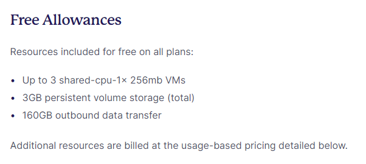
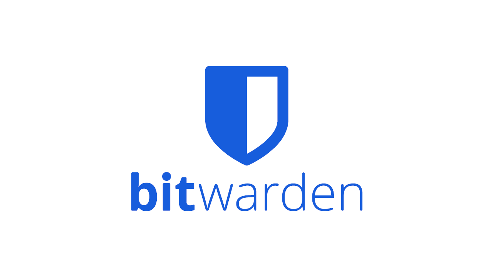
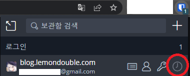
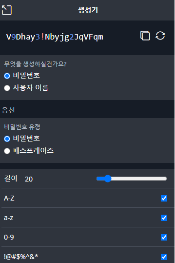
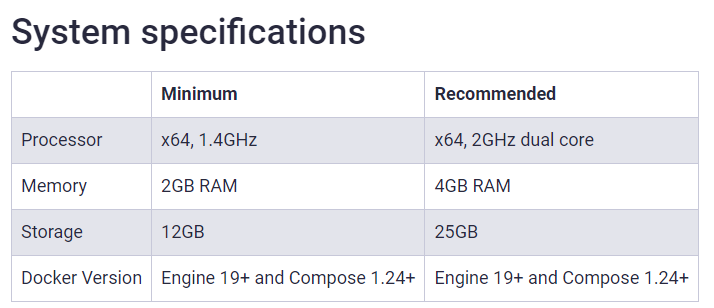
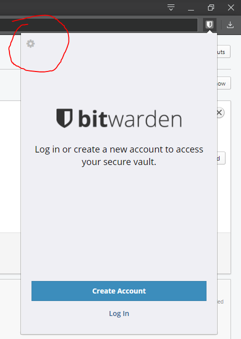
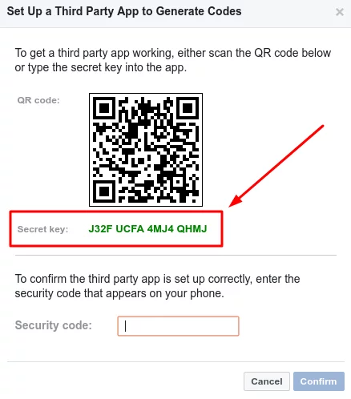
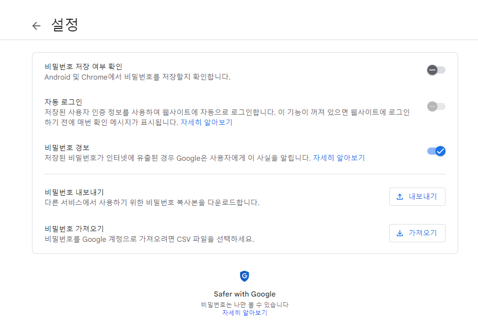
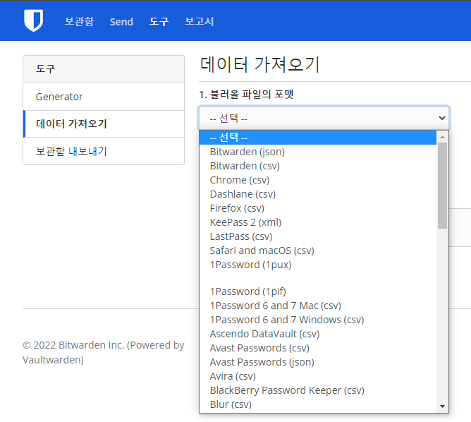

_註：筆者居住於韓國，部分內容包含韓國特有的背景。_

Fly.io 這家公司提供了一項功能：只要準備好 Docker 映像檔，就能輕鬆地把映像檔部署到指定國家等。

（註冊完成後）只要適當地撰寫一個名為 `fly.toml` 的檔案，然後輸入

```bash
flyctl deploy
```

它就會幫你處理好一切，將映像檔上傳到伺服器，並完成 DNS、HTTPS 設定、IP 配發、監控（Grafana）設定等。

而且只要點幾下就能 Scale-up。雖然你也可以自己手動設定，但這些相當繁瑣的工作它都會替你完成，非常方便。

此外，免費方案也提供如下規格。




不過既然是免費方案，規格自然並不寬裕。
因此它適合那種「資料管理很重要、希望使用雲端服務，但又不會消耗太多運算資源」的應用程式。

下面我就來介紹如何安裝一款非常適合此用途的密碼管理器 Vaultwarden。


### VaultWarden（Bitwarden 相容伺服器）



Bitwarden 是一款密碼管理器，能讓你透過網頁瀏覽器、Windows、iOS、Android 應用程式等在多台裝置之間共享密碼。

如果你用過 Chrome，把它想成「Chrome 自動填入」功能就最容易理解。

除此之外，Bitwarden 還支援 OTP 功能，



並提供密碼產生器，



以及透過 Organization（組織）設定共享密碼的功能。

如果你和別人一起開發，需要共享 Slack Webhook URL、環境變數、開發資料庫 ID 與密碼等，這些功能就非常實用。

此外它還提供安全稽核功能，可以檢查被洩漏的資料庫中是否有與你密碼一致的項目、是否存在被重複使用的密碼等，以及透過端對端加密傳送敏感資料的 SEND 功能等。

然而，Bitwarden 雖然是開源的，可以 Self-hosting 密碼伺服器，但若要在生產等級確保高可用性，會需要較高的規格與不少設定。（[Bitwarden Install Docs](https://bitwarden.com/help/install-on-premise-linux/)）




為了解決這個問題，有個名為 [Vaultwarden](https://github.com/dani-garcia/vaultwarden) 的專案，它與 Bitwarden Client 相容，但降低了規格需求，並採用 SQLite 作為資料庫，只靠一個 Docker Image 就能跑起伺服器。


相比官方伺服器需要 2GB RAM，這個伺服器在 Idle 狀態下約只需要 100MB 記憶體，所以利用 Fly.io 部署後就能輕鬆使用！


讓我們按照以下步驟來部署一台 Vaultwarden 伺服器吧。
1. 按照 Fly.io Docs（[Link](https://fly.io/docs/hands-on/install-flyctl/)）中的說明，安裝與你的 OS 相符的 flyctl，並完成登入。
2. 在 Shell 中建立任一資料夾（我使用的是 `~/flyio/vaultwarden` 資料夾），然後進入該資料夾。
3 . 輸入以下命令建立一個名為 `fly.toml` 的設定檔。此時，`app-name` 可以依需求修改。輸入時會出現選擇 Region 的視窗，我選擇了距離最近的 Tokyo(nrt) 區域。

```bash
flyctl launch --name app-name --image vaultwarden/server:latest --no-deploy
```

4. 輸入以下命令，建立一個用來持久化保存資料的 Volume。Volume 你可以把它想成一種 SSD：即使容器掛掉，儲存在其中的檔案也不會消失。app 名稱要與第 3 步中設定的 app 名一致，Region 同樣選擇最近的 Tokyo(nrt) 區域。

```bash
flyctl volumes create vaultwarden_data --size 1 --app app-name
```

5. 使用以下命令建立應用程式啟動時要注入的 Admin Token Secrets。`ADMIN_TOKEN` 你可以把它視為進入管理員頁面所需的密碼。
請使用一組不會外洩的獨立密碼；為了進入 admin 頁面進行初始設定，我們會新增這個 Secrets 值。

```bash
flyctl secrets set ADMIN_TOKEN=abc123456 
```


6. 參考以下檔案，修改資料夾中的 `fly.toml` 檔案。
只需要在原有檔案中修改 `[env]` 區段、`[mounts]` 區段以及 `[[services]]` -> `internal_port` 部分即可。

```yml
app = "app-name"
kill_signal = "SIGINT"
kill_timeout = 5
processes = []

[env]
  ROCKET_PORT = 8080

[experimental]
  allowed_public_ports = []
  auto_rollback = true

[mounts]
  destination = "/data"
  source = "vaultwarden_data"

[[services]]
  http_checks = []
  internal_port = 8080
  processes = ["app"]
  protocol = "tcp"
  script_checks = []
  [services.concurrency]
    hard_limit = 25
    soft_limit = 20
    type = "connections"

  [[services.ports]]
    force_https = true
    handlers = ["http"]
    port = 80

  [[services.ports]]
    handlers = ["tls", "http"]
    port = 443

  [[services.tcp_checks]]
    grace_period = "1s"
    interval = "15s"
    restart_limit = 0
    timeout = "2s"
```


7. 在該資料夾底下執行以下命令以部署應用程式。

```bash
flyctl deploy
```

8. 部署後，輸入以下命令存取網頁。然後點擊「建立帳號」，進行帳號建立與主密碼建立。

```bash
flyctl open
```

9.  (Optional) 之後用以下命令進入管理員頁面，並使用上面建立的 `ADMIN_TOKEN` 登入。若有需要的設定可以進行設定。我自己關閉了新使用者註冊，並關閉了邀請功能。

```bash
flyctl open /admin
```


10. 然後下載 Bitwarden 用戶端，點擊左上角的箭頭，輸入你已部署的應用程式網址。可輸入 `app-name.fly.dev`，或是輸入你剛才訪問過的網頁網址。



恭喜你！ 走到這一步代表設定已經完成！

之後就可以享用一款相當好用的密碼管理器了。

Appendix 1. OTP 要怎麼新增？
在新增 ID/Password 時，於以下的 TOTP 欄中





輸入上面那樣的 Secret Key 即可。

Appendix 2. 我已經在用 Google 密碼了，可以繼續使用嗎？

A. 可以！

從 Google 密碼管理器中匯出密碼後，



進入 Vaultwarden 網頁主控台 -> 登入 -> 工具 -> 匯入資料，就可以繼續使用你之前在 Chrome 中使用的密碼。


