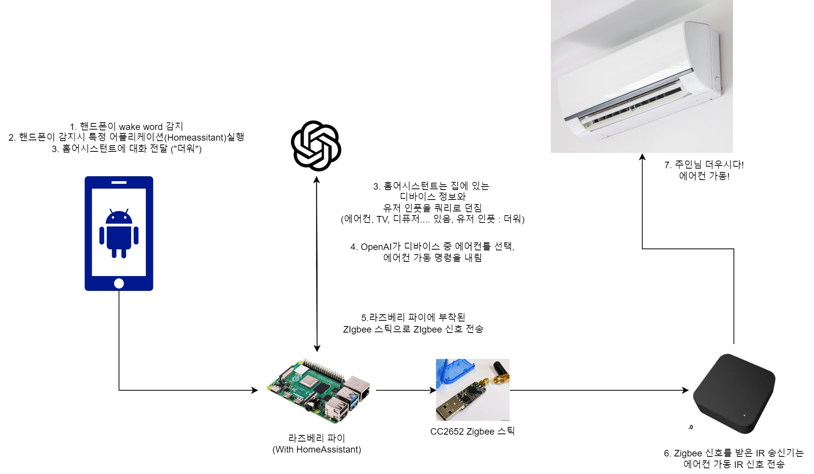

_注：筆者は韓国在住のため、本文には韓国特有の文脈が含まれることがあります。_

## 作ったスマートホームのプレビュー（日本語音声注意）

- [Link](smart-home.mp4)

### 1. HomeAssistantとは？

以前にも[記事を書いたことがある](/ja/p/homeassistant%EB%A1%9C-iot-%ED%95%9C%EB%B2%88-%ED%95%B4-%EB%B3%B4%EC%A7%80-%EC%95%8A%EC%9D%84%EB%9E%98%EC%9A%94/)、HomeAssistantというプラットフォームから始まります。

2023年はHomeAssistantにとって[音声の年](https://www.home-assistant.io/blog/2022/12/20/year-of-voice/)でした。

LLMを筆頭にAIがどんどん高度化し、「これで本当にジャービスが作れるぞ！」と思うようになった年でした。

### 2. それで何が言いたいの？

ただ自慢してみたかっただけです（…）。

### 3. 使用・参考にした情報

[HotWordPlugin](https://play.google.com/store/apps/details?id=nl.jolanrensen.hotwordPluginFree&hl=ko) - AndroidでWake wordを検知

[Tasker](https://play.google.com/store/apps/details?id=net.dinglisch.android.taskerm&hl=ko) - AndroidでHotwordPluginのイベントを検知して特定のアプリを実行

[Whisper](https://openai.com/index/introducing-chatgpt-and-whisper-apis/) - Speech To Textエンジン

[extended_openai_conversation](https://github.com/jekalmin/extended_openai_conversation) - 家にあるデバイス情報を利用し、function calling機能で実際のデバイス状態を操作する関数を呼び出してくれます。

[Bert-VITS2 (TTS)](/ja/p/bert-vits2%EB%A1%9C-%EB%82%98%EB%A7%8C%EC%9D%98-tts-%EB%A7%8C%EB%93%A4%EA%B8%B0/) - キャラクターの声、可愛いでしょう？

[Zigbee2Mqtt](https://www.zigbee2mqtt.io/) - Zigbee信号をMQTT Queueに繋いでくれるオープンソースプロジェクトです。

[SONOFF ZBDongle-P](https://ko.aliexpress.com/item/1005003758328408.html) - ラズベリーパイからZigbee信号を送れるようにするドングルです。

[Tuya IRリモコン](https://ko.aliexpress.com/item/1005006007728129.html) - Zigbeeを受け取ってIR信号を送ってくれます。
