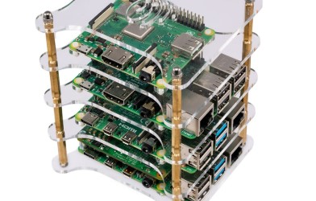
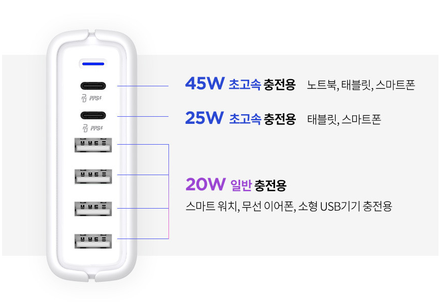
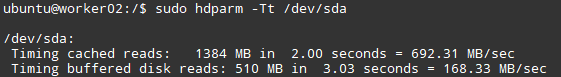
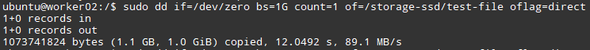

_註：筆者居住於韓國，部分內容包含韓國特有的背景。_

第一節是硬體時間！從簡單的內容到稍微複雜的話題，讓我們快速開始吧！

### 1. SBC (Single Board Computer)

最重要的當然還是SBC吧？

個人推薦在Danggeun Market[^1] 上設定通知，每當有 **Raspberry Pi 4B 4GB 或 8GB** 型號上架時就一個一個地湊齊。

它的參考資料最多，軟體維護和測試都做得很好，二手購買時還能在一定程度上抵消價格上的劣勢。

參考一下，目前合適的價格大約在 **8-10萬韓元** 之間。（2023年12月首爾標準）

需要注意的是，由於Raspberry Pi使用ARM架構，執行一些只支援X86的程式時可能會遇到困難。（典型的例子是自架的 [Sentry](https://sentry.io/)。）

如果經濟條件允許，並且想避免這種情況，**Intel NUC** 或來自AliExpress的 **搭載N100的Mini PC** 也是不錯的選擇。

[^1]: Danggeun Market（당근마켓）是韓國流行的在地化二手交易App。

### 2. 機殼

以Raspberry Pi為標準，我推薦如圖所示的塔式機殼。

可以高效利用空間，價格便宜，而且最重要的是~~理線後很漂亮，心情會變好~~理線和管理都很方便。

不過，基礎購買時附帶的散熱系統比較弱，所以需要額外的散熱。

可以將上圖所示的5V風扇插在叢集節點之一上使用（搜尋「5V風扇 樹莓派」會有很多資料），或者推薦在旁邊放一個手持風扇。

### 3. 電源供應器

以Raspberry Pi 4B型號為標準，每台電腦需要15W (5V 3A) 的電源供應。（[Link](https://www.raspberrypi.com/products/raspberry-pi-4-model-b/)，搜尋 A 15W）

因此，每個Pi需要15W的電力，如果搭建4台的叢集，就需要最大 **60W** 的輸出。

因此，例如並聯連接到上述充電器的USB A型孔（下方4個）時，所需容量大於供給容量，充電器會過載。

市場上提供5V 3A的充電器並不多（大部分是2.1A或2.4A Max），所以除非購買專用充電器，否則會有一定程度的過載。根據經驗，1A左右的差異沒有大問題，但是 **像將4台連接到多孔充電器** 這樣的連接還是要避免。

由於市場上沒有販售在多孔充電器上為多個埠供應5V 3A...甚至5V 2.4A的多孔充電器，所以如果想整理電源供應線，購買SMPS (Switching Mode Power Supply) 這種電源供應器是最安全的方法。這部分內容以後有機會再發文。

總結一下，電源供應方面：

1. 如果使用多孔充電器，要仔細查看總電量，分配線纜使其不至於過度過載（不能因為是6孔充電器，就把6個孔都插滿！）
2. 否則就買幾個2.1A的單孔充電器分別插上

大致可以這樣整理。

### 4. SSD與USB UASP (USB Attached SCSI Protocol)

Raspberry Pi沒有單獨的Sata線或NVME插槽，所以透過USB連接SSD。

此時，使用 **SATA3** 的SSD的傳輸速度最大為 **6Gbps**，**USB 3.0** 的傳輸速度最大為 **5Gbps**。（當然，這是理論速度，實際上要比這低得多。）

但是，如果USB 3.0不支援UASP功能，USB 3.0會以低效的方式收發資料（詳細說明會很長，所以省略...），需要使用支援UASP (USB Attached SCSI Protocol) 協定的線纜/連接器，才能無損耗地使用全部吞吐量。

但是幾千韓元的便宜線纜不支援這個UASP協定，所以購買前需要確認是否支援UASP協定。

我使用的是 `Saerotec FHD-260U3`（非廣告），據說AliExpress的 `Ugreen` 公司的線纜也評價不錯。

以下是我的測試結果。

- 推薦一起閱讀: [UASP makes Raspberry Pi 4 disk IO 50% faster](https://www.jeffgeerling.com/blog/2020/uasp-makes-raspberry-pi-4-disk-io-50-faster)

至於SSD，趁有合適的特價時隨便撿一個使用SATA3的SSD就行。

### 5. 網路設備

網路配置以後在系統搭建時還有很多機會聊到，所以這裡只簡單說明設備。

交換器方面，我用的是 `ipTIME H6008-IGMP`，只要是支援1Gbps以上的交換器，買什麼都沒關係。

同樣，網路線也只要Cat5e以上（一般買的都是Cat5e以上）就沒問題。

### 結語

第1篇簡單介紹了搭建穩定叢集所需的硬體。

如果有錯誤或需要修改的地方，歡迎告知，非常感謝！
