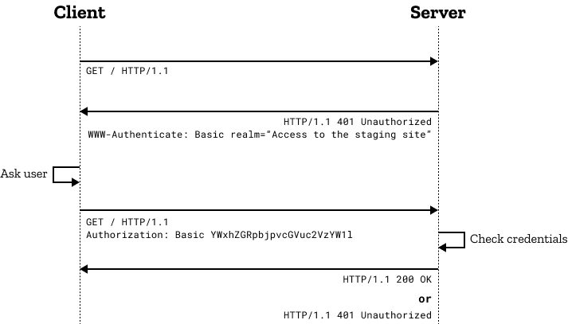

_注：筆者は韓国在住のため、本文には韓国特有の文脈が含まれることがあります。_

**以下の内容は、Sealed Secretsの[セクション3](https://lemondouble.github.io/ja/p/%EC%A7%91%EC%97%90%EC%84%9C-%EB%9D%BC%EC%A6%88%EB%B2%A0%EB%A6%AC-%ED%8C%8C%EC%9D%B4-%ED%81%B4%EB%9F%AC%EC%8A%A4%ED%84%B0%EB%A1%9C-%EB%8D%B0%EC%9D%B4%ED%84%B0%EC%84%BC%ED%84%B0-%EC%B0%A8%EB%A6%AC%EA%B8%B0-7.-sealed-secrets%EB%A5%BC-%ED%86%B5%ED%95%9C-%EB%B9%84%EB%B0%80-%EA%B4%80%EB%A6%AC--traefik-basic-auth-%EC%84%A4%EC%A0%95/#3-sealed-secrets-%EC%9D%B4%EC%9A%A9%ED%95%98%EC%97%AC-basic-auth-%EB%93%B1%EB%A1%9D%ED%95%B4%EB%B3%B4%EA%B8%B0)と重なる部分が多いです。すでにそのセクションを進めており、Basic Authについてよくご存じであればスキップしても構いません。**

### 1. はじめに

Kubernetesを触っていると、いろいろなサービスを多く立ち上げることになります。

もちろん、内部ネットワークだけでサービスするのがセキュリティ上は最も安全ですが、クラスタ管理を常に内部ネットワークから行えるとは限りません。たとえば、出先で急にトラブルが発生する場合などもあるでしょう。

このような場合の解決方法は2つあります。

1. VPNを使い、別のコンピュータから内部ネットワークに接続して関連サービスを使用する
2. インターネットにサービスを公開し、認証メカニズムを追加して使用する

私の場合は2番を選び、個人的にSSOサーバを構築して使用しています。

しかし、SSOシステムは構築プロセスが大規模なので、まずは最も簡単な認証メカニズムから進めてみたいと思います。

### 2. Basic Authの流れ



Basic Authはとてもシンプルです！

1. クライアントがサーバにページをリクエストします。
2. サーバはリクエストを受け取り、認証情報がなければ401レスポンスとともに認証方法（Basic Auth）を要求します。
3. クライアントはレスポンスを受け取り、Basic Authを進めます。
    - このとき、HTTP Authorizationヘッダーに`Basic ${認証トークン}`の値を入れて送ります。
    - 認証トークンはBase64Encode("userId:password")です。
    - たとえばidがlemondouble、パスワードが1q2w3e4r!なら、`"lemondouble:1q2w3e4r!"`をbase64エンコードした`bGVtb25kb3VibGU6MXEydzNlNHIh`を使用します。
4. サーバはこのトークンを確認した後、正常なレスポンスを返します。

### 3. Basic Authのメリット・デメリット

メリット：

1. ビルトインです！ ほとんどのブラウザで特別な設定なしでサポートされています。
2. 実装が簡単です。 ほとんどのWebフレームワークで標準サポートされています！

デメリット：

1. セキュリティが弱い：最大のデメリットです。
   - パスワードがbase64エンコード（=平文）でリクエストごとに送信されます。
     - HTTPSプロトコルを使えば問題ありませんが、HTTPプロトコルを使うとリクエストごとに平文でパスワードが送信されます！
   - ブルートフォース攻撃などへの防御がない。
     - これはId/Passwordの問題でもありますが、Traefikのデフォルト設定では、一定回数以上失敗したクライアントをドロップするといった機能はありません。
     - Id/Passwordが弱いと、悪意ある攻撃者がブルートフォース攻撃でサービスにアクセスできる可能性があります。

したがって、可能であればこの機能は

1. アクセスされても特に問題ないサービス、または一部のユーザーにだけ共有したいサービスを対象に
2. HTTPSプロトコルを使用して
3. 十分に長いパスワードを使用すること

をおすすめします！

### 4. Basic Authの設定方法

- ここではSealed Secretsを使い、接続情報（Id/Password）を暗号化してGitに保存する方式を採用します。
- このようにする理由は次のとおりです。
  - 不測の事故が起こったときに、接続情報を含めて迅速にクラスタを復旧するため（Secrets情報もGitにあるので、デプロイするだけで済む）
  - いくらPrivate Repoを使っているとしても、ふとしたミスでId/Passwordが露出するのを防ぐため

Disclaimer：以下の内容はSealed Secretsの[セクション3](https://lemondouble.github.io/ja/p/%EC%A7%91%EC%97%90%EC%84%9C-%EB%9D%BC%EC%A6%88%EB%B2%A0%EB%A6%AC-%ED%8C%8C%EC%9D%B4-%ED%81%B4%EB%9F%AC%EC%8A%A4%ED%84%B0%EB%A1%9C-%EB%8D%B0%EC%9D%B4%ED%84%B0%EC%84%BC%ED%84%B0-%EC%B0%A8%EB%A6%AC%EA%B8%B0-7.-sealed-secrets%EB%A5%BC-%ED%86%B5%ED%95%9C-%EB%B9%84%EB%B0%80-%EA%B4%80%EB%A6%AC--traefik-basic-auth-%EC%84%A4%EC%A0%95/#3-sealed-secrets-%EC%9D%B4%EC%9A%A9%ED%95%98%EC%97%AC-basic-auth-%EB%93%B1%EB%A1%9D%ED%95%B4%EB%B3%B4%EA%B8%B0)と同じです！

Longhorn Dashboardを外部からアクセスできるように設定しながら、Basic Authの設定方法を学んでいきましょう。

1. `apt install apache2-utils`を実行して、htpasswdコマンドを使えるようにします。
2. `htpasswd -nb <id> <password> | openssl base64`を使い、id・passwordが入ったSecret Stringを取得します。
3. 任意のテキストエディタでsecret.yamlを作成し、以下を参考にSecretを追加します。

```yaml
apiVersion: v1
kind: Secret
metadata:
  name: longhorn-system-basic-auth
  namespace: longhorn-system
data:
  users: <2で得たString>
```

4. `cat secret.yaml | kubeseal --controller-namespace=sealed-secrets-system --controller-name=sealed-secrets -oyaml > sealed-secrets.yaml`を実行して、sealed-secrets.yamlを取得します。
5. 以下を参考にingressを登録します。

`modules/longhorn-system/ingress.yaml`

```yaml
apiVersion: traefik.containo.us/v1alpha1
kind: IngressRoute
metadata:
  name: longhorn-dashboard
  namespace: longhorn-system
spec:
  tls:
    certResolver: le
  routes:
    - kind: Rule
      match: Host(`<希望のsubdomain、例：longhorn.lemon.com>`)
      middlewares:
        - name: basic-auth
          namespace: longhorn-system
      services:
        - name: longhorn-frontend
          port: 80
---
apiVersion: traefik.containo.us/v1alpha1
kind: Middleware
metadata:
  name: basic-auth
  namespace: longhorn-system
spec:
  basicAuth:
    secret: longhorn-system-basic-auth
```

`modules/longhorn-system/sealed-basic-auth-secret.yaml`には、先ほど生成したsealed-secrets.yamlをコピー＆ペーストしましょう。

```yaml
apiVersion: bitnami.com/v1alpha1
kind: SealedSecret
metadata:
  creationTimestamp: null
  name: longhorn-system-basic-auth
  namespace: longhorn-system
spec:
  encryptedData:
    users: adfasdflavasdlfj...
  template:
    metadata:
      creationTimestamp: null
      name: longhorn-system-basic-auth
      namespace: longhorn-system
```

6. その後、デプロイを行います。
7. アクセスすると、正常にid/password確認画面が表示され、ログインしないとそのページが見られません！

### 5. おわりに

Basic Authは、私の初期のクラスタ管理方法でした。

外部に公開されるサービスがそれほど多くなければ、Basic Authを設定し[Bitwarden](https://lemondouble.github.io/ja/p/fly.io-%EC%86%8C%EA%B0%9C-%EB%B0%8F-fly.io%EC%97%90-%EC%98%AC%EB%A6%AC%EA%B8%B0-%EC%A2%8B%EC%9D%80-%EC%84%9C%EB%B9%84%EC%8A%A4-%EC%B6%94%EC%B2%9C-vaultwarden/)などのパスワードマネージャで管理するだけでも十分だと感じました。

しかし、後ほどプロジェクトがさらに増えたら？

そのケースに対応するためのSSO認証方法を、次のポストでアップしようと思います。

ただし、認証サーバはDIYで作っており、全ソースコードを提供するのは難しそうなので、ひとまず使えるBasic Authから先に説明することをご了承ください 🙇
