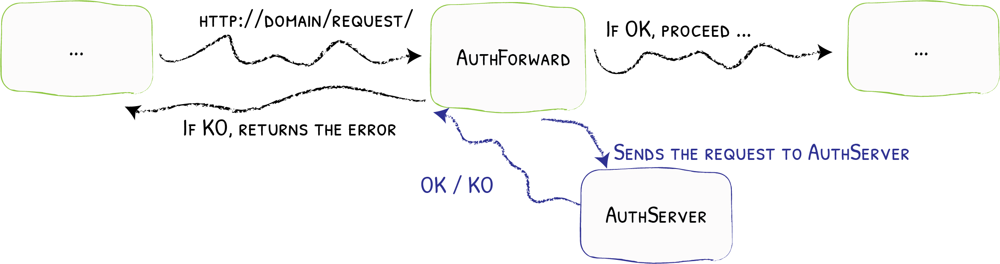
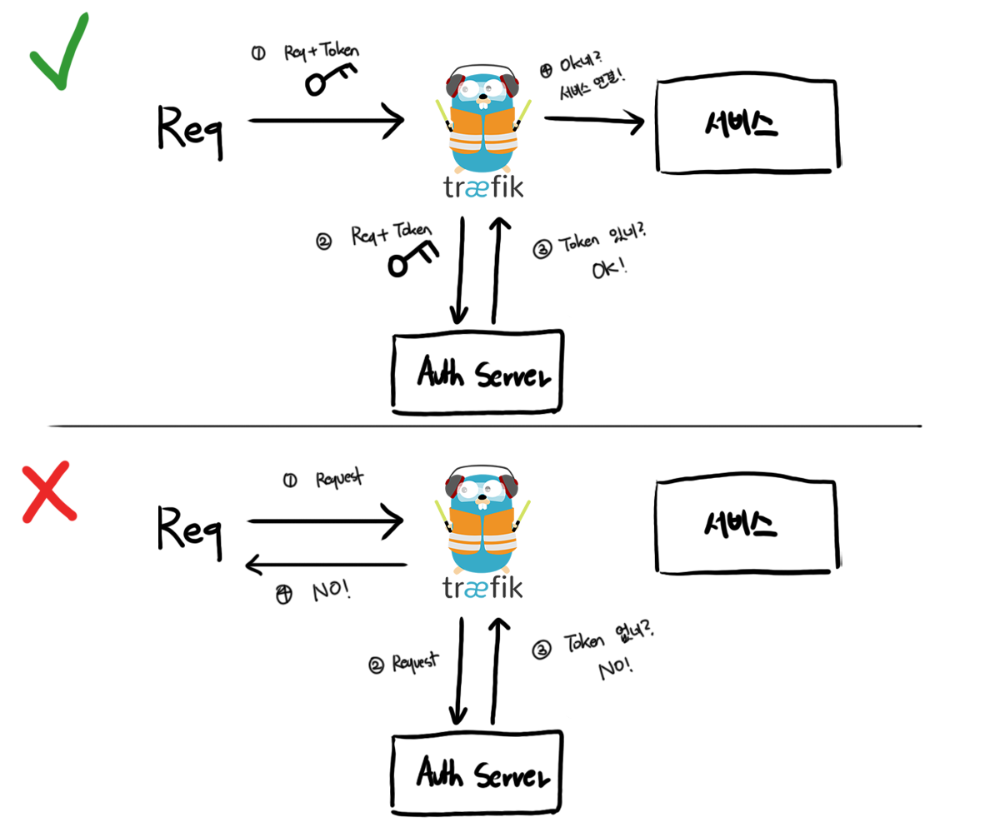
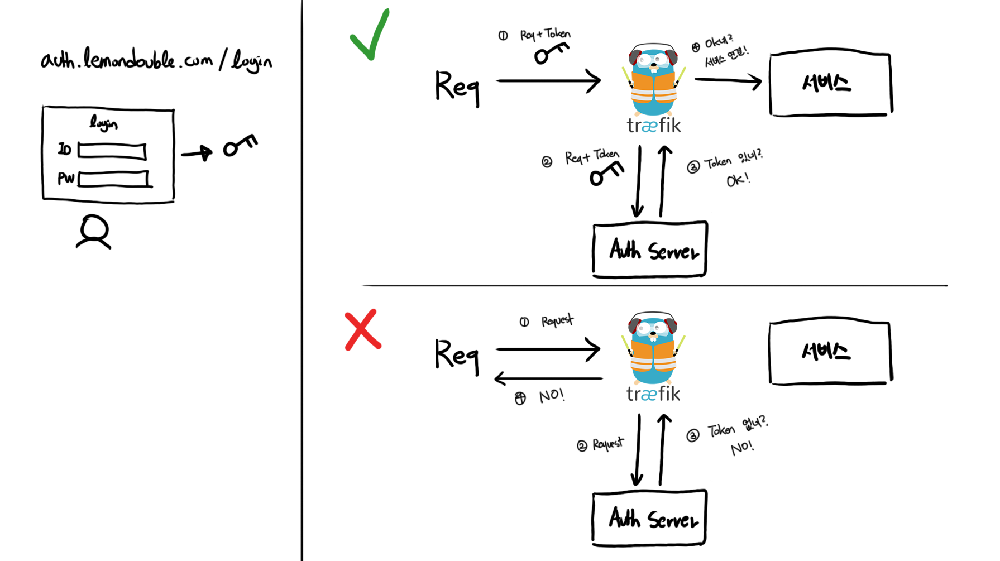
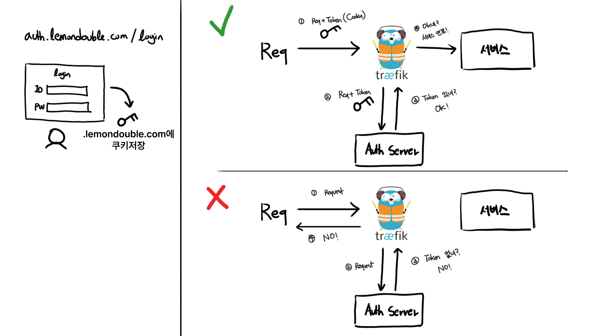
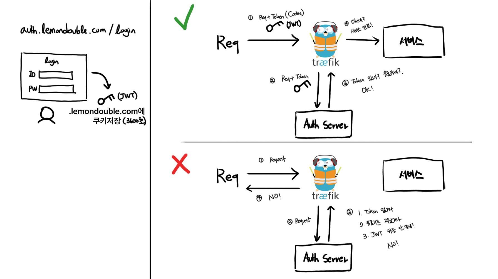
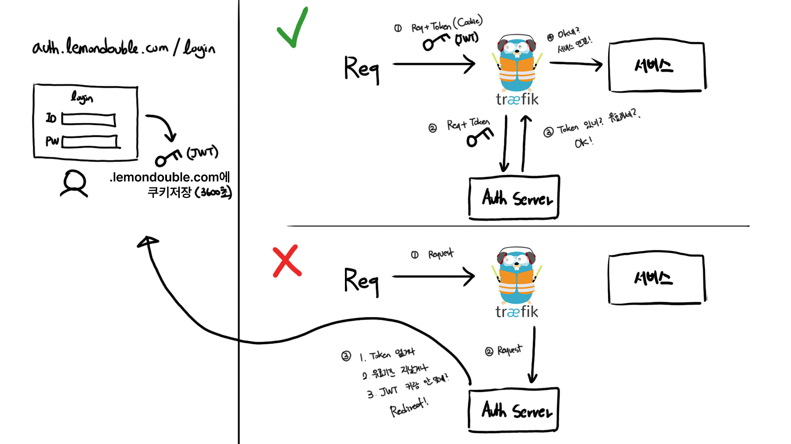
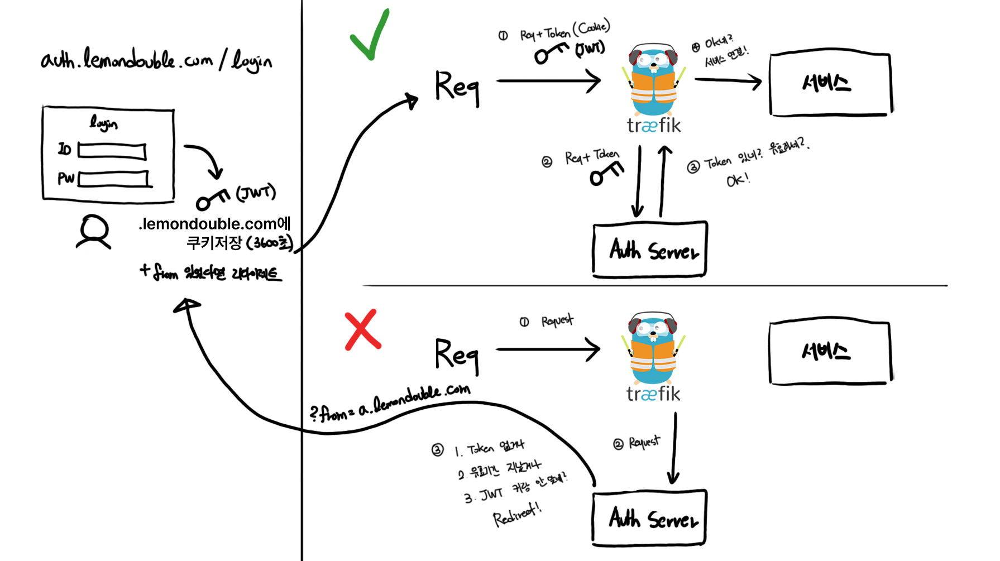
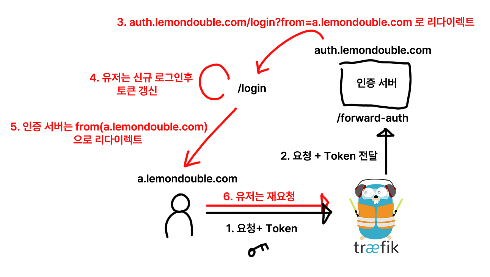
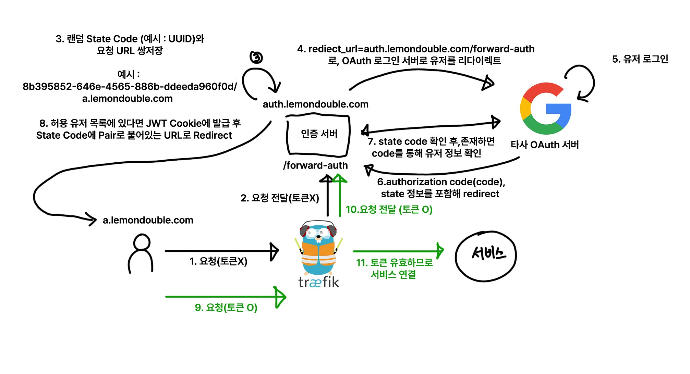

_注：筆者は韓国在住のため、本文には韓国特有の文脈が含まれることがあります。_

### 1. Forward Auth?

認証ロジックが必要なとき、私たちはどこで認証ロジックを実装できるでしょうか？

すぐに思いつくのは、アプリケーションで直接実装する方法でしょう。

しかし、アプリケーションが多くなったらどうでしょうか？あるいは、一部のアプリケーションは自分が作ったものではなく、他の人が作ったものなので、自由に認証ロジックを実装できないとしたらどうでしょう？

私たちはKubernetesを使っており、すべてのリクエストはTraefikを一度経由します。

ですから、Traefikが`「リクエストを転送する前」`に認証ロジックを処理してはどうでしょうか？



**シンプルです！**

1. すべてのリクエストはTraefikを通過します。
2. Forward Authが設定されていれば、外部認証サービスにリクエストを送ります。
3. 外部認証サービスは次のような処理を行います。
   - 有効なリクエストであれば、2XX系のOKコードを返します。この場合、正常に処理が続きます。
   - 有効でないリクエストであれば、認証サーバーのレスポンスをそのまま返します。（エラーを返す）

では、これをどのように使えるでしょうか？

### 2. OAuth2とCookie、Forward Auth

#### 2-1. 最もシンプルなForward Authサーバー

最初からゆっくり考えてみましょう。

まず、最もシンプルなForward Authサーバーを考えてみます。

あるリクエストにはOK、別のリクエストにはNOを返すには、どうすれば良いでしょうか？

そうです！Basic Authの時に見たように、各リクエストに認証情報を一緒に送り、その認証情報が有効であれば通過させれば良いのです。

図にしてみると、最もシンプルな例は次のようになります。



#### 2-2. 認証トークンはどこに保存する？

良いですね！

ひとまず、最もシンプルなForward Auth Serverを考えてみました。次は、「では、トークンはいつ、どこで受け取るのか？」という質問が残ります。

シンプルな方法としては、ログインページを一つ作って、ログインに成功したらTokenを発行する方法がありそうです。

図に描いてみます。



あれ？でも`auth.lemondouble.com`でログインしたら、トークンをどうやって共有すれば良いでしょうか？どこにトークンを保存すれば良いでしょう？

しかも、a.lemondouble.com、b.lemondouble.comのような他のサイトでもそのトークンを使ってログインを維持しなければなりません。

（実際わりとよくある話ですが）a.lemondouble.comで既にSSOログインしたのに、b.lemondouble.comでまたログインさせられたら、（ユーザー情報が共有されていても）非常に面倒なことになります！

これを解決するために、私たちはCookieにトークンを入れる予定です。

例えば、`.lemondouble.com`にCookieを設定すると、そのCookieはすべてのサブドメイン、つまり`a.lemondouble.com`、`auth.lemondouble.com`、`'b.lemondouble.com'`にアクセスする際に自動的に一緒に送信されるという点を利用するのです。

```javascript
res.cookie('forward-auth-token', token, {
    domain: '.lemondouble.com',        //subdomain까지 공유하려면 앞에 "."을 붙여줘야함!
});
```

そうすると、多くのことがシンプルになります！整理しましょう。

1. Forward Authはトークンがあれば許可、なければ拒否します。
2. ログインページを作って、ログインページはログイン成功時に`.lemondouble.com`にCookieを設定するようにします。

ここまで整理すると次のような図になります。



#### 2-3. JWTトークンの利用と有効期限設定、検証

さて！ところでトークンの中にはどんな値を入れたら良いでしょうか？

この場合、JWTが適切と思われます。Statelessで、改ざんが非常に困難なトークンこそ、このユースケースに非常に適していそうです。

中身は…ユーザーIDかメールアドレスくらいが良さそうですね。

ところでトークンを一度発行したら、千年万年使って良いのでしょうか…？それだとトークンが一度盗まれたら、千年万年サーバーが乗っ取られることになります…？したがって、トークンの有効期間設定が必要そうです。セキュリティと利便性のバランスを取れば良いのですが、便宜上3600秒（1時間）を使うとしましょう。

すると

1. JWTのExp（Expired Time）を現在時刻 + 3600秒として、ログインサーバーで発行する必要がありそうです。便宜上、Cookieの保持時間も3600秒に統一すると良さそうです。
2. Forward Authでは以前はトークンがあれば無条件で通過させていましたが、JWT検証および有効期限切れトークンの場合は値が有効でも拒否するロジックを追加する必要がありそうです。

図でもう一度描いてみます。



#### 2-4. リダイレクト処理

ところで、もしトークンが有効でない、あるいはトークンがない場合、ただエラーページだけを表示すれば良いのでしょうか？

もちろん…一人で使う分には問題ないかもしれませんが…毎回非常に面倒でしょう。認証失敗したら自動的にログインページにリダイレクトされる方が便利そうです。

すぐに追加してみましょう。



ところで普通、SSO成功したら元のサイトに戻りますよね？それも一度追加してみましょう。

クエリパラメータやヘッダーなどで「もともとどこから来たのか」を覚えておき、ログインに成功したら元の場所を覚えていてログインサーバーがリダイレクト処理をすれば良さそうです。



ああ…OAuthはまだ話も出ていないのに、すでに複雑ですね。とりあえずもう一回やってみましょう…

統合認証がID/Passwordログインなら、ここで完成です。少し混乱しやすいので整理しておくと、ログインサーバーとTraefikのForward Authサーバーは同一でも問題ありません。

わざわざ図まで描いてこれを書き直す理由は、Forward Auth認証サーバーとログインサーバーを分離する必要がないからです！



#### 2-5. OAuthスタート！

まずスペックを決めて行きましょう。

私たちが作るスペックは次の通りです。

1. もしあるサービスにアクセスして、OAuth SSOが必要であれば、すぐに該当Social Providerのログインページに移動します。（つまり、私たちはログインページを作りません！）
2. ログインに成功すれば、もともとアクセスしようとしたサービスにリダイレクトされます！

そしてClient ID登録などの基本内容は省略します。これを一つひとつ説明していたら本一冊分になりそうなので…もしOAuth 2.0プロトコルについてよく分からないという方は、生活コーディングの[Web2 - OAuth 2.0](https://opentutorials.org/course/3405)講座をおすすめします。[^1]（無料です！）

#### 2-6. OAuth全体フロー

私が…本当にこれを分かりやすく説明しようと努力してみたのですが…正直、答えが出なくて…

全体フローをお見せします。



核心アイデアはState Codeを利用することです！

- OAuth認証サーバーにリクエストを送るとき、任意の文字列を生成して一緒に（?state=任意の文字列）送ると、その後ユーザーがログイン成功して戻ってくるときにその文字列を一緒に送ってくれるという仕様がOAuth 2.0標準にあります。（必須パラメータではないので、OAuth連携をしながら見たことがないかもしれません！）
- これを利用してユーザーが「どこから来たのか」をデータベースに記録し、ログイン成功後にそのURLにリダイレクトさせるアイデアを採用します。

全体フローは上の図を参考にしてください。では私たちの認証サーバーは何を実装すべきでしょうか？

エンドポイントを一つだけ実装するのですが、次を実装してください。（上から順番に処理する必要があります。処理順序が重要です！）

1. クエリパラメータにcodeとstateがある場合、State CodeがDBに保存された値と一致するか確認します。もしDBに該当State Codeが存在するなら、サードパーティのOAuth Serverと通信してAuthorization Codeをユーザー情報に変換します。変換したユーザー情報があらかじめ登録された権限リストにあるか確認し、もしなければエラーを返します。もし権限リストにあるなら、ログイン用の新規JWTを生成後、Cookieに`.yourdomain.com`として保存します。このとき、セキュリティのためsecure、httpOnly設定をオンにすると良いでしょう。またsameSiteオプションは`'Lax'`に設定します。その後、State CodeとペアになっているURIへユーザーをRedirectさせます。

2. CookieにJWTトークンがある場合、JWT検証後、正常なJWTなら200を返します。


3. もしCookieにJWTトークンが全くないか、有効期限切れのCookieであれば、有効期限切れのCookieを削除し、State Codeに`X-Forwarded-Host`ヘッダーと`X-Forwarded-Uri`をパースして現在のURIを抽出します。その後、新規State Codeと該当URIペアをDBに保存し、現在のAPIをRedirect URLとして設定し、State Codeと共に送信します。

- TIP：ユーザーがリクエストしたURI：`https://" + GetHeader("X-Forwarded-Host") + GetHeader("X-Forwarded-Uri")`

#### 2-7. 追加設定

最後に…Traefik設定に次の2行を追加します。

```
- "--entryPoints.web.forwardedHeaders.insecure"
- "--entryPoints.websecure.forwardedHeaders.insecure"
```

この行がないと、X-forwarded-forヘッダーが渡ってきません！

私のブログ記事（[4. Traefik HTTPS認証およびArgoCD設定](/ja/p/%EC%A7%91%EC%97%90%EC%84%9C-%EB%9D%BC%EC%A6%88%EB%B2%A0%EB%A6%AC-%ED%8C%8C%EC%9D%B4-%ED%81%B4%EB%9F%AC%EC%8A%A4%ED%84%B0%EB%A1%9C-%EB%8D%B0%EC%9D%B4%ED%84%B0%EC%84%BC%ED%84%B0-%EC%B0%A8%EB%A6%AC%EA%B8%B0-4.-traefik-https-%EC%9D%B8%EC%A6%9D-%EB%B0%8F-argocd-%EC%84%A4%EC%A0%95/)）を参考にされたなら、次のように設定すれば良いです。

```yaml
# https://traefik.io/blog/https-on-kubernetes-using-traefik-proxy/
apiVersion: helm.cattle.io/v1
kind: HelmChartConfig
metadata:
  name: traefik
  namespace: kube-system
spec:
  valuesContent: |-
    ports:
      web:
        redirectTo:
          port: websecure
          priority: 10
    additionalArguments:
      - "--log.level=INFO"
      - "--certificatesresolvers.le.acme.email=yourMail@gmail.com"
      - "--certificatesresolvers.le.acme.storage=/data/acme.json"
      - "--certificatesresolvers.le.acme.tlschallenge=true"
      - "--certificatesresolvers.le.acme.caServer=https://acme-v02.api.letsencrypt.org/directory"
      - "--entryPoints.web.forwardedHeaders.insecure"
      - "--entryPoints.websecure.forwardedHeaders.insecure"
```

その後kubectl applyを実行して、Forward Auth設定を仕上げましょう！

### おわりに

実は内容があまりにも膨大で…できるだけ分かりやすく書こうと努力したのですが、ちゃんと伝わったかは自信がありません。後ほど記事を一度修正する必要があるかもしれません。

それでも、もしものために、参考にして構築される方は理解できない部分があれば下のコメントや、contact@lemondouble.comまで気軽にご連絡ください！トラブルシューティングまで一緒にお手伝いします。

ああ、そしてもしGolangができる方であれば、[traefik-forward-auth](https://github.com/thomseddon/traefik-forward-auth)を参考にされても良いです。

[^1]: 生活コーディング（생활코딩）は韓国の人気オンライン学習プラットフォームで、主に韓国語で無料のプログラミング講座を提供しています。
