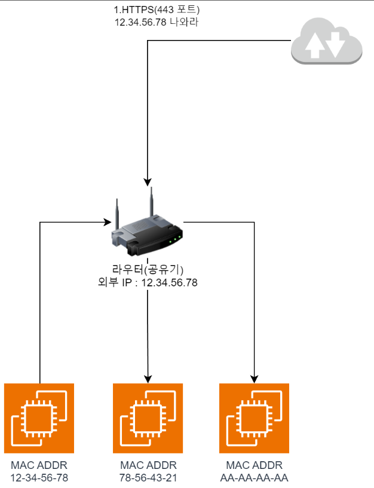
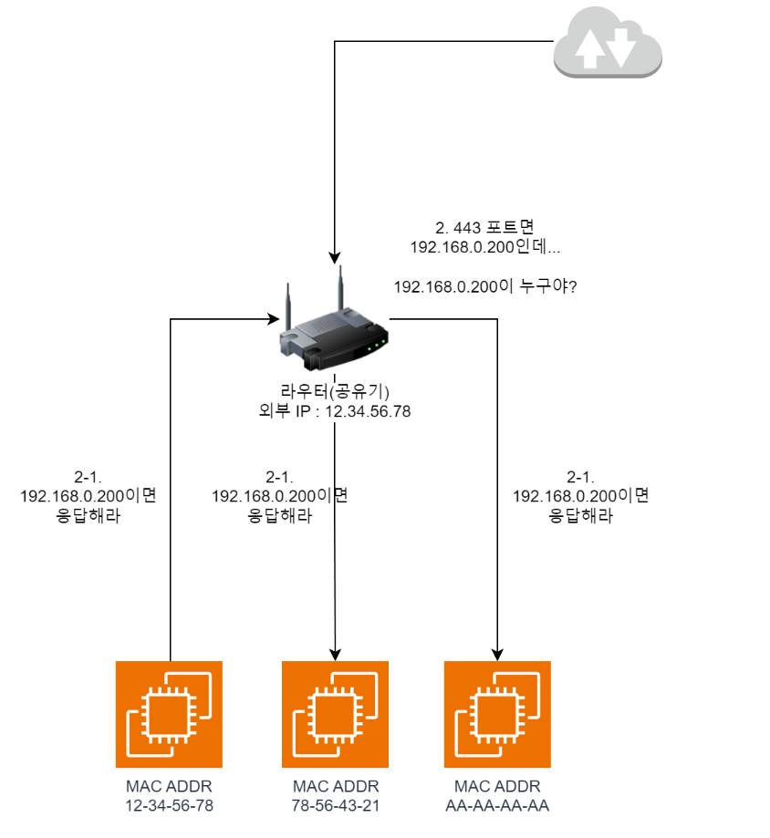
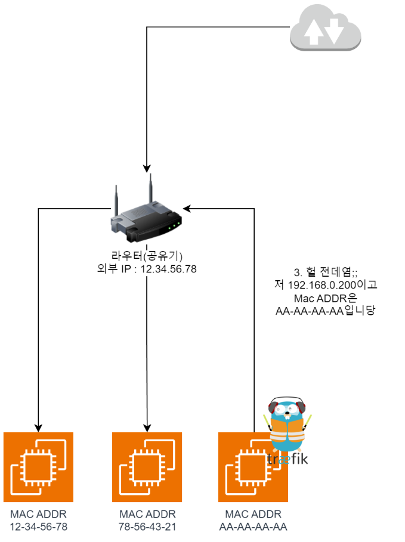
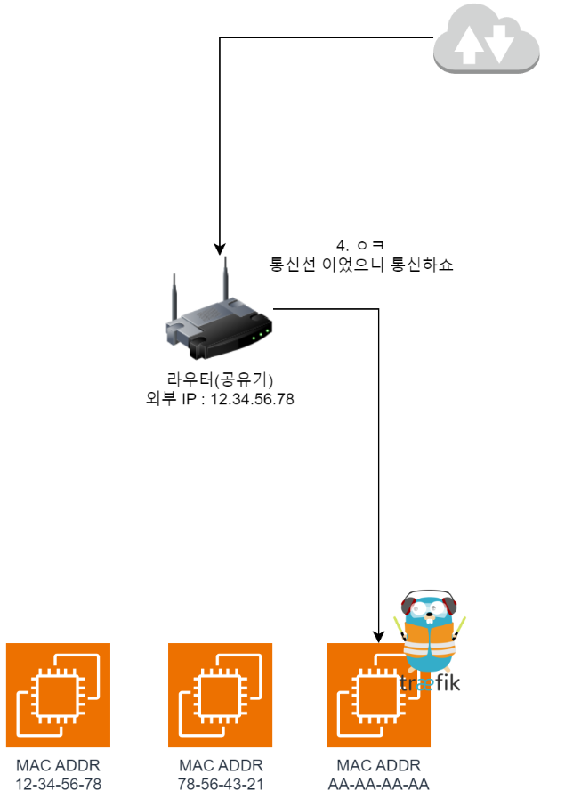

_注：筆者は韓国在住のため、本文には韓国特有の文脈が含まれることがあります。_

### Helmのインストール

- 参考記事：[Installing Helm](https://helm.sh/docs/intro/install/)

次のコマンドを順番に入力してHelmをインストールします。

```sh
curl -fsSL -o get_helm.sh https://raw.githubusercontent.com/helm/helm/main/scripts/get-helm-3
chmod 700 get_helm.sh
./get_helm.sh
```

その後、kubeconfigファイルを設定します。

```sh
cp /etc/rancher/k3s/k3s.yaml ~/.kube/config
chmod 600 ~/.kube/config
```

続いて、bashrc の一番下に次の一行を追加し、`source ~/.bashrc` でシェル設定を即時に反映させます。
```sh
export KUBECONFIG=~/.kube/config
```


Helm は Kubernetes のパッケージマネージャに似た役割を果たします。

例えば、Kafka をクラスタモードでインストールしたいとしましょう。

私が手作業で Kafka を Kubernetes 上に立ち上げようとすると、Kafka のコンテナイメージを取ってきて、クラスタオプションを有効化し、内部ネットワークの接続を行い…といった作業を全部やる必要があります。

また、Kafka のバージョンアップグレードを想像してみてください。

自分で書いた Kafka クラスタの YAML ファイルでコンテナイメージのバージョンを上げて…もしクラスタインストール時に他のリソースを使っていたなら互換性があるか確認して…などなど、複雑な作業が待ち構えていることでしょう。

でも、もし誰かがこの作業を事前にやってくれていたら？

それを `Helm Chart` と呼び、私たちは `helm install kafka` と入力するだけで、ネットワークやクラスタ設定が完了済みの Kafka クラスタを得ることができます。

ところが、もし全員が同じ Helm Chart を使うなら、実験用に Kafka コンテナを1台だけ立てたい私たちのような(?)人と、Kafka 数百台でクラスタを構成しなければならない大企業が、お互い同じ設定を使わざるを得なくなってしまいます。

このような場合に備えて、Helm と Chart は `Values.yaml` という追加の設定ファイルを提供します。

つまり、もし私がコンテナを1台だけ必要とする場合、チャートの `values.yaml` をきちんと読んで `kafka.container-count : 1` のように設定すれば、その変数が注入されることで、Helm Chart を必要な設定を加えて柔軟に使えるようになる、という仕組みです。（まるでサーバーの環境変数のように！）

### MetalLB のインストール

- 参考記事：[Installation With Helm](https://metallb.universe.tf/installation/)

それでは Helm を使ってロードバランサーである MetalLB をインストールしてみましょう！

次のコマンドを順番に入力します。特に断りがない限り、すべてのコマンドは `Control Node` で入力します。

```sh
helm repo add metallb https://metallb.github.io/metallb
helm upgrade --install metallb metallb/metallb --create-namespace --namespace metallb-system --wait
```

その後、`ip-address-pool.yaml` というファイルを1つ作成し、次のように記述して `kubectl apply -f ip-address-pool.yaml` で適用します。

下記は、ロードバランサーなどの IP が必要なサービスに 192.168.0.200〜192.168.0.250 の IP を割り当てるという意味です。

```yaml
apiVersion: metallb.io/v1beta1
kind: IPAddressPool
metadata:
  name: ipaddresspool
  namespace: metallb-system
spec:
  addresses:
    - 192.168.0.200-192.168.0.250
---
apiVersion: metallb.io/v1beta1

kind: L2Advertisement
metadata:
  name: default
  namespace: metallb-system
spec:
  ipAddressPools:
  - ipaddresspool
```

これで、正常に設定されていれば LoadBalancer を使用するサービスに IP が割り当てられます。

`kubectl get svc -n kube-system` を入力して、`traefik` の `EXTERNAL-IP` の部分に 192.168.0.xxx が割り当てられているかを確認します。

おそらく特に設定をしていなければ、192.168.0.200 が割り当てられているはずです。

### ルーターのポートフォワーディング設定

Traefik の IP を確認したら、（次回やるべきことを）一つだけ先にやっておきます。

ルーターのポートフォワーディング設定を探し、80番、443番ポートを上で確認した Traefik の IP にポートフォワーディングします。

![IpTime[^1] ルーターの設定ページ。80・443 ポートをポートフォワーディングしている。](image.png)

[^1]: IpTime は韓国の家庭で非常に普及しているルーターブランドです。

### MetalLB はどう動くのか？

MetalLB は ARP モードと BGP モードの2種類で動作できますが、私たちは ARP モードを使うので、ARP モードの動作方法について非常に簡単に(?) 見ていきます。

画像を見る前に、少しだけ前提知識が必要です。

1. MAC アドレスはハードウェアに刻まれているアドレスで、工場出荷時から存在し、固有のものです。
2. ルーター（ルータ）のポートフォワーディングは、特定のポートで外部リクエストを受けたときに、内部網の特定の IP に変換してリクエストを送る役割を果たします。
    - 例えば、上で設定した80番ポート、443番ポートに 192.168.0.200 を設定しておいたなら、http（80番ポート）、https（443番ポート）に対して、内部網で 192.168.0.200 を持つノードに接続します。


**その後のネットワークリクエストの流れは次の通りです。**



1. `https://` でサーバーにアクセスすると、`443` ポートが外部からリクエストされます。



2. 私たちが上で設定した `ポートフォワーディング` 設定により、ルーターは `192.168.0.200` にトラフィックを転送する必要があります。ところがルーターは現在 `192.168.0.200` のアドレスを知らないので、`内部網のみんな、192.168.0.200 はいる？` というリクエストをばらまきます。（ARP Request）



3. すると Traefik があるノードが「あ、私です；；」と自分の `MAC Address` を含めた応答を送ります。これによりルーターは、外部から入ってきたトラフィックを `AA-AA-AA-AA` に送ればよいと知ります。



4. これでお互いトラフィックの転送が可能になり、通信ができるようになります。

### 紛らわしい点

すると？紛らわしい部分が出てきます。一つずつざっくりまとめると

1. **ということは、1つのノードが複数のIPを持てるの？**
    - 例えば、先ほどの例では AA-AA-AA-AA はすでに DHCP サーバーから内部 IP を1つ割り当てられているはずです。
    - そこにさらに IP を割り当てられるってこと？と思った方、その通りです！
    - `MetalLB システムでは、1つのノードが複数の内部IPを割り当てられます。`

2. **もし Traefik があるノードが死んだらどうなるの？**
    - 当然？ 短い間アクセス不能でダウンします。
    - その代わり Traefik が別のノードに立ち上がり、その後新たに ARP Request/Response を行えば、新しい MAC Address（ノード）にフォワーディングされるので、障害が復旧します。

3. **ARP Response は誰がやってるの？**
   - MetalLB コンテナが ARP Response と、当該アドレス宛に届いたトラフィックを Pod（ここでは Traefik）に運ぶ役割をしています。


### おわりに

この内容は、ドキュメントを調べながら行った独自調査です。（特に MetalLB のあたりは）

もし間違っているところがあれば、いつでも修正していただけるとありがたいです！
