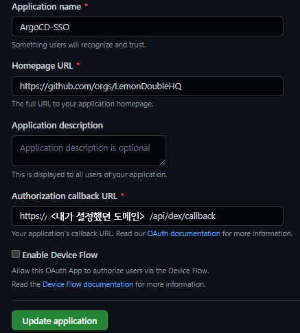
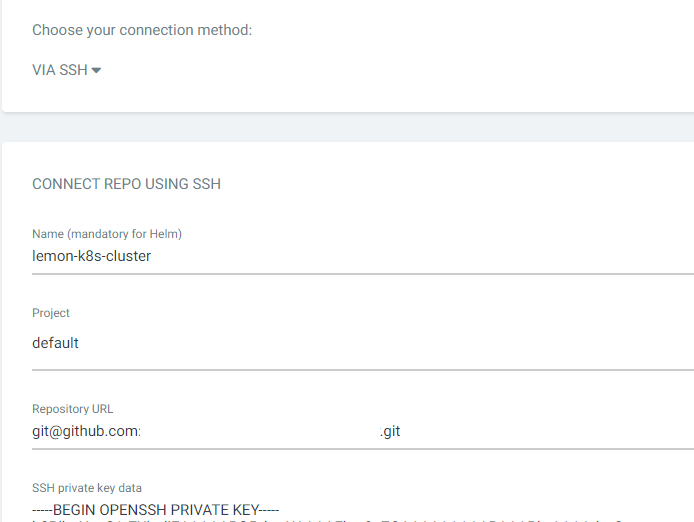

_注：筆者は韓国在住のため、本文には韓国特有の文脈が含まれることがあります。_

もし、システムをGitを通じて管理できたらどうでしょうか？
必要なコンテナの種類、数などをすべてGitに宣言し、Gitに宣言されたとおりにクラスタが運用されたら、とても便利ではないでしょうか？

わざわざクラスタのあちこちを確認しなくても、Gitに上がっている設定値だけを確認すればよいからです。

また、デプロイ中に問題が発生した場合、すぐにRevertできるのではないでしょうか？さらに、複数の人が同じクラスタを管理することで生じる問題も、いつも行うPRを通じて管理できるでしょう。

最後に、もしクラスタに突然問題が生じてすべてのノードがダウンしてしまっても、宣言した状態値がGitにあるため、別のクラスタを通じてでも素早く復旧を進めることができます。

このような方法をGitOpsと呼び、ArgoCDはGitに宣言された状態とクラスタの状態を同じに合わせてくれるツールです。

今後デプロイすべきシステムが本当に本当にたくさんあるので、まずはこのGitOpsを助けてくれるArgoCDを最初にインストールしましょう。

また、ArgoCDの外部接続が可能になるよう、TraefikのLetsEncrypt設定なども一緒に進めてみましょう。

### Traefik Letsencrypt Certification 適用

- 参考にした記事：[HTTPS on Kubernetes Using Traefik Proxy](https://traefik.io/blog/https-on-kubernetes-using-traefik-proxy/)

Control Nodeで以下を参考にtraefik-update.yamlを一つ作成します。

```yaml
# https://traefik.io/blog/https-on-kubernetes-using-traefik-proxy/
apiVersion: helm.cattle.io/v1
kind: HelmChartConfig
metadata:
  name: traefik
  namespace: kube-system
spec:
  valuesContent: |-
    ports:
      web:
        redirectTo:
          port: websecure
          priority: 10
    additionalArguments:
      - "--log.level=INFO"
      - "--certificatesresolvers.le.acme.email=yourMail@gmail.com"
      - "--certificatesresolvers.le.acme.storage=/data/acme.json"
      - "--certificatesresolvers.le.acme.tlschallenge=true"
      - "--certificatesresolvers.le.acme.caServer=https://acme-v02.api.letsencrypt.org/directory"
```

その後、`kubectl apply -f traefik-update.yaml`を使ってクラスタに適用します。

これにより、IngressRouteでCertificationResolverとしてle（letsEncrypt）を使用できるようになります。（何のことか分からなくても、進めていくうちに理解できるようになります。）

### ArgoCD インストール

ArgoCDをインストールし、Github SSOを連携してみましょう。

1. DNS設定を行います。ArgoCDを外部からアクセスする際に使用するサブドメインを現在のIPアドレスに紐付けます。
    - 「自分のIPを確認する」サービスにアクセスして自分のIPを確認します。
    - DNSを購入したところに行き、AレコードでIP4 Addressに先ほど確認した自分のIPを入力します。

2. `Github Organization`を一つ作成し、適切なRoleを一つ作成します。私の場合は個人用OrganizationにAdminというRoleを追加しました。

3. Organization -> Settings -> Developer Settings -> OAuth Appsに行き、新しいOAuthアプリを一つ追加します。



このとき、Authorization callback URLを`https://<先ほど設定したドメイン>/api/dex/callback`に設定します。
残りは自由に変更しても構いません。

その後、`Client ID, Secret`を発行して記憶しておきます。

4. values.yamlファイル作成

次のファイルを参考に`values.yaml`ファイルを作成します。

```yaml
configs:
  params:
    # TraefikがHttps接続をしてくれるのでInsecureモードで起動
    server.insecure: true
  rbac:
    # Built-in Policy : https://github.com/argoproj/argo-cd/blob/master/assets/builtin-policy.csv
    policy.default: role:readonly
    policy.csv: |
      g, <Github Organization 名>:<作成したRole 名>, role:admin

server:
  config:
    url: https://<設定したドメイン名>

    dex.config: |
      connectors:
      - type: github
        id: github
        name: github
        config:
          clientID: <先ほど発行されたClient ID>
          clientSecret: <先ほど発行されたClient Secret>
          orgs:
          - name: <Github Organization 名>
```

例えば次のようになります。

```yaml
configs:
  params:
    # TraefikがHttps接続をしてくれるのでInsecureモードで起動
    server.insecure: true
  rbac:
    # Built-in Policy : https://github.com/argoproj/argo-cd/blob/master/assets/builtin-policy.csv
    policy.default: role:readonly
    policy.csv: |
      g, LemonLemon:Admin, role:admin

server:
  config:
    url: https://argo.lemon.com

    dex.config: |
      connectors:
      - type: github
        id: github
        name: github
        config:
          clientID: vadf45a6sdfad
          clientSecret: adsfvasd45f6ads4f56asd7
          orgs:
          - name: LemonLemon
```

5. ingress.yamlファイル作成

```yaml
apiVersion: traefik.containo.us/v1alpha1
kind: IngressRoute
metadata:
  name: argocd-ingress
  namespace: argocd
spec:
  entryPoints:
    - websecure
  routes:
    - kind: Rule
      match: Host(`<設定したドメイン名>`)
      priority: 10
      services:
        - name: argo-cd-argocd-server
          port: 80
    - kind: Rule
      match: Host(`<設定したドメイン名>`) && Headers(`Content-Type`, `application/grpc`)
      priority: 11
      services:
        - name: argo-cd-argocd-server
          port: 80
          scheme: h2c
  tls:
    certResolver: le
```

以下は例です。

```yaml
apiVersion: traefik.containo.us/v1alpha1
kind: IngressRoute
metadata:
  name: argocd-ingress
  namespace: argocd
spec:
  entryPoints:
    - websecure
  routes:
    - kind: Rule
      match: Host(`argo.lemon.com`)
      priority: 10
      services:
        - name: argo-cd-argocd-server
          port: 80
    - kind: Rule
      match: Host(`argo.lemon.com`) && Headers(`Content-Type`, `application/grpc`)
      priority: 11
      services:
        - name: argo-cd-argocd-server
          port: 80
          scheme: h2c
  tls:
    certResolver: le
```

6. `values.yaml`と`ingress.yaml`を作成したら、次のコマンドを入力してargocdをインストールします。

```sh
kubectl create namespace argocd
helm repo add argo https://argoproj.github.io/argo-helm
helm install -n argocd argo-cd argo/argo-cd -f values.yaml

kubectl apply -f ingress.yaml
```

少し待ってから、設定したドメイン（私の場合は`https://argo.lemon.com`）にアクセスすると、ArgoCDが正常に出迎えてくれます。

その後、`Log in Via Github`ボタンをクリックしてログインします。

ログインが成功したら、正常にインストールされた場合です！

※ Tip: 401エラーが発生した場合は、argocd名前空間のargocd-serverポッドを一度killしてみてください。

### ArgoCD Git Private Repo 接続

クラスタをPublic Repoとして使用する場合はこの設定を省略しても良いですが、万が一の事故を防ぐためにGitでもprivate Repoを使用し、ArgoCDでも接続して使ってみましょう。

GithubでArgoCDで新しいリポジトリ（空のリポジトリ）を一つ追加した後、そのリポジトリをArgoCDと連携してみます。

1. ArgoCDログイン後、Settings -> Repository -> Connect Repoを押します。
2. connection method via ssh、Nameは任意、Projectはdefault、Repository URLはgit cloneする際の`ssh アドレス`を、SSH private key dataはControl01ノードの`~/.ssh/id_rsa`をコピーして貼り付けます。
3. Gitを接続します。



### おわりに

今日はTraefik Ingress設定、ArgoCDインストールおよびGit連携までを進めてみました。

次のポストでは、これまで散らかしてきた(?)yamlファイルを整理し、App of Appsを利用してリポジトリ構造を整理し、もし障害が発生してもクリック一つで復旧できるシステムを作る予定です。

いつものように、間違った内容があれば教えてください！
