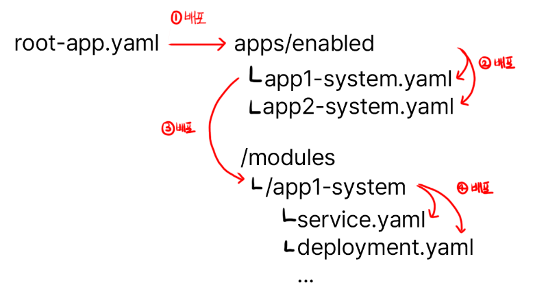
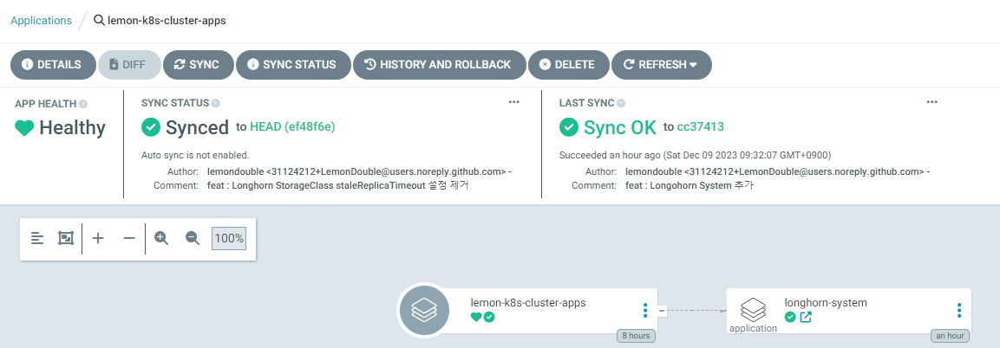

_Note: I'm based in Korea, so some context here is Korea-specific._

### 1. Getting Started with GitOps

Now that we've installed ArgoCD, let's organize our repository structure.

We're going to use the App On Apps pattern to create a clean deployment method.

Even if it doesn't quite make sense yet, just follow along for now.

Take the empty repository we created last time and structure it like this:

```sh
/apps
    ㄴ/disabled
    ㄴ/enabled
/init
/modules
```

Then, add all the files we worked on earlier (ip_address_pool.yaml, the ArgoCD ingress.yaml, traefik-update.yaml, and values.yaml) to the init folder.

The reason for keeping the initial setup files in Git is so that, if you ever need to recover the cluster, you can quickly reapply the configs with `kubectl -f <filename>`.

Adding the files like below and writing a README.md describing what you've done so far makes cluster recovery much easier when something breaks. Please write the README.md yourself!

```sh
/init
    ㄴ ip_address_pool.yaml
    ㄴ ingress.yaml
    ㄴ traefik-update.yaml
    ㄴ values.yaml
```

Next, inside the init folder, add a root-app.yaml referencing the YAML below.

```yaml
apiVersion: argoproj.io/v1alpha1
kind: Application
metadata:
  name: <any name you like (mine is lemon-k8s-apps)>
  namespace: argocd
spec:
  destination:
    namespace: argocd
    server: 'https://kubernetes.default.svc'
  source:
    repoURL: 'git@github.com:<YourOrganizationName>/<YourRepositoryName>.git'
    targetRevision: HEAD
    path: apps/enabled
  project: default
  syncPolicy:
    syncOptions:
      - CreateNamespace=true
```

Breaking it down:

1. Add an application managed by ArgoCD
2. The application references my GitHub repository
3. The path runs all YAML files inside the apps/enabled folder we configured above

Then run `kubectl apply -f root-app.yaml` to install the root app.

After that, head back to ArgoCD and check that your shiny new first application is showing up. If Sync fails saying that the path doesn't exist in the repository, that's expected - it means the connection works.

### 2. Installing Longhorn

* This assumes you have at least one storage USB, SSD, or HDD plugged in besides the main USB (the one with the OS).

**As of December 2023, when installing via ArgoCD, Longhorn's initial Batch Job fails due to a bug, so we'll install it manually first and then migrate to ArgoCD.**

Longhorn is a distributed storage manager that provides the following features. (If you're too lazy to read, it provides functionality similar to S3!)

1. **Distributed Storage**

It distributes your files across N storage devices according to your configuration.

If a disaster destroys one storage device, the data on that device is automatically migrated to other storage so that at least N replicas are maintained.

This means even if one SSD dies, the same data exists on other storage, so your programs and system keep running normally.

2. **Storage Tiering**

Some systems have I/O-heavy workloads requiring high storage performance,

while other systems have huge numbers of files that are rarely read, where capacity matters more than performance.

Longhorn supports StorageClass, letting you partition storage into tiers.

For example, you might assign an NVMe-SSD-only storage class for I/O-critical use cases, and an HDD-only storage class when you just need lots of file storage.

So! Run the following commands to install Longhorn.

```sh
helm repo add longhorn https://charts.longhorn.io
helm repo update
helm install longhorn longhorn/longhorn --namespace longhorn-system --create-namespace --set service.ui.loadBalancerIP="192.168.0.201" --set service.ui.type="LoadBalancer"
```

Once installed, open `http://192.168.0.201` in your browser to confirm the Longhorn UI shows up.

### 3-1. Installing via ArgoCD - Adding Config Files

Now that the install is done once, let's move the existing Longhorn install over to ArgoCD.

The folder structure and deployment strategy looks like this. With the structure below, deploying root-app makes the child apps come up automatically.



Just follow along here too. Add the file below.

* `apps/enabled/longhorn-system.yaml`

```yaml
apiVersion: argoproj.io/v1alpha1
kind: Application
metadata:
  name: longhorn-system
  namespace: argocd
spec:
  destination:
    namespace: longhorn-system
    server: 'https://kubernetes.default.svc'
  source:
    path: modules/longhorn-system
    repoURL: 'git@github.com:<YourOrganizationName>/<YourRepositoryName>.git'
    targetRevision: HEAD
  project: default
```
This adds an application that auto-deploys modules/longhorn-system.

* `modules/longhorn-system/longhorn.yaml`

```yaml
apiVersion: argoproj.io/v1alpha1
kind: Application
metadata:
  name: longhorn
  namespace: argocd
spec:
  destination:
    namespace: longhorn-system
    server: 'https://kubernetes.default.svc'
  source:
    repoURL: 'https://charts.longhorn.io'
    targetRevision: 1.5.3
    chart: longhorn
    helm:
      parameters:
        - name: service.ui.loadBalancerIP
          value: 192.168.0.201
        - name: service.ui.type
          value: LoadBalancer
  project: default
```

Through `helm.parameters` you can add values that would normally go into values.yaml, as shown above.


* `modules/longhorn-system/storage-class.yaml`

```yaml
kind: StorageClass
apiVersion: storage.k8s.io/v1
metadata:
  name: longhorn-ssd
provisioner: driver.longhorn.io
allowVolumeExpansion: true
reclaimPolicy: "Delete"
volumeBindingMode: Immediate
parameters:
  numberOfReplicas: "2"
  fsType: "ext4"
  diskSelector: "ssd"
---
kind: StorageClass
apiVersion: storage.k8s.io/v1
metadata:
  name: longhorn-hdd
provisioner: driver.longhorn.io
allowVolumeExpansion: true
reclaimPolicy: "Delete"
volumeBindingMode: Immediate
parameters:
  numberOfReplicas: "1"
  fsType: "ext4"
  diskSelector: "hdd"
```
This adds SSD and HDD storage. If you're using USB drives, feel free to rename them to longhorn-usb or whatever fits.

`numberOfReplicas`: The number of replicas. In my case, since the SSDs hold data needed by applications, I set at least 2 for safety, while HDDs are just for file storage so I set it to 1.
`fsType`: The filesystem type. We'll use ext4. Just match this if you're following along.
`diskSelector`: Used later when registering disks. Make sure to remember it.

Once done, commit and push to Git!

### 3-2. Installing via ArgoCD - Actually Deploying

Now head into the ArgoCD instance you set up earlier and do the deploy yourself.



The buttons we care about are `Sync` and `Refresh`.

- `Sync`: Pulls the new cluster state from Git, then synchronizes the actual cluster state with Git.
- `Refresh`: Pulls the new cluster state from Git. It does not sync the cluster.

So, hitting Sync makes ArgoCD start the deploy.

After that, drill down through Longhorn-system -> Longhorn and hit Sync at each step to deploy.

### Wrapping Up

Nice work! We finally cleaned up all the YAML files that were scattered everywhere and took our first step toward GitOps.

Next time, we'll register the actual SSDs and HDDs through Longhorn.
