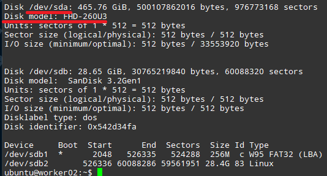
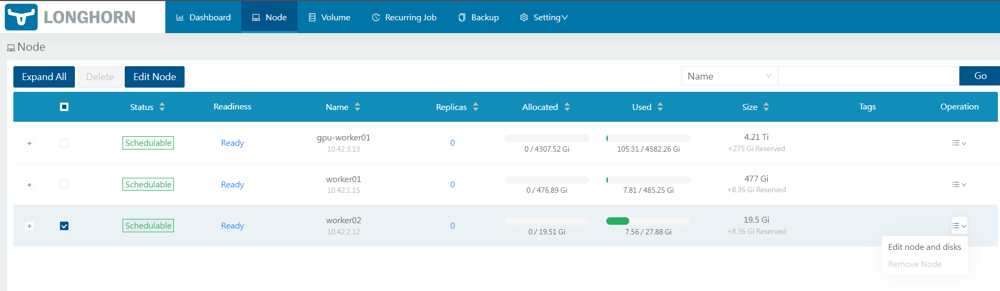
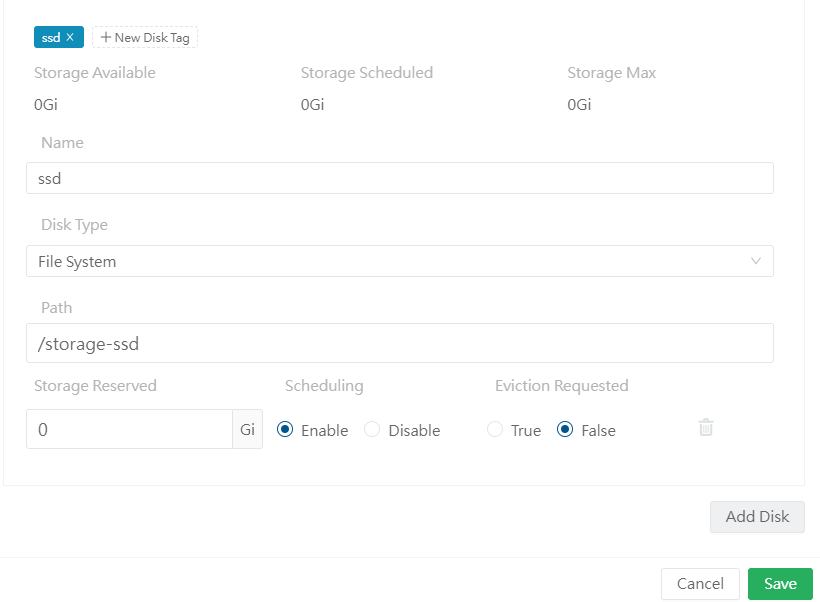

_註：筆者居住於韓國，部分內容包含韓國特有的背景。_

### 1. 新增並掛載新磁碟

- 此部分內容與一般 SSD / HDD 掛載相同！如果遇到問題，也可以搜尋 `Ubuntu 硬碟掛載` 等關鍵字參考操作。

1. 將 SSD 或 HDD 連接到樹莓派。

2. 輸入 `sudo fdisk -l` 指令，找出已掛載硬碟的名稱。我這裡是 `/dev/sda`。

3. 輸入 `sudo wipefs -a /dev/<剛才確認的磁碟>`，小心地格式化磁碟。（範例：`sudo wipefs -a /dev/sda`）
4. 輸入 `sudo mkfs.ext4 /dev/<剛才確認的磁碟>`，將磁碟格式化為 ext4 格式。
5. 輸入 `sudo blkid -s UUID -o value /dev/<剛才確認的磁碟>`，取得該磁碟的唯一 ID（形如 680dfccb-9d8f-431c-ab3b-8c1e6c86e04f）。
6. 使用 `sudo mkdir /storage-ssd`（位置隨意，我為方便起見掛載在根目錄下名為 `/storage-ssd` 的資料夾）建立掛載用的資料夾。
7. 以 sudo 權限開啟 `/etc/fstab`，在最後一行加入 `UUID=7cf3fc21-74d6-4c01-a835-f8bd36bc3f7b /storage-ssd ext4 defaults 0 0`。（掛載到第 6 步建立的資料夾）
8. 透過 `sudo mount -a` 掛載剛剛註冊的磁碟。

### 2. 將新磁碟註冊到 Longhorn

接下來把新磁碟註冊到 Longhorn 吧！

1. 在瀏覽器中開啟先前設定的負載平衡器 IP（`http://192.168.0.201/`）。
2. 依序選擇 Node -> 該 Node -> Edit Node and disks。

3. 在 disk tag 中輸入與設定 StorageClass 時的 `diskSelector` 相同的標籤，告知系統此磁碟屬於該 StorageClass。接著將 Path 指定為上面設定的掛載資料夾。

4. 之後按下儲存，並確認 volume 是否正常被辨識。

### 3. 結語

辛苦了！現在可以透過 Longhorn 為後續的應用程式穩定地提供分散式儲存系統了！

接下來將介紹如何透過 Sealed Secrets 將密碼等敏感資訊用 Git 進行管理，之後還計畫實作 Private Docker Registry。

謝謝！
