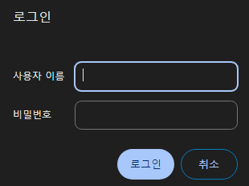

_注：作者居住在韩国，部分内容包含韩国特有的背景。_

### 1. Sealed Secrets?

我们现在正在做 GitOps。也就是说，我们把所有与集群相关的设置都上传到 Git。

可是，Kubernetes Secret 没有加密功能。任何人用 base64 解码后都能看到明文内容。

那这样就不能上传到 Git 了对吧?

为了解决这种问题，Sealed Secrets 应运而生。

1. 集群拥有加密/解密密钥。
2. 用户在把文件上传到 Git 之前，先用集群所持有的密钥进行加密。
3. 加密后的 Secret 被上传到 Git。任何人都能看到，但无法解密，因此是安全的。
4. 之后通过 ArgoCD 等将该 Secret 重新加载到集群时，Sealed Secret 控制器会解开加密并自动解密。

Sealed Secrets GitHub : [Link](https://github.com/bitnami-labs/sealed-secrets)

### 2. 添加 Sealed Secrets

通过 ArgoCD 一气呵成地完成部署吧!

`apps/enabled/sealed-secrets-system.yaml`
```yaml
apiVersion: argoproj.io/v1alpha1
kind: Application
metadata:
  name: sealed-secrets-system
  namespace: argocd
spec:
  destination:
    namespace: sealed-secrets-system
    server: 'https://kubernetes.default.svc'
  source:
    path: modules/sealed-secrets-system
    repoURL: 'git@github.com:<YourOrganizationName>/<YourRepositoryName>.git'
    targetRevision: HEAD
  project: default
```

`modules/sealed-secrets-system/sealed-secrets.yaml`
```yaml
apiVersion: argoproj.io/v1alpha1
kind: Application
metadata:
  name: sealed-secrets
  namespace: argocd
spec:
  destination:
    namespace: sealed-secrets-system
    server: 'https://kubernetes.default.svc'
  source:
    repoURL: 'https://bitnami-labs.github.io/sealed-secrets'
    targetRevision: 2.13.3
    chart: sealed-secrets
    helm:
      releaseName: sealed-secrets
  project: default
```

然后进行部署。

接下来，使用以下命令安装 kubeseal 命令行工具。

```shell
KUBESEAL_VERSION='0.23.0' #截至 2023.12 的最新版本
wget "https://github.com/bitnami-labs/sealed-secrets/releases/download/v${KUBESEAL_VERSION:?}/kubeseal-${KUBESEAL_VERSION:?}-linux-arm64.tar.gz"
tar -xvzf kubeseal-${KUBESEAL_VERSION:?}-linux-arm64.tar.gz kubeseal
sudo install -m 755 kubeseal /usr/local/bin/kubeseal
```


`secret.yaml`
```yaml
apiVersion: v1
kind: Secret
metadata:
  name: mysecret
  namespace: mynamespace
data:
  users: bGVtb246JGFwcjEkL0ZYczZGam0kMkpJZWNlQy45UWc5QjV5NUw2TzVoMAoK
```

通过以下命令，可以创建并注册 Sealed Secrets。
```sh
cat secret.yaml | kubeseal --controller-namespace=kube-sealed-secrets-system --controller-name=sealed-secrets -oyaml > sealed-secrets.yaml
```

### 3. 利用 Sealed Secrets 注册 Basic Auth

Basic Auth 简单粗暴地说，就是 ID/密码登录。



让我们设置 Ingress 让 Longhorn Dashboard 也能从外部互联网访问，并加上 Id/密码登录吧! (在 Control01 上执行)

1. 执行 `apt install apache2-utils`，使 htpasswd 命令可用。
2. 通过 `htpasswd -nb <id> <password> | openssl base64`，获取包含 id、password 的 Secret String。
3. 用任意文本编辑器创建 secret.yaml，参考以下内容添加 Secret。

```yaml
apiVersion: v1
kind: Secret
metadata:
  name: longhorn-system-basic-auth
  namespace: longhorn-system
data:
  users: <在 2 中获得的 String>
```

4.输入 `cat secret.yaml | kubeseal --controller-namespace=sealed-secrets-system --controller-name=sealed-secrets -oyaml > sealed-secrets.yaml` 获取 sealed-secrets.yaml。
5. 参考以下内容注册 ingress。

`modules/longhorn-system/ingress.yaml`

```yaml
apiVersion: traefik.containo.us/v1alpha1
kind: IngressRoute
metadata:
  name: longhorn-dashboard
  namespace: longhorn-system
spec:
  tls:
    certResolver: le
  routes:
    - kind: Rule
      match: Host(`<想要的 subdomain，例如:longhorn.lemon.com>`)
      middlewares:
        - name: basic-auth
          namespace: longhorn-system
      services:
        - name: longhorn-frontend
          port: 80
---
apiVersion: traefik.containo.us/v1alpha1
kind: Middleware
metadata:
  name: basic-auth
  namespace: longhorn-system
spec:
  basicAuth:
    secret: longhorn-system-basic-auth
```

在 `modules/longhorn-system/sealed-basic-auth-secret.yaml` 中，把刚生成的 sealed-secrets.yaml 复制粘贴进去。

```yaml
apiVersion: bitnami.com/v1alpha1
kind: SealedSecret
metadata:
  creationTimestamp: null
  name: longhorn-system-basic-auth
  namespace: longhorn-system
spec:
  encryptedData:
    users: adfasdflavasdlfj...
  template:
    metadata:
      creationTimestamp: null
      name: longhorn-system-basic-auth
      namespace: longhorn-system
```

6. 然后进行部署。
7. 之后访问时，会正常弹出 id/密码确认窗口，不登录就看不到该页面!

### 3. 备份和恢复

现在我们也能把 Secret 这类敏感信息存放到 Git 上了!

不过虽然一切都好，但如果集群挂了导致解密密钥丢失，那我们自己也解不开秘密了对吧?

因此，加密/解密密钥**一定要**备份!

- 备份方法

1. 输入 `kubectl get secret -n sealed-secrets-system -l sealedsecrets.bitnami.com/sealed-secrets-key -o yaml >master.key`，把 master.key 一定要备份到某个地方。

- 恢复方法

1. 把刚才备份的 master.key 复制到集群上，输入 `kubectl apply -f master.key` 注册 master key。
2. 杀掉 sealed-secrets-system 中的一个 Pod，让它重新读取新的 Key。(在 ArgoCD 中可以方便地做到)

### 4. 结语

我们现在通过 Sealed Secrets 可以把所有数据都保存到 Git 上，

并且通过 Traefik Basic Auth 可以把内部服务对外公开(具备最低限度的安全性)了!

那么下次，我们将了解如何搭建 Private Docker Registry!
