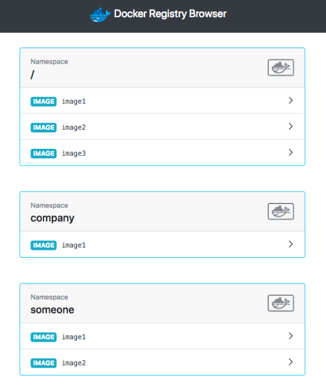
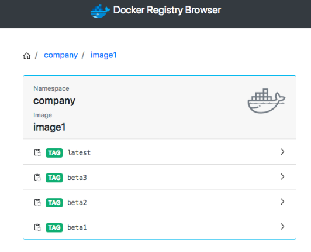

_註：筆者居住於韓國，部分內容包含韓國特有的背景。_

### 1. Private Registry 雖然好用，但管理起來太麻煩了！

雖然有些人非常喜歡 CLI，但我實在記不住命令，所以更偏好 GUI 與有跡可循的紀錄。

Docker Registry 也可以透過 CLI 管理，但為了更方便一點，我使用 [docker-registry-browser](https://github.com/klausmeyer/docker-registry-browser)。

將會使用類似下圖的 GUI。





### 2. 安裝

將其與現有的 docker-registry-system 一同安裝。

請在原有檔案下方加上 `---` 後再撰寫。

`modules/docker-registry-system/deployment.yaml`

- 現有 deployment
```yaml
apiVersion: apps/v1
kind: Deployment
metadata:
  name: docker-registry-ui-deployment
  namespace: docker-registry-system
spec:
  replicas: 1
  selector:
    matchLabels:
      app: docker-registry-ui-app
  template:
    metadata:
      labels:
        app: docker-registry-ui-app
    spec:
      nodeSelector:
        node-type: worker
      containers:
        - name: docker-registry-ui-pod
          image: klausmeyer/docker-registry-browser:1.7.0
          imagePullPolicy: Always
          ports:
            - name: http
              containerPort: 8080
          envFrom:
            - secretRef:
                name: docker-registry-ui-secrets-sealed-secrets
```

`modules/docker-registry-system/service.yaml`

```yaml
... 現有 service
---
apiVersion: v1
kind: Service
metadata:
  name: docker-registry-ui-service
  namespace: docker-registry-system
spec:
  selector:
    app: docker-registry-ui-app
  type: ClusterIP
  ports:
    - name: http
      protocol: TCP
      port: 80
      targetPort: 8080
```

`modules/docker-registry-system/ingress.yaml`

```yaml
---
apiVersion: traefik.containo.us/v1alpha1
kind: IngressRoute
metadata:
  name: docker-registry-ui-ingress
  namespace: docker-registry-system
spec:
  tls:
    certResolver: le
  routes:
    - kind: Rule
      match: Host(`用來公開 UI 的 URL 範例:docker-ui.lemon.com`)
      services:
        - name: docker-registry-ui-service
          port: 80
```

若還想設定 Basic Auth，請參考 [透過 Sealed Secrets 管理密鑰 + Traefik Basic Auth 設定](/zh-tw/p/1379182f14a62e9b/)。


`modules/docker-registry-system/sealed-docker-registry-ui-secrets.yaml`

進入 sealed secrets GUI，新增下列 Secret。（參考 Docs [Link](https://github.com/klausmeyer/docker-registry-browser/blob/master/docs/README.md)）

- BASIC_AUTH_USER：登入 registry 所使用的使用者名稱
- BASIC_AUTH_PASSWORD：密碼
- DOCKER_REGISTRY_URL：https://<我註冊的 Registry 位址>
- ENABLE_DELETE_IMAGES：true
- SECRET_KEY_BASE：執行 `openssl rand -hex 64` 後得到的值

```yaml
apiVersion: bitnami.com/v1alpha1
kind: SealedSecret
metadata:
  name: docker-registry-ui-secrets
  namespace: docker-registry-system
  annotations: {}
spec:
  encryptedData:
    BASIC_AUTH_USER: afdfads...
    BASIC_AUTH_PASSWORD: fadvbads..
    DOCKER_REGISTRY_URL: dfd..
    ENABLE_DELETE_IMAGES: afdgd...
    SECRET_KEY_BASE: dffdf...

```

使用方式很直觀，建議大家直接動手試試看！


### 3. Registry GC

即使在 Docker Registry UI 中刪除映像檔（或透過 CLI 刪除映像檔），磁碟空間也不會立刻減少。

這是因為從 GUI/CLI 刪除映像檔時，實際上並沒有發生物理刪除，只是刪除了該映像檔的 Manifest。

真正的資料刪除，是在顯式執行 Registry GC 時才會進行。

雖然還能談得更深入，但今天先聚焦在使用方法上，細節就略過。

（如果對相關內容更感興趣，建議先閱讀 [透過透明玻璃紙理論理解 Overlay FS 的使用方法與聯合掛載](https://blog.naver.com/alice_k106/221530340759)（韓文）一文，再以 Docker registry 與映像檔刪除等關鍵字搜尋。）

* 執行 Registry GC

**!! 注意！GC 執行期間不應在儲存庫中發生 Pull/Push。請先確認這一點再進行作業！**

1. 使用 `kubectl get pod -n docker-registry-system` 找到 Registry 的 Pod。
2. 執行 `kubectl exec -it pod/<registry-pod-name> -n docker-registry-system -- /bin/registry garbage-collect /etc/docker/registry/config.yml` 來執行 GC。
3. 接著在 Longhorn Dashboard 中選擇 Volume -> 點擊 Trim Filesystem 重新計算 Actual Size。

### 4. 結語

透過本文了解了 Docker UI 與 GC 的方法。

現在已經有了 Private Registry 與管理方法，可以放心地開發（？）伺服器，把想要的服務塞進去！

下次將介紹如何使用 CloudNativePG，在 Kubernetes 上運行資料庫。
