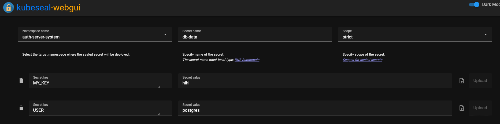

_注：作者居住在韩国，部分内容包含韩国特有的背景。_

### 1. 前言

既然已经搭建好了基础设施，我们顺便也来自己搭一个私有 Docker Registry 吧。

我自己的情况是，后续在这个集群上单独部署了一些个人服务器，为了管理这些容器镜像，所以使用了私有 Registry。

如果你愿意为 Dockerhub 付费，或者使用公开镜像就够用，那么本指南可以跳过。

由于我们要使用私有 Repo，因此 ID 和密码的设置也会一并完成！

### 2. 安装

这次我们仍然使用 ArgoCD 快速安装！

`modules/docker-registry-system/pvc.yaml`

```yaml
apiVersion: v1
kind: PersistentVolumeClaim
metadata:
  name: longhorn-docker-registry-pvc
  namespace: docker-registry-system
spec:
  accessModes:
    - ReadWriteOnce
  storageClassName: longhorn-ssd
  resources:
    requests:
      storage: 300Gi
```

我自己运行了 ML 服务器，镜像体积较大，所以宽裕地分配了 300Gi。你可以根据自己的需求调整。

`modules/docker-registry-system/service.yaml`

```yaml
apiVersion: v1
kind: Service
metadata:
  name: registry-service
  namespace: docker-registry-system
spec:
  selector:
    app: registry
  type: LoadBalancer
  ports:
    - name: docker-port
      protocol: TCP
      port: 5000
      targetPort: 5000
  loadBalancerIP: 192.168.0.202
```

`modules/docker-registry-system/deployment.yaml`

```yaml
apiVersion: apps/v1
kind: Deployment
metadata:
  name: registry
  namespace: docker-registry-system
spec:
  replicas: 1
  selector:
    matchLabels:
      app: registry
  template:
    metadata:
      labels:
        app: registry
        name: registry
    spec:
      nodeSelector:
        node-type: worker
      containers:
      - name: registry
        image: registry:2
        ports:
        - containerPort: 5000
        env:
        - name: REGISTRY_HTTP_ADDR
          value: 0.0.0.0:5000
        - name: REGISTRY_AUTH
          value: htpasswd
        - name: REGISTRY_AUTH_HTPASSWD_REALM
          value: docker-registry
        - name: REGISTRY_AUTH_HTPASSWD_PATH
          value: /auth/registry.password
        - name: REGISTRY_STORAGE_DELETE_ENABLED
          value: "true"
        volumeMounts:
        - name: lv-storage
          mountPath: /var/lib/registry
          subPath: registry
        - name: docker-registry-account-htpasswd
          mountPath: /auth
          readOnly: true
      volumes:
        - name: lv-storage
          persistentVolumeClaim:
            claimName: longhorn-docker-registry-pvc
        - name: docker-registry-account-htpasswd
          secret:
            secretName: docker-registry-account-htpasswd
```

通过名为 docker-registry-account-htpasswd 的 Secret 来指定 Registry 使用的 ID 和密码。该内容会在后面说明。

`modules/docker-registry-system/sealed-docker-registry-account-htpasswd.yaml`

Secrets 的设置稍微复杂一些。我们 Step By Step 来！

1. 在 Control Node 上运行 `htpasswd -Bbn <id> <password>`，得到 Docker Registry 要使用的 id/password 字符串。
2. 使用在 7-1 中搭建的 kubeseal-webgui 对该 Secret 进行加密。

1. 将该 Secret 粘贴到 sealed-docker-registry-account-htpasswd.yaml 中。

```yaml
apiVersion: bitnami.com/v1alpha1
kind: SealedSecret
metadata:
  name: docker-registry-account-htpasswd
  namespace: docker-registry-system
  annotations: {}
spec:
  encryptedData: 
    registry.password: dfadf...
```

`modules/docker-registry-system/ingress.yaml`
```yaml
apiVersion: traefik.containo.us/v1alpha1
kind: IngressRoute
metadata:
  name: docker-registry-ingress
  namespace: docker-registry-system
spec:
  tls:
    certResolver: le
  routes:
    - kind: Rule
      match: Host(`<要使用的 subdomain>`)
      services:
        - name: registry-service
          port: 5000
```

### 3. 验证是否正常工作

确认正常工作后，进行部署！

部署完成后，确认能否使用 id/password 正常登录。

在已安装 docker 的机器上，通过终端执行以下命令。

```shell
docker login <my-registry.lemon.com>
```

之后输入 id/password，确认是否能正常登录。

### 4. 从私有 Registry 拉取镜像的方法

接下来我们需要了解如何从需要 Id/Password 的私有 Registry 中拉取镜像。否则上传上去的镜像也无法使用。

我先分享一下我自己使用的方法。也许有更优雅的做法，如果有的话欢迎告诉我！

假设要在名为 auth-server-system 的 namespace 中使用：

1. 使用 `kubectl create secret docker-registry regcred --docker-server=<your-registry-server> --docker-username=<your-name> --docker-password=<your-pword> --docker-email=<your-email>` 在 default Namespace 中创建一个名为 regcred 的 secret。
2. 使用 `kubectl get secret regcred --output=yaml > secret.yaml` 将 secret 信息保存到 secret.yaml。该 Secret 请妥善备份。
3. 输入 `kubectl delete secret regcred` 删除刚才在 default namespace 中创建的 secret。
4. 之后将第 2 步的 Secret 中的 Namespace 修改为你要使用的 namespace（例如：auth-server-system）。

```yaml
apiVersion: v1
data:
  .dockerconfigjson: ddfadf...
kind: Secret
metadata:
  name: regcred
  namespace: auth-server-system # 每次修改这里
type: kubernetes.io/dockerconfigjson
```

5. 然后执行 `cat secret.yaml | kubeseal --controller-namespace=sealed-secrets-system --controller-name=sealed-secrets -oyaml > sealed-regcred.yaml` 命令生成 Sealed Secret。
6. 在部署时一起部署 Sealed regcred，并在 Deployment 中按下方方式添加 ImagePullSecret。

```yaml
apiVersion: apps/v1
kind: Deployment
metadata:
  name: auth-server
  namespace: auth-server-system
spec:
  replicas: 1
  selector:
    matchLabels:
      app: auth-server
  template:
    metadata:
      labels:
        app: auth-server
        name: auth-server
    spec:
      nodeSelector:
        node-type: worker
      containers:
        - name: auth-server
          image: registry.lemon.com/auth_server_repository:2023.12.10.1
          imagePullPolicy: Always
          ports:
            - name: http
              containerPort: 80
      imagePullSecrets:
        - name: regcred # 添加这个
```

### 5. 结语

恭喜！现在你已经完成了私有 Docker Registry 的搭建，

可以通过 Id/Password 安全地保护自己的镜像了！

下一篇会介绍如何通过 Web UI 管理镜像，以及 Docker GC 的方法。
