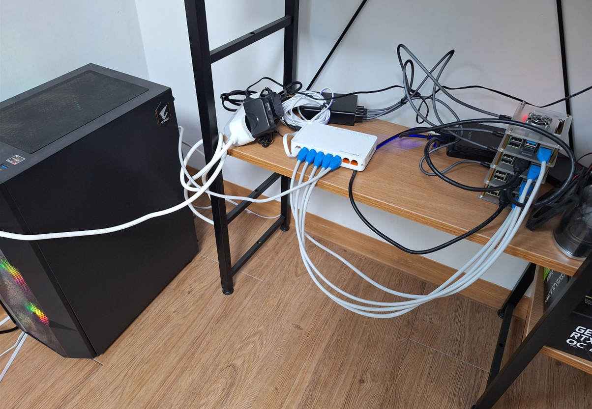
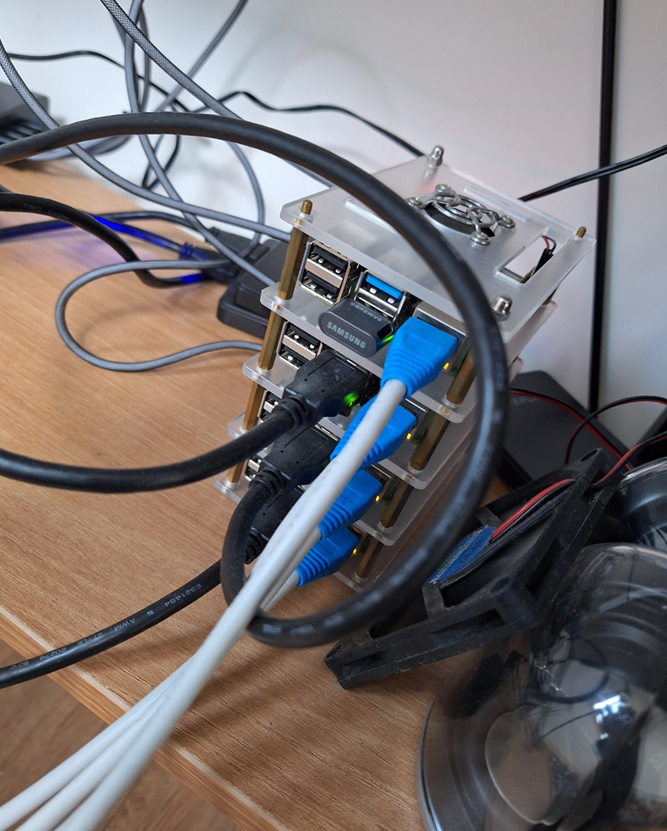

_注：作者居住在韩国，部分内容包含韩国特有的背景。_

### 我第一次搭建树莓派集群至今，大约已经过去300天了。

契机其实并不算大。

我每天早上上班路上都会看一个叫[GeekNews](https://news.hada.io/)[^1]的新闻聚合服务，其中一篇题为[Chick-Fil-A 的 Edge Computing 技术架构：Enterprise Restaurant Compute](https://news.hada.io/topic?id=8306)的文章引起了我的注意。

之后，"连Chick-Fil-A都在用Kubernetes，作为一名服务器工程师，我自己是不是也该有一个属于自己管理的集群？"——这就是一切的开始。

### 配置环境

我屋顶房间(...)的集群大概是这样的。

整理一下配置规格：

- **Control Node**
  - Raspberry PI 4b+ 8GB Model * 1
  - Samsung MUF-AB FIT PLUS 64GB USB
- **ARM Worker + Storage Node**
  - Raspberry PI 4b+ 8GB Model + 500GB SSD(PNY CS900 500GB) * 3
  - Sandisk USB Ultra Fit USB 3.1 32GB * 3
- **GPU X86 Worker Node (For ML)**
  - Ryzen 5600x + 64GB DDR4 3200 RAM + RTX3090 + NVME SSD(WD Black) 1TB + WD RED Plus 4TB HDD

按以上方式配置，总共用4台树莓派、1台X86 GPU服务器，运营着X86和ARM混合的集群。

树莓派的磁盘I/O为了稳定性，使用USB盘代替SD卡。

### 咦？只有1台Control Node不就没法做HA了吗？

- 这是首次搭建集群时最大的烦恼。
  - 用3台以上配置HA虽然安全，但考虑到Pi的运算能力并不强，我希望尽可能减少浪费的计算资源。

- 由此得出的结论是，**Master Node只用一台**，并设置了如下安全机制。
  - 用**External Database**代替etcd作为状态存储。
    - 目前使用**Supabase**提供的Postgresql作为外部存储。
  - Master Node设置了Taint，使其无法进行Job scheduling。
    - 通过这种方式，减少了在任务分配过程中master节点突然挂掉的情况。
  - Master Node使用了相对更可靠的设备(USB、散热器等)。

尽管如此，夏天Master Node因过热(...)USB还是出过故障，但由于所有State都存在外部DB中，10分钟内就完成了恢复。

### 目前在软件层面已搭建的内容

1. 利用K3S和External DB，构建即使Master Node宕机也能恢复的系统。
2. 利用ArgoCD和Github，构建GitOps系统。
3. 利用[Mend Renovate](https://www.mend.io/renovate/)，当已安装的Helm Chart及Private Registry有新版本发布时，自动创建PR，使集群保持最新状态。
4. 利用[Longhorn](https://github.com/longhorn/longhorn)实现分布式存储，构建即使一块SSD损坏也能恢复的系统。
5. 搭建Docker Private Registry，并利用[Docker-registry-browser](https://github.com/klausmeyer/docker-registry-browser)构建可以查看已上传镜像的GUI。
6. 利用[Sealed-secrets](https://github.com/bitnami-labs/sealed-secrets)，无需外部服务即可将Secret保存在Git中进行管理。同时利用[Kubeseal-webgui](https://github.com/Jaydee94/kubeseal-webgui)，构建通过GUI便捷添加Secret的界面。
7. 利用[kube-prometheus-stack](https://github.com/prometheus-community/helm-charts/tree/main/charts/kube-prometheus-stack)搭建并管理监控系统。
8. 利用[CloudNativePG](https://cloudnative-pg.io/)搭建HA Postgres数据库系统，并为防止意外，在AWS等位置构建自动备份系统。
9. 利用[Portainer](https://www.portainer.io/)构建基于Web UI的集群管理系统。
10. 通过[MetalLB](https://metallb.universe.tf/)配置，方便地构建仅可在内网访问的endpoint和服务。
11. 利用[nvidia-device-plugin](https://github.com/NVIDIA/k8s-device-plugin)，使Kubernetes上的容器能够使用CUDA等设备。
12. 借鉴[traefik-forward-auth](https://github.com/thomseddon/traefik-forward-auth)库的思路，构建自有认证系统。除了密码外，还可通过SSO登录访问内部管理系统。

### 接下来要写的文章

接下来我打算回顾自己搭建的内容，从硬件到软件、再到系统构建，等有时间就一篇篇地添加进来。
以上内容是无序排列的，写作过程中内容可能会有变化。

另外，本搭建指南是基于2023年12月时点，我亲自跟着操作并确认正常运行的方法。

### 结束序论

搭建集群时我努力寻找了相关资料，

但意外地发现这类资料并不多。
[VladoPortos](https://github.com/VladoPortos)的[Kubernetes with OpenFaaS on Raspberry Pi 4](https://rpi4cluster.com/)资料给了我很大帮助，但国内资料不多这一点确实有些遗憾。

希望这份微薄的指南，能对想要开拓类似道路的朋友有所帮助。

[^1]: GeekNews是韩国的技术新闻聚合网站，类似Hacker News，但面向韩国开发者社区。
