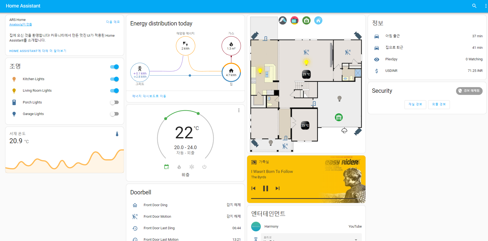
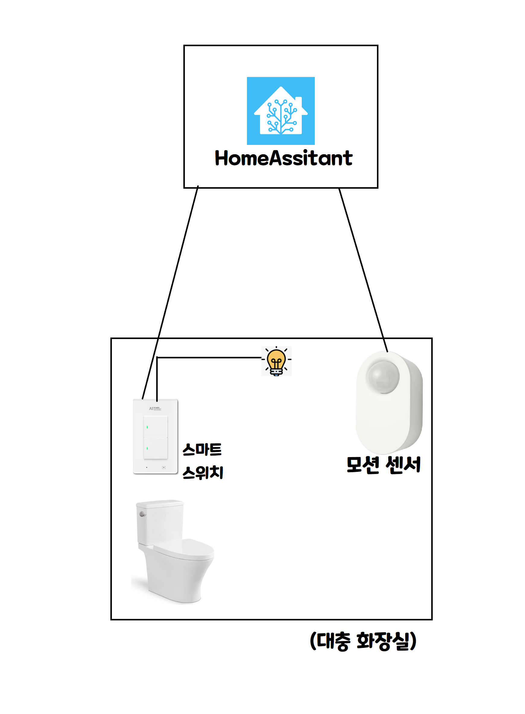
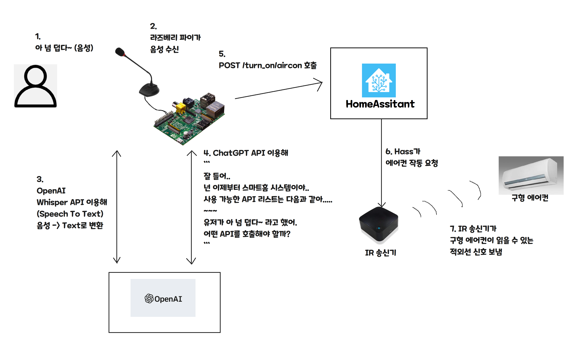
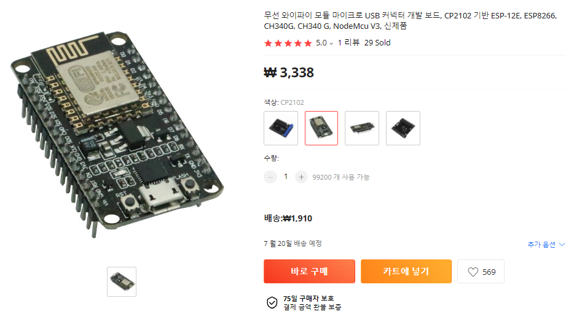
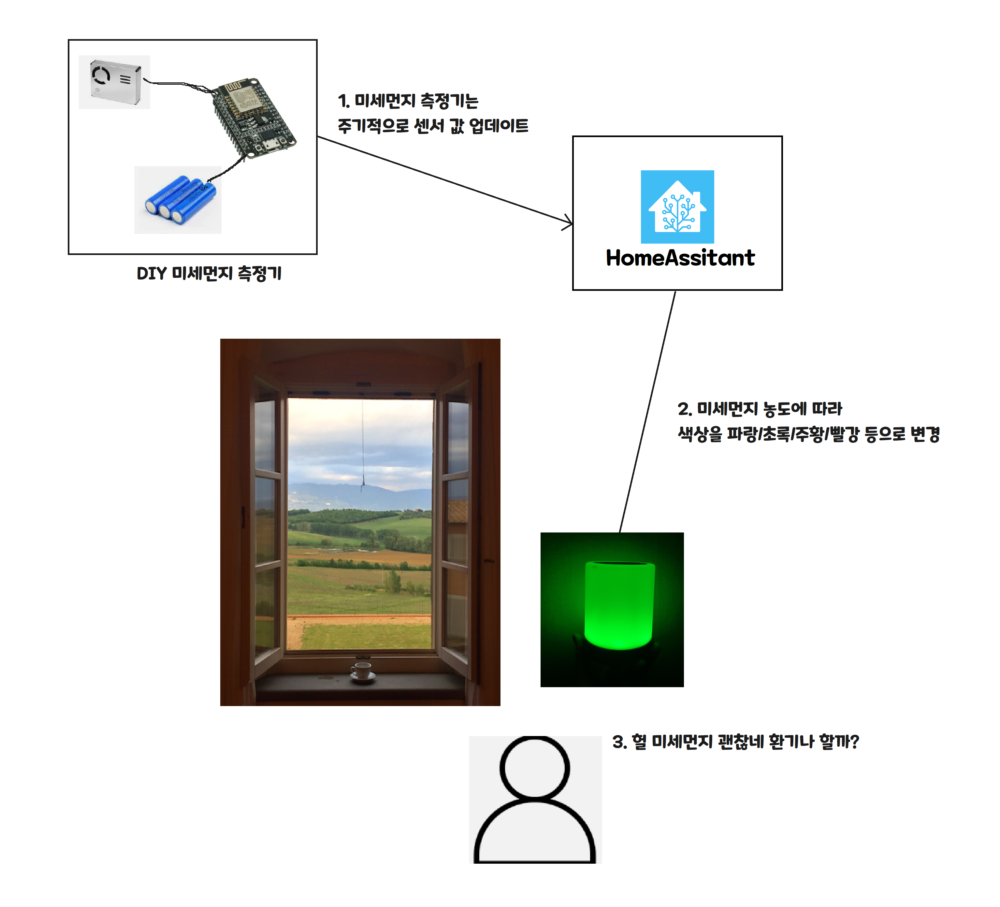
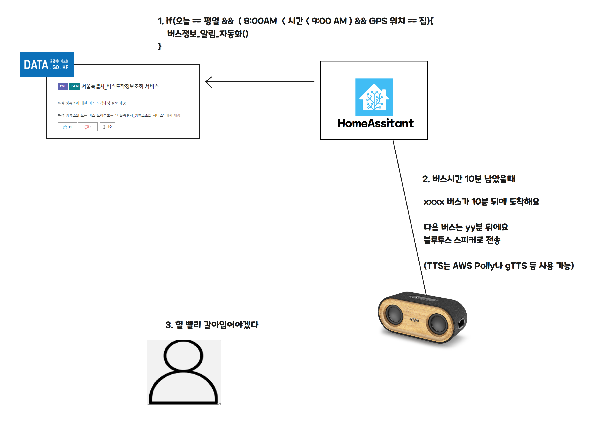

_注:作者居住在韩国,部分内容包含韩国特有的背景。_

IoT 是一个相当有趣的话题,

但入门难度较高,而且也不是很广为人知的话题,所以人们似乎也不太清楚用它能做什么。

在众多平台中,我亲自安装并正在使用 HomeAssistant(以下简称 HASS)这个平台,我想聊聊为什么需要这种平台,以及它能在我们的生活中改善什么!


### 1. HomeAssistant 是什么?(以下简称 HA、Hass)

它是一个整合平台,可以让你在一个地方统一管理来自不同公司的 IoT 设备。

请看看 [Demo](https://demo.home-assistant.io/#/lovelace/0) 吧!



### 2. 用它能做什么?

- 如果你会编程,字面意义上什么都能做!

根据大家的兴趣不同,我来举几个例子。

- **对自动化感兴趣?**
    - **示例场景:关浴室的灯实在太麻烦了**




如上图所示,安装一个智能灯泡和动作感应器,

就可以做出下面这样的自动化!

```kotlin
// 这不是实际代码,只是伪代码。
// 自动化 1. 自动开浴室灯
if(浴室_动作_传感器.Occupancy transfer to True){
    turn_on (浴室_灯)
}

// 自动化 2. 自动关浴室灯
if(浴室_动作_传感器.Occupancy transfer to False && 切换后_经过10分钟){
    turn_off(浴室_灯) 
}
```

- 在实际的 hass 界面中,自动化大致是这样的。


- **对 AI 感兴趣?**
    - 示例场景:制作语音助手
    - 而且真的什么都能做……



- **对电路 DIY 感兴趣?**
    - 试试 [ESPHome](https://esphome.io/) 这样的项目吧!



- 像 ESPxx 这样带 WiFi 和 CPU 的开发板,只要几块钱就能买到!

- 下面这种通风灯的场景怎么样?




- **每次都要查公交时间太烦了?**

- 不如用公共 API 做一个公交提醒器吧?




除此之外,通过 HomeAssistant 这个平台还能做更多事情!

而且它完全开源,需要的话还可以自己改,这也算是附加福利!

要不要一起来体验一下有趣的 IoT?
