_注：作者居住在韩国，部分内容包含韩国特有的背景。_

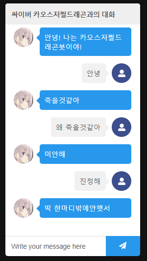

> 来聊聊我做了这样一个服务的故事！

> 2024.06.30 补充：那时 ChatGPT 还没出现，这种聊天机器人服务并不常见！

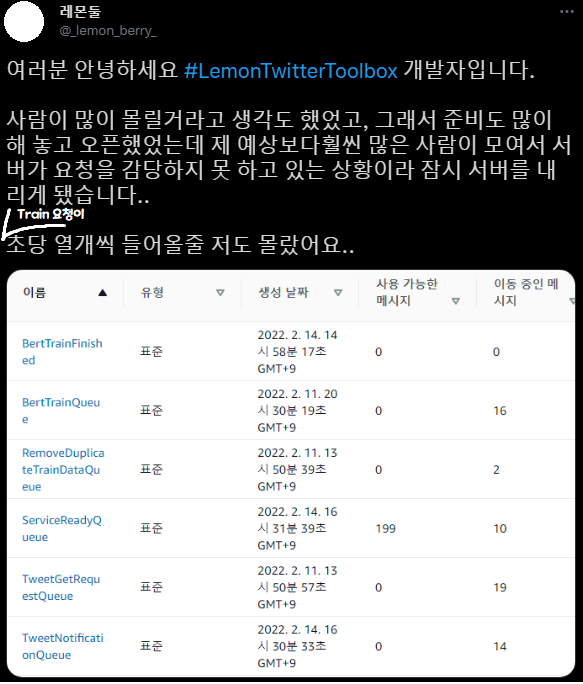

> 啊啊啊啊到底发生什么事了！！

### 1. 为什么会开发这个？

~~原本写了挺长一段，但别人的 TMI 估计不太有趣，所以简单写。不过即便缩短了，仍然挺长的！~~

我业余在读[利用深度学习的自然语言处理入门](https://wikidocs.net/book/2155)，看到[使用 BERT 句向量的韩语聊天机器人](https://wikidocs.net/154530)那部分时，突然冒出一个想法：训练数据用推文应该也行吧？

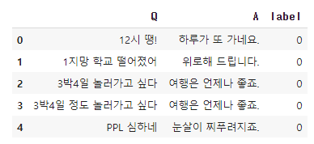

> 咦，这个……用 Twitter 的提及应该也能做出类似的吧？

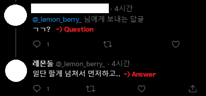

> 是不是可以做成这样？

问题在于训练数据的数量，Twitter API 在请求最近推文时，最多只提供 3200 条推文数据。

保守估计这里有一半是公开推文（朝着虚空发的推文），那就是大约 1600 条推文作为训练数据。如各位所知，机器学习里 1600 条训练数据数据量太小，很难做出有意义的聊天机器人。

**但只要看起来有趣，难道不值得先试一下吗？**

所以我决定动手做做看。
啊……那时还不知道，自己居然会为了把大约 200 行的 Colab 代码改造成一个服务而烧掉一个多月……

### 2. Serverless ML？

#### 生成机器学习转换数据的极其简单的结构如下。

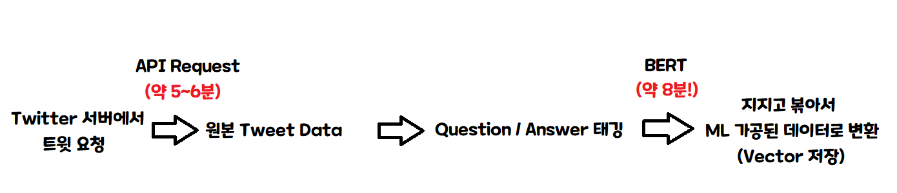

> 也就是说，单台服务器一次只处理一个，每个人大约要 15 分钟！

那么大概一小时能处理 4 个人！
100 个人就是 25 小时，
1000 个人来就是 250 小时……

**今天注册服务的话，10 天后才会完成！**
~~而且这还是不算聊天机器人问答部分的数字！~~

> 啊……这有点……得想点别的办法……

啊！想想用 Serverless 架构应该不错。
有些朋友可能不太了解 Serverless 的概念，我用图简单说明一下。

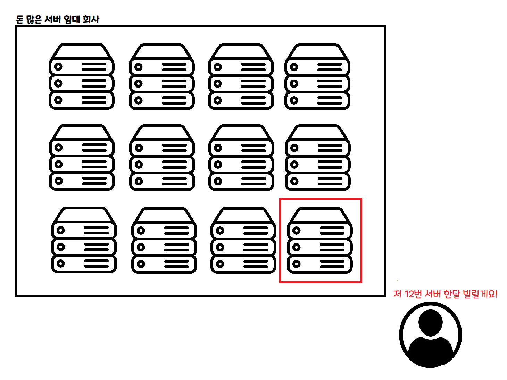

> 这是传统的云使用方式。按一个月、一周、一天等固定期限租用一台计算机，按租用时间付费。VPS 这个东西就是类似的概念！

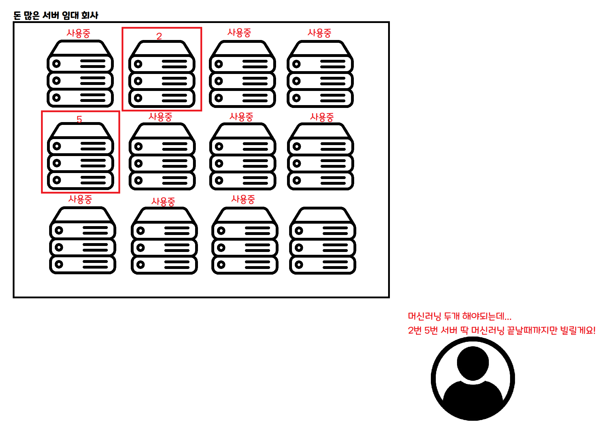

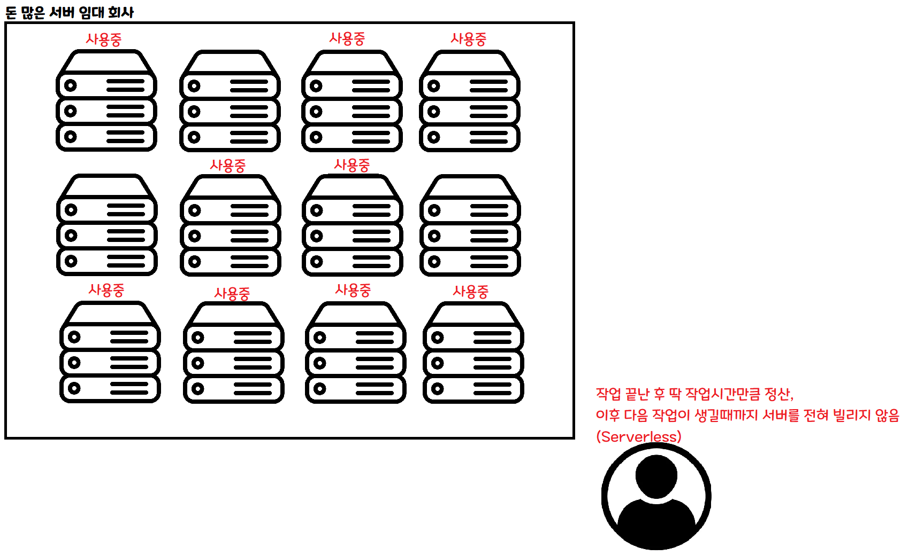

> 这是 Serverless 的方式。要做某项工作时按需申请，就只在那项工作完成之前借用一段时间。

如果同时来 100 个人，可以同时租用 100 台服务器并行处理。
如果一个人都没来，那段时间就不必租用任何服务器。

如果采用这种架构，理论上**无论来多少人，处理数据的速度都跟只来一个人时一样**！ ~~当然实际上还是会有别的问题。~~

#### 啊！问题解决了！就这么干一波吧！

### 3. 现实没那么轻松

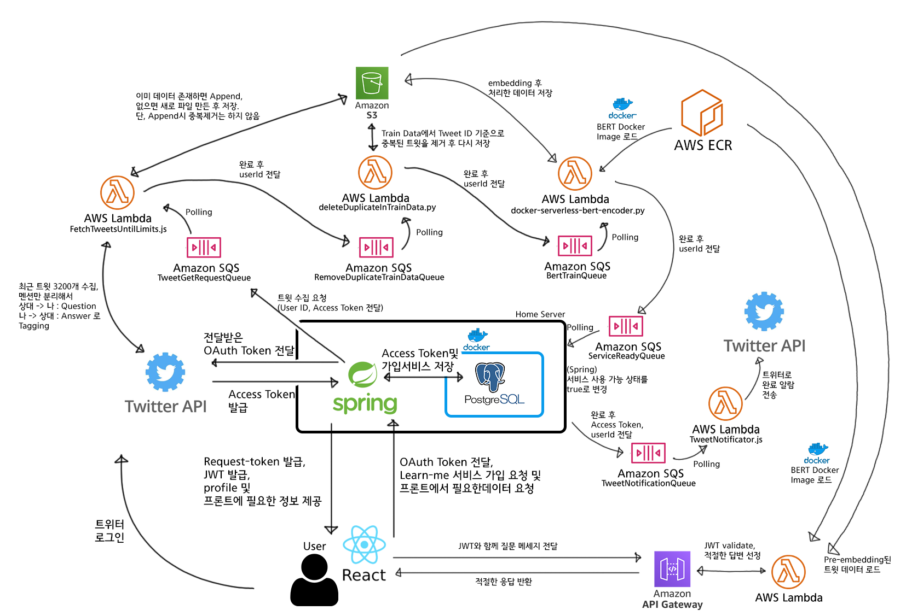

> 我以为大致这样做就行了，没想到……

啊……。
是不是大家也突然觉得头疼？
把它非常非常简单地总结一下就是下面这样。

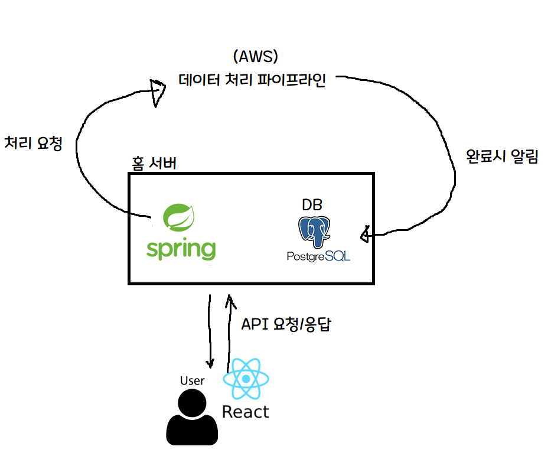

> 啊，这样就好理解多了！

核心部分如下。

1. 为节省服务器费用，注册/认证 token 签发等只由家用服务器上的 Spring 服务器处理。
2. 重负载的机器学习运算发送请求到云（AWS），利用 AWS 的服务器资源处理。
3. AWS 处理完成后通知家用服务器，并把处理完成的事实写入 DB。

我个人有家用服务器，所以抱着用家用服务器处理轻量运算来减少租赁费用、把重运算交给云服务（AWS）的方式同时拿下**性价比**和**性能**的梦想与希望，把这个服务做了出来！

### 4. 上线 — 副标题：瓶颈往往出现在意想不到的地方

> 抱歉…… 不是，那个…… 计划本来明明很完美……

我当然以为这个项目的瓶颈会出现在机器学习部分，并以此为前提搭建了整个系统，结果意外地……并非如此。

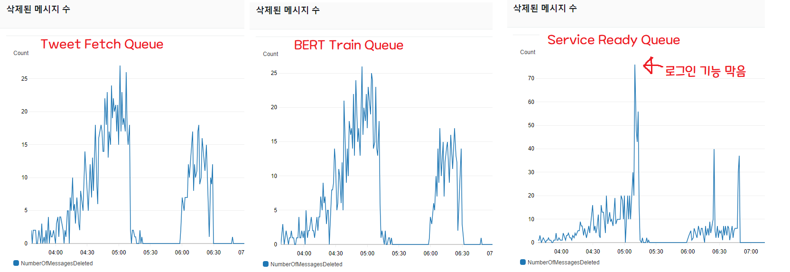

已删除消息数量是衡量处理量的指标。
当请求以消息形式进入时，它表示一分钟内处理了多少条请求并删除了消息。

如各位所见，抓取 3200 条推文的脚本和处理 BERT 机器学习的队列动作类似，把请求都消化掉了（1 号和 2 号曲线）。

但是当所有流水线作业成功后，向 Spring 通知处理完成、并把 DB 中"可用"字段改为 true 的队列（3 号），处理量却跟不上。

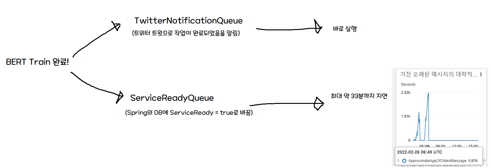

问题在于，初期架构假设 ServiceReadyQueue 会立刻被处理掉。

因此训练完成时，Twitter 通知（Serverless）和 Spring 通知是同时发出的，但 Twitter 通知会立即送达，而 DB 写入存在延迟。
也就是说，收到通知后过来的用户**最多会有 33 分钟**看到"无法使用！"的画面。

老实说，这里我纠结了挺久。
> 啊……这是一辈子都遇不到的流量……要不要把登录关掉……得关掉吧……？ 都积压 30 分钟了……？

Spring 每分钟消费 10 条消息，所以只要每 6 秒注册一个用户以下的速率，瓶颈就会自动消解。但监控显示完全没有减少的趋势，于是我决定先把登录关掉。

判断标准很明确：**处理变慢**没关系，但**显示已处理却无法使用**是非常大的缺陷。

于是我赶紧改了 React 项目，把登录按钮和服务注册按钮拿掉，并紧急把流水线改成下面这样。

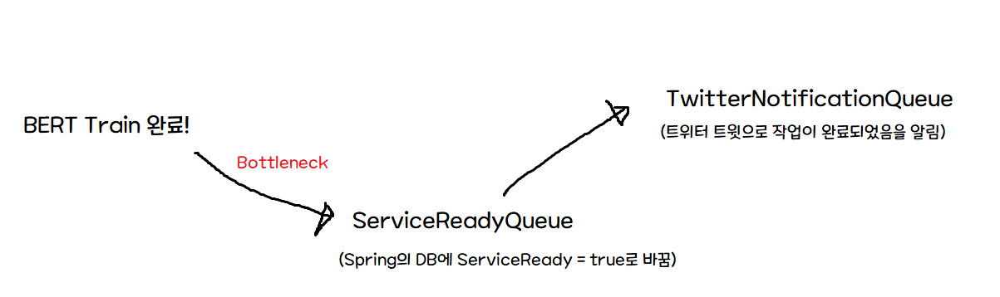

> 这样改之后，处理速度没有变化，但可以避免**收到通知却无法使用**这种致命情况。

之后等了一小段时间，让 DB 写入完成（让积压的任务跑完），再把登录/注册按钮恢复回来。

之后服务就如预期一样正常工作了。虽然瓶颈本身没解决，但至少避免了**收到完成通知后过来却几十分钟无法使用服务**这种致命错误。

接着我一边监控一边分析原因，发现消息处理量被固定在最多 10 条，于是去查相关资料，在 spring-cloud-aws 的 issue 中找到了[这个](https://github.com/spring-attic/spring-cloud-aws/issues/166) issue。简而言之，就是一次只能处理 10 条消息，且不是异步而是同步运行的问题。

再看目前仍然 open 的另一个 [issue](https://github.com/awspring/spring-cloud-aws/issues/23)，这个问题需要大规模重构，计划在 3.0.0 修复。结论上……

> 啊……那热修复就难了……

总之，瓶颈本身没办法简单解决，要解决的话，要么把 Spring 做的工作本身改写为 Serverless 架构，要么对库依赖做大手术（……）。不管怎样，刚上线当天不该折腾这个，所以决定先继续监控。

#### 啊！

这次轮到另一个队列开始堆消息了。就是抓取 3200 条推文的那个队列。
我立刻进入监控，发现处理该队列的 Lambda 函数错误率上涨到了 100%。

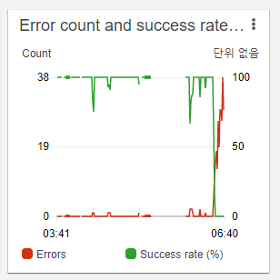

> 这一看就是 API 限流嘛！

进入 CloudWatch，打开该 Lambda Function 的日志，果然不出所料。

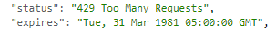

> 果然是 API 限流！

虽然不知道具体是哪种限流
~~（Twitter 有用户限流、应用限流、15 分钟限流、每日限流、每月限流等各种各样的限制……）~~
但显然得把服务注册按钮拿掉了（……）。
拿掉服务注册按钮，并在 Twitter 上发了相关公告之后，暴风雨般的 3 个小时就这么过去了。

吃了每日限流之后我已经没什么可做的了（……），于是决定给服务做个尸检留个记录，所以现在正在写这篇。

### 5. 结论及后记

啊……我完全没想到 SQS -> Spring 的环节会成为瓶颈，
也好像是第一次体验到那种一直梦寐以求的、突然涌入大量流量但服务器扛不住时的恐慌状态。

尤其是因为整个服务都是我自己做的（……），故障点找得倒是挺快，但最难的是思考如何在线上服务运行中的状态下进行修复？副作用会怎样？等等。

特别是中间那种**"服务出现严重故障（收到通知但无法执行）"**的情况，得在线上服务器上快速修复，又不知道仓促写出的代码会带来什么副作用，还要赶紧热修复，这在心理上压力很大，应该是最让我紧张的时刻。

老实说最大的感受是
> 啊，原来这就是为什么大家一直说自动化测试自动化测试……
> 如果有大量的测试，就算遇到类似情况，也能更安心地修改。

我当时就是这么想的。

另外，虽然不是有意为之，但我从 AWS 上得到了很大帮助（？）

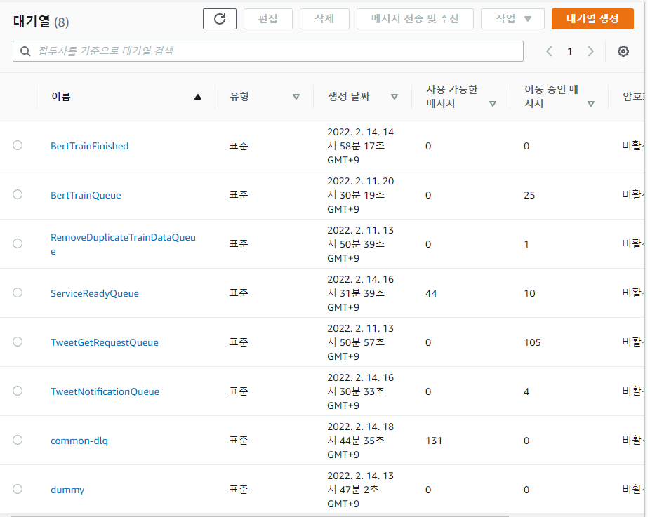

> 1. 通过使用基于队列的架构，我能很快知道在哪个环节出现瓶颈、在哪里发生错误。
> 如果没有用 SQS，找瓶颈会花更多时间，但多亏了基于队列的架构，我能很轻松地找到瓶颈所在。

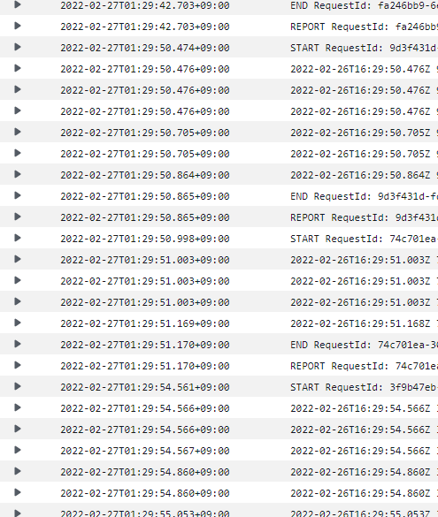

> 2. 我意识到 CloudWatch 日志非常非常方便、非常重要。
> 本来是想把监控系统也搭好再发布，但抱着先发出来看看反应再说（？）的天真想法，就直接上线了。
> 但果然出了问题，开发时习惯性留下的状态变化和 Exception 输出等，对错误处理起到了很大帮助。
> 即使不用 AWS，也要好好打日志、学好怎么看日志……

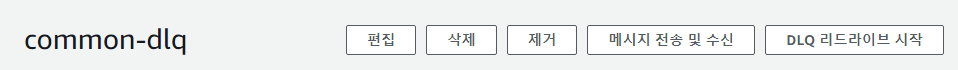

> 3. 一定要配置 DLQ。
> Poller（服务处理方）处理 N 次以上仍因 Exception 等无法处理的消息，可以收集到 DLQ（Dead Letter Queue）中，利用 DLQ 之后可以通过 DLQ 重新驱动（redrive）功能把未处理的消息送回原队列。
> 也就是说，如果有请求因某些原因发生错误而未能处理，就会进入 DLQ，之后可以利用 DLQ 重新驱动从中断点重新开始处理！

#### 总之……虽然挺辛苦，但好歹算是磕磕绊绊地挺过来了，太好了！

如果我有理解错的地方或者可以改进的地方，欢迎随时留言！非常感谢您读完这篇长文！
