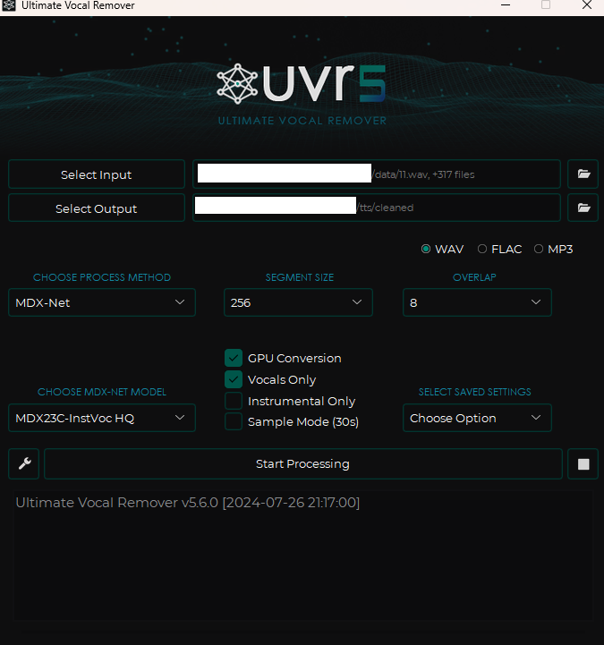
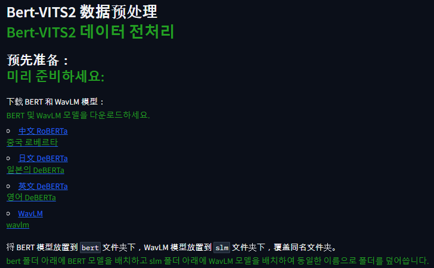
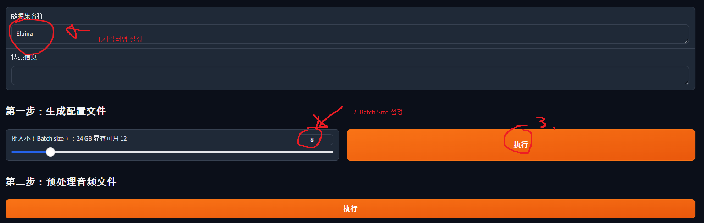
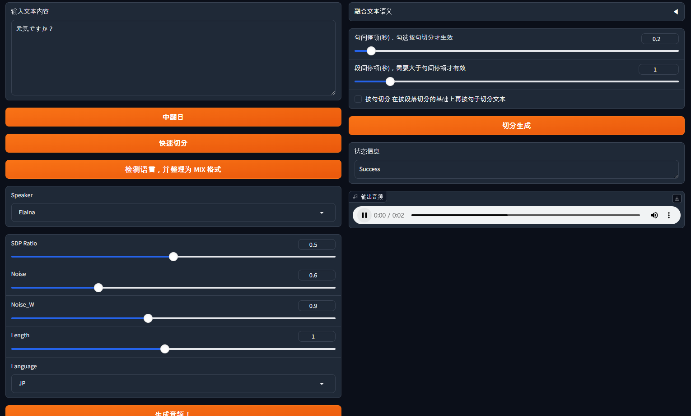

_注：作者居住在韩国，部分内容包含韩国特有的背景。_

## 先听一下我们要做的音频（日语）

- [Link](audio.wav)

### 1. TTS？

Text-To-Speech，顾名思义，是将文本转换为语音数据的软件。

只要做好一次，就可以在大量自动化场景中使用，不必担心调用次数，所以我的目标是亲手做一个。

既然要做，让我熟悉的角色来说话不是更有趣吗？所以我打算用自定义数据来微调模型，亲手做一个 TTS。

其中，我们将使用 [Bert-Vits2](https://github.com/fishaudio/Bert-VITS2) 这个模型来训练。顺带一提，它支持中文、英文和日文。

如果你对角色声音不感兴趣，只想要一个标准的韩文声音，那么建议你去看看 [Melotts](https://github.com/myshell-ai/MeloTTS) 和它的预训练模型。

最后再补充一句，做完模型之后请不要进行模型分发等行为，强烈建议仅作个人研究/兴趣使用。

需要的东西是：一台带 GPU 的 Ubuntu 服务器，以及毅力（……）。

### 2. 工作流程

为了进行训练，至少需要 20 分钟到 1 小时干净的语音数据。

如果能自己录制当然最好，但要用中文/日文/英文连续讲 20 分钟到 1 小时并不容易。

因此，我们打算使用动画来制作训练素材。

思路如下：

1. 字幕里有字幕的开始时间、结束时间和文本数据。
2. 在动画中按字幕时长切出对应的音频，然后把字幕文本作为该音频的 Label。

整体流程如下：

1. 找到喜欢的动画，以及其原语字幕。
2. 加载字幕数据和动画数据，提取出台词部分。
3. 提取出台词部分后，用机器学习去除背景音乐等。
4. 自己一句一句听台词，删除不是目标角色的数据。
5. 这样就会得到「目标角色」的「语音数据和标签数据」。用这些数据训练 Bert-VITS2。
6. 用做好的 TTS 玩耍！

我会按照这个流程简洁地讲一遍。

### 3-1. 利用字幕文件提取台词部分

动画和原语字幕请大家自行准备，这里跳过。

进入我整理过的素材仓库 [Github](https://github.com/LemonDouble/tts-preprocess)。

git clone 之后安装依赖，在 `extract_wav_1.py` 里填入视频名和字幕文件名后运行。

这样 data 文件夹里就会自动生成 1~xxx.wav 文件。


### 3-2. 用 UVR (ULTIMATE VOCAL REMOVER) 去除背景音乐

进入 [UVR 主页](https://ultimatevocalremover.com/)，下载并运行。

然后按下面的设置进行配置：



1. input 处放入刚才生成的全部 wav 文件。
2. output 处新建一个名为 cleaned 的文件夹。
3. Choose MDX-NET Models 处，先 Download New Model -> MDX-Net 下载 MDX23C-InstVoc HQ 模型，然后选择它。
4. 打开 GPU Conversion、Vocals Only 选项后运行。

### 3-3. 手动删除低质量音频和其他角色的台词

进入 cleaned 文件夹，删除低质量音频（混入脚步声、音效、声音重叠等情况），以及其他角色的台词。（直接删除文件）

### 3-4. 制作标签数据

运行 `change_name_2.py` 修改 cleaned 文件夹中的文件名，
再运行 `make_list_3.py` 生成 esd.list 文件。

### 3-5. 检查收集到的数据时长

运行 `calculate_length.py`，确认一共收集到多少分多少秒的数据。

### 3-6. 重复

如果数据还不够，请重复前面的步骤，直到数据足够。

在另一个目录里以角色名建一个文件夹，按下面的方式排布：

```
角色名/
  ㄴesd.list
  ㄴraw/
    ㄴf6df34d9-01c4-4db9-97e9-a35795a5f64b.wav
    ㄴ18bcc2c6-3e23-427c-a04a-9414b6f0b85e.wav
    ...
```

esd.list 用文本编辑器打开，不断追加内容；
raw 文件夹则把 cleaned 中的 wav 文件粘贴进去即可。

不断重复，让总文件时长达到 20 分钟到 1 小时。

### 3-7. 训练数据

把数据拷贝到 Ubuntu 服务器。

如果 Ubuntu 上还没有安装 CUDA，请搜索「Ubuntu CUDA 安装」并安装 CUDA。

Clone [Bert-Vits2](https://github.com/fishaudio/Bert-VITS2) 仓库，创建[虚拟环境](https://heytech.tistory.com/295)后，执行 `pip install -r requirements.txt` 安装依赖。

然后执行 `python webui_preprocess.py`。

之后访问对应的 Gradio 环境，把各个文件下载下来放到对应位置。



[中文 RoBERTa](https://huggingface.co/hfl/chinese-roberta-wwm-ext-large/tree/main) -> 把 flax_model.msgpack、pytorch_model.bin、tf_model.h5 下载到 BERT_VITS2/bert/chinese-roberta-wwm-ext-large 文件夹。

其余的也一样，把容量较大的文件下载下来放进去。

[日文 DeBERTa](https://huggingface.co/ku-nlp/deberta-v2-large-japanese-char-wwm/tree/main) -> Bert-VITS2/bert/deberta-v2-large-japanese-char-wwm 文件夹

[英文 DeBERTa](https://huggingface.co/microsoft/deberta-v3-large/tree/main) -> Bert-VITS2/bert/deberta-v3-large 文件夹

[WaveLM](https://huggingface.co/microsoft/wavlm-base-plus/tree/main) -> Bert-VITS2/slm/wavlm-base-plus 文件夹

然后新建 Bert-VITS2/data/{角色名} 文件夹，把训练数据移过去。

```
Bert-VITS2/
ㄴdata/
  ㄴElaina/
    ㄴesd.list
    ㄴtrain.list
    ㄴval.list
    ㄴraw/
        ㄴf6df34d9-01c4-4db9-97e9-a35795a5f64b.wav
        ㄴ18bcc2c6-3e23-427c-a04a-9414b6f0b85e.wav
        ...
```

此时，esd.list 是刚才做好的文件原样；
val.list 是从 esd.list 末尾取出 5% 左右复制粘贴；
train.list 是 esd.list 中除掉 val.list 内容剩下的部分复制粘贴。

示例：

esd.list
```
f6df34d9-01c4-4db9-97e9-a35795a5f64b.wav|Elaina|JP|ありがとう
b234c567-d890-1234-e567-890f123g4567.wav|Elaina|JP|おはよう
c345d678-e901-2345-f678-901g234h5678.wav|Elaina|JP|すみません
d456e789-f012-3456-g789-012h345i6789.wav|Elaina|JP|さようなら
e567f890-0123-4567-h890-123i456j7890.wav|Elaina|JP|元気ですか？
```

train.list
```
f6df34d9-01c4-4db9-97e9-a35795a5f64b.wav|Elaina|JP|ありがとう
b234c567-d890-1234-e567-890f123g4567.wav|Elaina|JP|おはよう
c345d678-e901-2345-f678-901g234h5678.wav|Elaina|JP|すみません
d456e789-f012-3456-g789-012h345i6789.wav|Elaina|JP|さようなら
```

val.list
```
e567f890-0123-4567-h890-123i456j7890.wav|Elaina|JP|元気ですか？
```

到这里，回到刚才的 Gradio，按以下方式配置：



1. 输入角色名（我这里是 Elaina）。
2. 选择 batch size。batch size 越大训练越快，但太大就装不进 GPU 显存。我用的是 3090，所以设成 12，建议先用大值试试，不行再降。
3. 全部设置好后按按钮。

按下按钮后会生成 Bert-VITS2/config.yml 文件。
修改这个文件：

1. 第 7 行的 "Data/" 部分改成 "data/{角色名}"。（我这里是 data/Elaina）
2. 第 20 行的 in_dir 从 "audios/raw" 改成 "raw"。
3. 第 22 行的 out_dir 从 "audios/wavs" 改成 "wavs"。
4. 第 29 行的 transcription_path 改成 "filelists/esd.list"。

之后回到 Gradio，依次点击 第二步：预处理音频文件、第三步：预处理标签文件、第四步：生成 BERT 特征文件。

然后下载预训练模型。

进入下面的[链接](https://huggingface.co/OedoSoldier/Bert-VITS2-2.3/tree/main)，下载 DUR_0.pth、D_0.pth、G_0.pth、WD_0.pth，粘贴到 data/{角色名}/models 文件夹。

之后把 config.yml 第 90 行的 config_path 改成 "configs/config.json"（train_ms 部分）。

然后在 Bert-VITS2 文件夹下执行 `torchrun --nproc_per_node=1 train_ms.py`，训练就会开始！

### 3-8. 输出语音

训练进行的过程中，需要确认语音是否能正常输出。

打开 data/{角色名}/models 文件夹，会看到随着训练进度生成的多个文件，比如 G_1000.pth 这种格式。

G_xxxx.pth 文件就是用来生成声音的文件。
确认该文件夹后，把 config.yml 第 105 行（webui 部分）的 model 改成 "model/G_xxxx.pth"。（这里 xxxx 是当前目录中存在的模型编号）

然后在 Bert-VITS2 文件夹中执行 `python webui.py`，就会启动一个 Gradio，可以在该 Gradio 中测试 TTS。



顺带一提，如果想用这些数据另外搭建一个服务器，可以参考 hiyoriUI.py！它提供了基于 fastAPI 的服务器。

### 结语

至此，简？单地讲了一遍如何制作 TTS。

中间漏了不少细节，是因为已经有类似的文章了，我只重点写了那篇文章里我自己感到困惑的地方。

[Chapter 4. Bert-VITS2 训练前准备与开始训练](https://info-nemo.com/coding-story/chapter-4-bert-vits2-%ed%95%99%ec%8a%b5-%ec%a0%84-%ec%82%ac%ec%a0%84-%ec%a4%80%eb%b9%84/)

本文中遗漏的部分，配合上面这篇一起看会更容易理解。

我自己已经把 TTS 移植到了另一台跑着的机器学习服务器上，用得很顺手。

如果有什么不顺利的地方欢迎留言，也祝大家做出有趣的 TTS！
