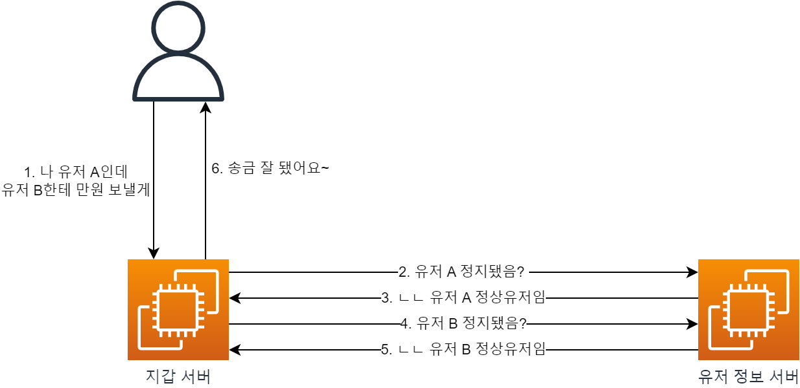
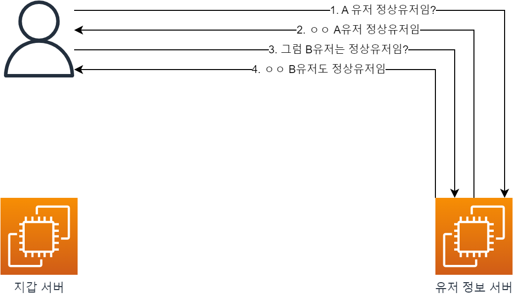
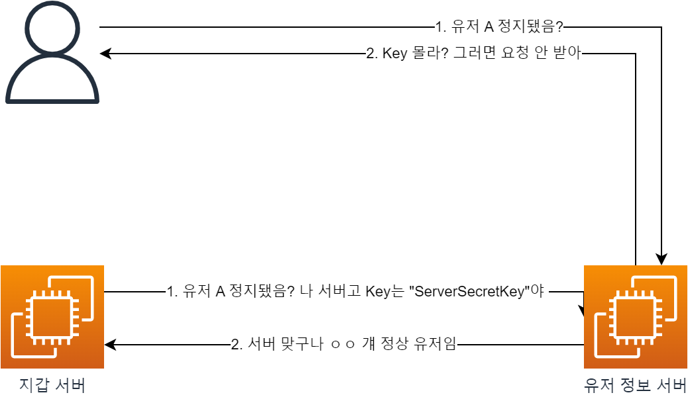
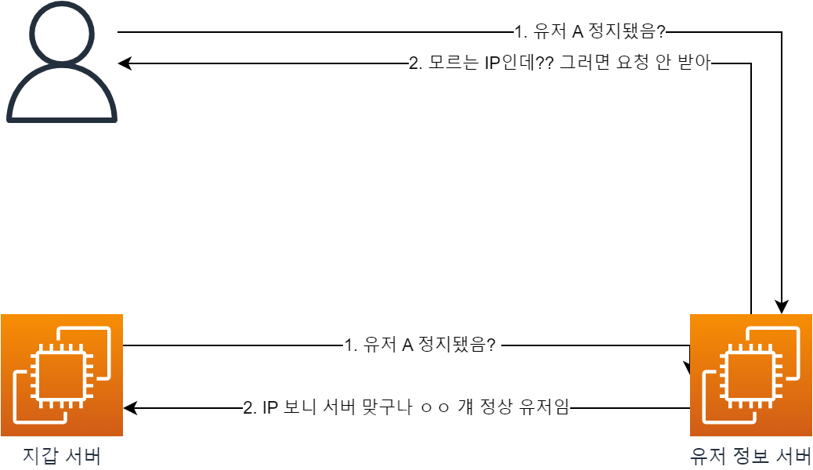
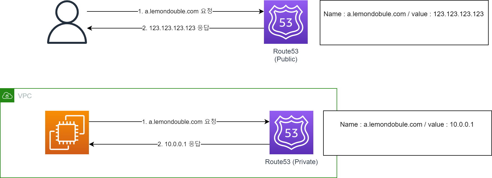
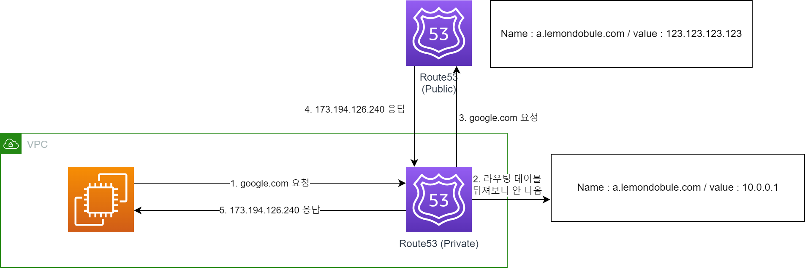
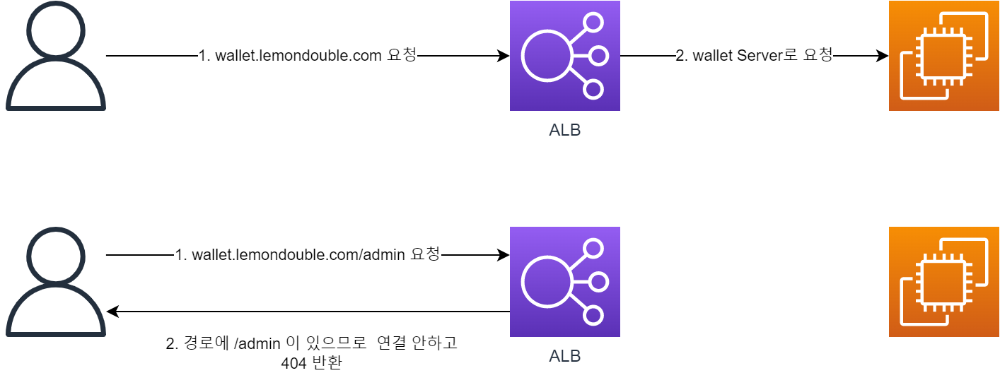
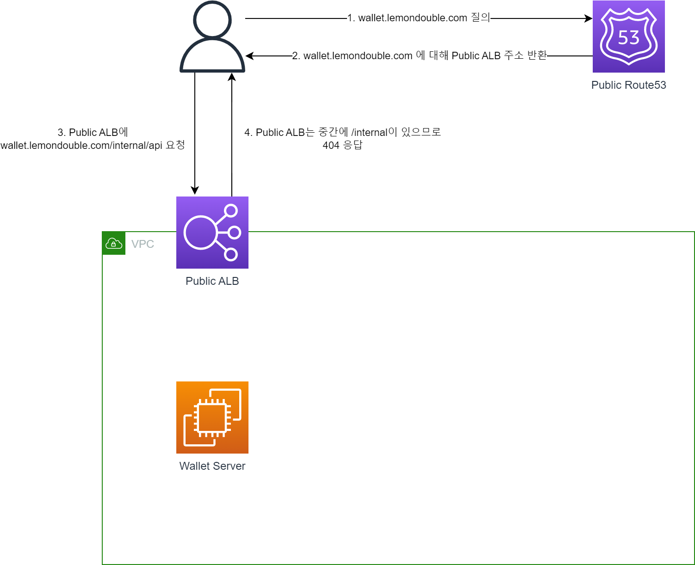
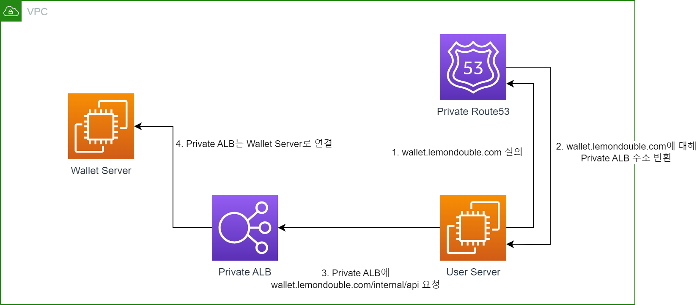
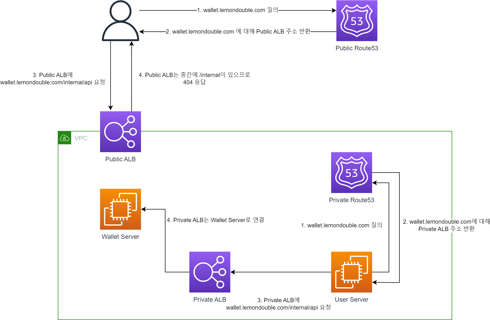

_注：作者居住在韩国，部分内容包含韩国特有的背景。_

构建 MSA 服务时，服务器之间会发生非常频繁的通信。

例如，假设有一个（高度简化的）转账服务。

如果有钱包服务器和用户信息服务器，调用转账 API 时会发生上图中的情况。

那么，如果**正常用户检查 API**可以从外部访问呢？

如果恶意用户有意访问，他们甚至可以将我们服务的正常用户比例绘制成图表（..）

因此，在 MSA 架构中出现了这样的需求：`服务器之间的请求可以使用该 API，但外部用户不应该能够访问`。

如何才能实现这个需求呢？

### 1. 最简单的方法是服务器之间共享密钥。

* 通过环境变量等方式，服务器之间共享相同的密钥。
* 将其放入 HTTP 自定义 Header 等，服务器在请求时一起发送密钥。
* 服务器收到内部 API 请求后会检查密钥，如果不匹配则 Reject。

但这种方法存在问题。

* 如果有人偷走了密钥怎么办？或者，如果密钥泄露到 Git 等外部仓库怎么办？
* 当然，从外部就可以发起 API 请求了。

### 2. 那么管理 Whitelist 怎么样？

* 如果能知道所有服务器的 IP，可以通过 `X-Forwarded-For` 等 Header 检查 IP，如果不是我们已知的服务器 IP 就拦截。

但这种方法也有些问题！

* 如果请求量太大需要扩容服务器怎么办？
* 当然不知道新服务器的 IP，所以会被拦截。

### 3. 通过网络配置阻止外部进入吧！

* 1、2 的方法也是好方法，但如果外部访问时响应根本到不了服务器会更安全。
* 让我们用 Private DNS / Public DNS 来实现这个！
* 这种方法也叫做 `Split Horizon DNS` 或 `Multiview DNS`。
* 相关文档：( [Link](https://aws.amazon.com/ko/premiumsupport/knowledge-center/internal-version-website/) )
* 那么让我们一步步了解。

* **1. 首先了解一下 Public DNS / Private DNS。**

* 简单来说，从 VPC 外部访问时 / 从 VPC 内部访问时可以返回不同的响应地址。
* 可以理解为从 VPC 内部访问时使用内部 DNS 服务器，从外部访问时使用外部 DNS 服务器！

* 那么，如果请求内部 DNS 中没有的记录会怎样？
* 如上图所示，先查询 Private DNS，如果没有则查询 Public DNS。
* (Note：可能与实际网络流程不完全一致。但重要的是，Private DNS 具有优先权。)

* **2. 那么现在了解一下 ALB。**

* ALB (Application Load Balancer) 可以评估传入的请求，并适当地分配。
    * 可以根据 HostName 适当响应。例如..
        * 进入 `wallet.lemondouble.com` 可以连接到 `wallet server`。
        * 进入 `user.lemondouble.com` 可以连接到 `user server`。
    * 使用 Path 也可以做同样的事情。
        * 进入 `api.lemondouble.com/wallet` 可以连接到 `wallet server`。
        * 进入 `api.lemondouble.com/user` 可以连接到 `user server`。
        * 当然，也可以做到 `如果包含特定 Path 就 Deny`。

* **3. 那么把这两个组合起来？**

* 首先，创建 Public DNS 和连接到互联网的 Public ALB。
    * 此时，Public ALB 的规则如下。
    * 优先级 1. `如果 Hostname 与 wallet.lemondouble.com 匹配且 Path 为 /internal* 则返回固定 404 响应`
    * 优先级 2. `如果 Hostname 与 wallet.lemondouble.com 匹配则连接到 Wallet Server 的 80 端口`

* 此时由于 ALB 规则按优先级顺序应用
    * `wallet.lemondouble.com/api/hello` 不匹配 `优先级 1`，匹配 `优先级 2`，因此连接到 wallet Server。
    * `wallet.lemondouble.com/internal/hello` 匹配 `优先级 1`，因此收到 404 响应。

* 接下来，与 Public DNS 一样，创建 Private DNS 和未连接到互联网的 Private ALB。
    * 此时，Private ALB 的规则如下。
    * 优先级 1. `如果 Hostname 与 wallet.lemondouble.com 匹配则连接到 Wallet Server 的 80 端口`

* 在这种情况下，由于没有对 `/internal*` 返回 404 的逻辑，所有请求都被转发到 Wallet Server。

* 把两个组合起来就是这样的形态。
* 当调用 `wallet.lemondouble.com/internal/hello` API 时，从 VPC 外部会收到 404 响应，但从 VPC 内部会收到正常响应。

### 4. 那么仅仅做网络配置就足够了吗？

* 取决于你构建的应用对信息泄露有多敏感，但结合 1 和 3 的方法会更好。这样..
    * 即使服务器之间的密钥泄露，由于网络配置的阻止，外部访问会被切断。
    * 即使误操作了网络配置，由于外部不知道密钥，外部访问也会被切断。
    * 错误随时可能发生，所以即使发生错误也能由系统阻止的方法要好得多！！

以上就是构建 Private (或 Internal) API 的方法。

构建 Private API 的方法多种多样。除此之外还可以使用 AWS 的 API Gateway，或者（虽然不太了解）也可以使用 K8S 或 Spring Cloud Gateway 等..？

希望大家把这个当作众多方法中的一种来看就好。如果有错误的地方，请留言指出！

谢谢。
