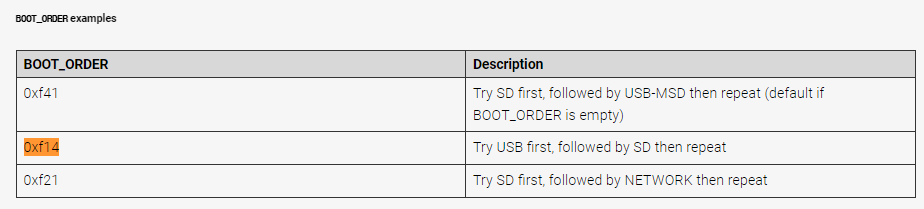

_注：作者居住在韩国，部分内容包含韩国特有的背景。_

树莓派哪里都好，就是SD卡启动经常让人非常生气。

折腾的时候SD卡反复拔插，不小心刮伤了导致无法识别，真的会让人心烦意乱。

我知道SD卡和USB用的是类似的技术，但是……

经验上，USB的稳定性通常要好一些（物理损坏方面）。

所以，把SD卡扔掉，让我们用USB来启动吧！

`以下内容基于Ubuntu 22.04 Server环境编写。`

### 1. 烧录SD卡

* 要从USB启动，得先调整bootloader，而这就需要至少用SD卡启动一次。
* 烧录SD卡，进行SSH连接。之后的命令都在终端里执行。

### 2. 更新EEPROM中的Bootloader

* EEPROM：还记得在计算机体系结构课上学到的ROM吗？大致上把它当作"可写可擦的ROM"就行。
* Bootloader就放在这里运行，大约2020年9月之后版本的bootloader开始支持USB启动。
* 顺便升级一下吧。

Ref: https://www.raspberrypi.com/documentation/computers/raspberry-pi.html#automaticupdates

1. 运行 `sudo rpi-eeprom-update` 命令，确认当前/最新版本的Bootloader。
2. 运行 `sudo rpi-eeprom-update -a` 命令，预约Bootloader更新。
3. 用 `sudo reboot` 重启，启动过程中bootloader更新就会执行。
4. 再次运行 `sudo rpi-eeprom-update` 命令，确认更新是否成功。

- Update (2023.05.19)
  - 上面的 rpi-eeprom-update 只支持RPI4及以上。
  - 如果你使用的是RPI 3B或更早的版本，请参考 [Booting Raspberry Pi 3 B With a USB Drive](https://www.instructables.com/Booting-Raspberry-Pi-3-B-With-a-USB-Drive/)。
  - 如果使用Raspbian OS，按照那个指南操作即可。
  - 如果使用Ubuntu，config.txt 需要修改 `boot/firmware/config.txt`！！！

### 3. 设置启动顺序

* Ubuntu Server里没有raspi-config程序，所以先安装。

1. 输入 `sudo apt install raspi-config` 来安装raspi-config程序。
2. 输入 `sudo raspi-config` 命令后，进入 Advanced Option -> Boot Order。
3. 选择 `USB Boot`，然后用 `sudo reboot` 重启。

### 4. 确认启动顺序是否正确应用

* 输入 `vcgencmd bootloader_config`。
* 检查下方是否设置了 `BOOT_ORDER=0xf14`。如果没有设置，说明配置过程中出了问题，重复1~3步。
* Ref: https://www.raspberrypi.com/documentation/computers/raspberry-pi.html#configuration-properties

### 5. 在USB上烧录OS后插上重启

* 拔掉SD卡，在USB上烧录OS后重启。
* 哇！启动成功了。Good！
